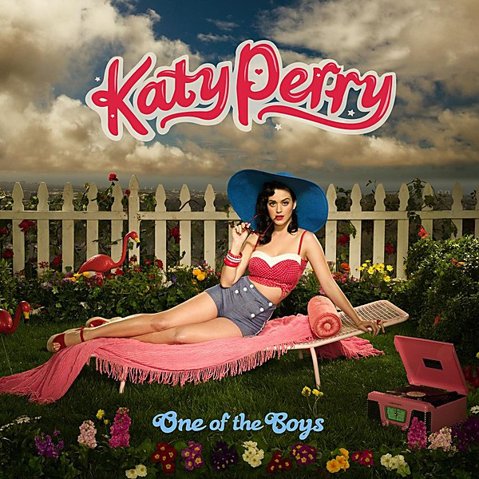

# One of the Boys

By **Katy Perry**

## Album Data

- **Catalog:** Beets
- **Format:** Digital, Album
- **Album:** One of the Boys
- **Artist:** Katy Perry
- **Albumartist:** Katy Perry
- **Genre:** Pop Rock
- **MusicBrainz Album Artist ID:** [122d63fc-8671-43e4-9752-34e846d62a9c](https://musicbrainz.org/artist/122d63fc-8671-43e4-9752-34e846d62a9c)
- **MusicBrainz Album ID:** [d7168cd8-d9dd-4815-819a-52533aefa0f8](https://musicbrainz.org/release/d7168cd8-d9dd-4815-819a-52533aefa0f8)
- **MusicBrainz Release Group ID:** [88f14b0b-f8d1-31b4-87ab-199145fc12d3](https://musicbrainz.org/release-group/88f14b0b-f8d1-31b4-87ab-199145fc12d3)
- **Year:** 2008
- **Catalog #:** 
- **Label:** Capitol Records
- **Total Tracks:** 19

## Album Tracks

### Track 01 - Teenage Dream

- **Artist:** Katy Perry
- **Format:** ALAC
- **Genre:** Pop
- **Length:** 3:47
- **MusicBrainz Track ID:** [8cf81f4a-05fd-4688-bb8c-eb59df2026a0](https://musicbrainz.org/recording/8cf81f4a-05fd-4688-bb8c-eb59df2026a0)
- **Title:** Teenage Dream
- **Track:** 01
- **Year:** 2012

### Track 02 - Last Friday Night (T.G.I.F.)

- **Artist:** Katy Perry
- **Format:** ALAC
- **Genre:** Pop
- **Length:** 3:50
- **MusicBrainz Track ID:** [a2b6d3f6-2ab5-4522-9a40-e589fb8f6e02](https://musicbrainz.org/recording/a2b6d3f6-2ab5-4522-9a40-e589fb8f6e02)
- **Title:** Last Friday Night (T.G.I.F.)
- **Track:** 02
- **Year:** 2012

### Track 04 - Firework

- **Artist:** Katy Perry
- **Format:** ALAC
- **Genre:** Pop
- **Length:** 3:48
- **MusicBrainz Track ID:** [9846e3f4-7bb9-49be-8e91-837a5ee5cefb](https://musicbrainz.org/recording/9846e3f4-7bb9-49be-8e91-837a5ee5cefb)
- **Title:** Firework
- **Track:** 04
- **Year:** 2012

### Track 05 - Peacock

- **Artist:** Katy Perry
- **Format:** ALAC
- **Genre:** Pop
- **Length:** 3:51
- **MusicBrainz Track ID:** [a086d104-c9f7-4406-bc7f-f1eb981b93c2](https://musicbrainz.org/recording/a086d104-c9f7-4406-bc7f-f1eb981b93c2)
- **Title:** Peacock
- **Track:** 05
- **Year:** 2012

### Track 06 - Circle the Drain

- **Artist:** Katy Perry
- **Format:** ALAC
- **Genre:** Pop Rock
- **Length:** 4:32
- **MusicBrainz Track ID:** [0f229041-ee60-4a73-b53c-aaf3e6632017](https://musicbrainz.org/recording/0f229041-ee60-4a73-b53c-aaf3e6632017)
- **Title:** Circle the Drain
- **Track:** 06
- **Year:** 2012

### Track 07 - The One That Got Away

- **Artist:** Katy Perry
- **Format:** ALAC
- **Genre:** Pop
- **Length:** 3:47
- **MusicBrainz Track ID:** [2d6f51c6-afc5-457e-9c58-689679c08d30](https://musicbrainz.org/recording/2d6f51c6-afc5-457e-9c58-689679c08d30)
- **Title:** The One That Got Away
- **Track:** 07
- **Year:** 2012

### Track 08 - E.T.

- **Artist:** Katy Perry
- **Format:** ALAC
- **Genre:** Electropop
- **Length:** 3:26
- **MusicBrainz Track ID:** [a0ad9828-ff96-42d0-b7a5-d0e85ec001c2](https://musicbrainz.org/recording/a0ad9828-ff96-42d0-b7a5-d0e85ec001c2)
- **Title:** E.T.
- **Track:** 08
- **Year:** 2012

### Track 09 - Who Am I Living For?

- **Artist:** Katy Perry
- **Format:** ALAC
- **Genre:** Electropop
- **Length:** 4:08
- **MusicBrainz Track ID:** [182defde-f578-4f62-87f7-cb02468ff560](https://musicbrainz.org/recording/182defde-f578-4f62-87f7-cb02468ff560)
- **Title:** Who Am I Living For?
- **Track:** 09
- **Year:** 2012

### Track 10 - Pearl

- **Artist:** Katy Perry
- **Format:** ALAC
- **Genre:** Pop
- **Length:** 4:08
- **MusicBrainz Track ID:** [72d0365f-b0e1-425a-8639-5d4c26816d83](https://musicbrainz.org/recording/72d0365f-b0e1-425a-8639-5d4c26816d83)
- **Title:** Pearl
- **Track:** 10
- **Year:** 2012

### Track 11 - Hummingbird Heartbeat

- **Artist:** Katy Perry
- **Format:** ALAC
- **Genre:** Pop Rock
- **Length:** 3:32
- **MusicBrainz Track ID:** [ccf72769-880d-4416-a619-ceca7337e81d](https://musicbrainz.org/recording/ccf72769-880d-4416-a619-ceca7337e81d)
- **Title:** Hummingbird Heartbeat
- **Track:** 11
- **Year:** 2012

### Track 12 - Not Like the Movies

- **Artist:** Katy Perry
- **Format:** ALAC
- **Genre:** Rock
- **Length:** 4:01
- **MusicBrainz Track ID:** [d75a05d3-203b-4dfb-97ef-9bbbc8a96fc4](https://musicbrainz.org/recording/d75a05d3-203b-4dfb-97ef-9bbbc8a96fc4)
- **Title:** Not Like the Movies
- **Track:** 12
- **Year:** 2012

### Track 13 - The One That Got Away (acoustic)

- **Artist:** Katy Perry
- **Format:** ALAC
- **Genre:** Pop
- **Length:** 4:19
- **MusicBrainz Track ID:** [c296a689-af01-4e56-9c4a-4128890b73c4](https://musicbrainz.org/recording/c296a689-af01-4e56-9c4a-4128890b73c4)
- **Title:** The One That Got Away (acoustic)
- **Track:** 13
- **Year:** 2012

### Track 14 - Part of Me

- **Artist:** Katy Perry
- **Format:** ALAC
- **Genre:** Pop Rock
- **Length:** 3:36
- **MusicBrainz Track ID:** [eca3290c-253d-458a-a5f2-f11dd1221648](https://musicbrainz.org/recording/eca3290c-253d-458a-a5f2-f11dd1221648)
- **Title:** Part of Me
- **Track:** 14
- **Year:** 2012

### Track 15 - Wide Awake

- **Artist:** Katy Perry
- **Format:** ALAC
- **Genre:** Pop
- **Length:** 3:41
- **MusicBrainz Track ID:** [2c2b2fff-b527-4cfd-90ae-41647a7d2d35](https://musicbrainz.org/recording/2c2b2fff-b527-4cfd-90ae-41647a7d2d35)
- **Title:** Wide Awake
- **Track:** 15
- **Year:** 2012

### Track 16 - Dressin’ Up

- **Artist:** Katy Perry
- **Format:** ALAC
- **Genre:** Teen Pop
- **Length:** 3:44
- **MusicBrainz Track ID:** [ce726e4e-fc06-489b-9bbd-79135aad6705](https://musicbrainz.org/recording/ce726e4e-fc06-489b-9bbd-79135aad6705)
- **Title:** Dressin’ Up
- **Track:** 16
- **Year:** 2012

### Track 19 - Tommie Sunshine’s Megasix Smash‐Up

- **Artist:** Katy Perry & Tommie Sunshine
- **Format:** ALAC
- **Genre:** Teen Pop
- **Length:** 7:03
- **MusicBrainz Track ID:** [47184c8b-f2a1-4781-adc4-0e425e63ee24](https://musicbrainz.org/recording/47184c8b-f2a1-4781-adc4-0e425e63ee24)
- **Title:** Tommie Sunshine’s Megasix Smash‐Up
- **Track:** 19
- **Year:** 2012

### Track 18 - Last Friday Night (T.G.I.F.)

- **Artist:** Katy Perry feat. Missy Elliott, Dr. Luke & Cirkut
- **Format:** ALAC
- **Genre:** Teen Pop
- **Length:** 3:59
- **MusicBrainz Track ID:** [b4a6fc20-21ed-468f-994c-4b9b9c05f693](https://musicbrainz.org/recording/b4a6fc20-21ed-468f-994c-4b9b9c05f693)
- **Title:** Last Friday Night (T.G.I.F.)
- **Track:** 18
- **Year:** 2012

### Track 03 - California Gurls

- **Artist:** Katy Perry feat. Snoop Dogg
- **Format:** ALAC
- **Genre:** Pop
- **Length:** 3:55
- **MusicBrainz Track ID:** [44e88237-bdb1-4176-9687-714f0d9f6f76](https://musicbrainz.org/recording/44e88237-bdb1-4176-9687-714f0d9f6f76)
- **Title:** California Gurls
- **Track:** 03
- **Year:** 2012

### Track 17 - E.T.

- **Artist:** Katy Perry feat. Kanye West
- **Format:** ALAC
- **Genre:** Electropop
- **Length:** 3:50
- **MusicBrainz Track ID:** [a53fe01d-5c2d-4c71-9684-9ef814df9c9b](https://musicbrainz.org/recording/a53fe01d-5c2d-4c71-9684-9ef814df9c9b)
- **Title:** E.T.
- **Track:** 17
- **Year:** 2012

## See also

- [Superbowl XLIX](Superbowl_XLIX.md)
- [Teenage Dream](Teenage_Dream.md)
- [CD: ](../../CD/Katy_Perry/Katy_Perry.md)
- [CD: One Of The Boys](../../CD/Katy_Perry/One_Of_The_Boys.md)
- [CD: Teenage Dream](../../CD/Katy_Perry/Teenage_Dream-_The_Complete_Confection.md)
- [Roon: One Of The Boys](../../Roon/Katy_Perry/One_Of_The_Boys.md)
