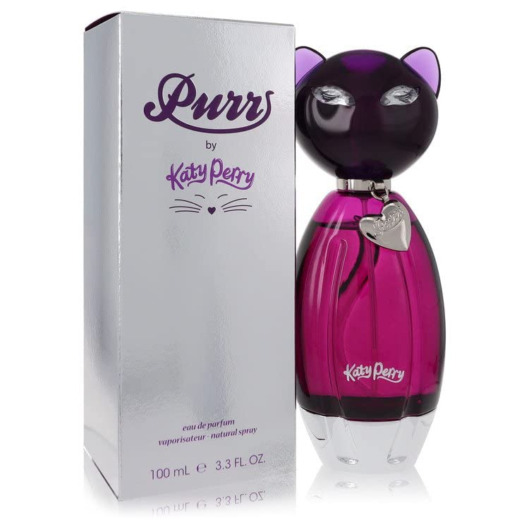

# Superbowl XLIX

By **Katy Perry**

## Album Data

- **Catalog:** Beets
- **Format:** Digital, Album
- **Album:** Superbowl XLIX
- **Artist:** Katy Perry
- **Albumartist:** Katy Perry
- **Genre:** Pop Rock
- **MusicBrainz Album Artist ID:** 
- **MusicBrainz Album ID:** 
- **MusicBrainz Release Group ID:** 
- **Year:** 2015
- **Catalog #:** 
- **Label:** Capitol Records
- **Total Tracks:** 12

## Album Tracks

### Track 01 - One of the Boys

- **Artist:** Katy Perry
- **Format:** ALAC
- **Genre:** Power Pop
- **Length:** 4:07
- **MusicBrainz Track ID:** [1817cdf8-996f-47f9-a53c-93b0665f3af1](https://musicbrainz.org/recording/1817cdf8-996f-47f9-a53c-93b0665f3af1)
- **Title:** One of the Boys
- **Track:** 01
- **Year:** 2008

### Track 02 - I Kissed a Girl

- **Artist:** Katy Perry
- **Format:** ALAC
- **Genre:** Pop Rock
- **Length:** 3:00
- **MusicBrainz Track ID:** [32e02581-0a95-43f0-a83c-17af5a0e0c63](https://musicbrainz.org/recording/32e02581-0a95-43f0-a83c-17af5a0e0c63)
- **Title:** I Kissed a Girl
- **Track:** 02
- **Year:** 2008

### Track 03 - Waking Up in Vegas

- **Artist:** Katy Perry
- **Format:** ALAC
- **Genre:** Pop Rock
- **Length:** 3:19
- **MusicBrainz Track ID:** [40e19d92-b212-4915-970a-2ce3b8169d7d](https://musicbrainz.org/recording/40e19d92-b212-4915-970a-2ce3b8169d7d)
- **Title:** Waking Up in Vegas
- **Track:** 03
- **Year:** 2008

### Track 04 - Thinking of You

- **Artist:** Katy Perry
- **Format:** ALAC
- **Genre:** Pop Rock
- **Length:** 4:06
- **MusicBrainz Track ID:** [0f719e23-01f6-41ae-bb8a-27e10360e128](https://musicbrainz.org/recording/0f719e23-01f6-41ae-bb8a-27e10360e128)
- **Title:** Thinking of You
- **Track:** 04
- **Year:** 2008

### Track 05 - Mannequin

- **Artist:** Katy Perry
- **Format:** ALAC
- **Genre:** Pop Rock
- **Length:** 3:17
- **MusicBrainz Track ID:** [af93a6ee-8b05-46dd-842e-9a58275a5beb](https://musicbrainz.org/recording/af93a6ee-8b05-46dd-842e-9a58275a5beb)
- **Title:** Mannequin
- **Track:** 05
- **Year:** 2008

### Track 06 - Ur So Gay

- **Artist:** Katy Perry
- **Format:** ALAC
- **Genre:** Pop Rock
- **Length:** 3:37
- **MusicBrainz Track ID:** [9319b69f-c741-4691-9b48-7889e89c4afc](https://musicbrainz.org/recording/9319b69f-c741-4691-9b48-7889e89c4afc)
- **Title:** Ur So Gay
- **Track:** 06
- **Year:** 2008

### Track 07 - Hot n Cold

- **Artist:** Katy Perry
- **Format:** ALAC
- **Genre:** Pop Rock
- **Length:** 3:40
- **MusicBrainz Track ID:** [82214173-a7e5-4abc-938e-03031d9241b3](https://musicbrainz.org/recording/82214173-a7e5-4abc-938e-03031d9241b3)
- **Title:** Hot n Cold
- **Track:** 07
- **Year:** 2008

### Track 08 - If You Can Afford Me

- **Artist:** Katy Perry
- **Format:** ALAC
- **Genre:** Indie Pop
- **Length:** 3:18
- **MusicBrainz Track ID:** [b119a122-1501-4735-9d9c-a698d1375daf](https://musicbrainz.org/recording/b119a122-1501-4735-9d9c-a698d1375daf)
- **Title:** If You Can Afford Me
- **Track:** 08
- **Year:** 2008

### Track 09 - Lost

- **Artist:** Katy Perry
- **Format:** ALAC
- **Genre:** Pop Rock
- **Length:** 4:15
- **MusicBrainz Track ID:** [2686465e-9612-4eec-9aab-80c42153c0cd](https://musicbrainz.org/recording/2686465e-9612-4eec-9aab-80c42153c0cd)
- **Title:** Lost
- **Track:** 09
- **Year:** 2008

### Track 10 - Self Inflicted

- **Artist:** Katy Perry
- **Format:** ALAC
- **Genre:** Pop Rock
- **Length:** 3:25
- **MusicBrainz Track ID:** [4a6c0db4-72ba-48f7-96dd-aea068cbe6ca](https://musicbrainz.org/recording/4a6c0db4-72ba-48f7-96dd-aea068cbe6ca)
- **Title:** Self Inflicted
- **Track:** 10
- **Year:** 2008

### Track 11 - I’m Still Breathing

- **Artist:** Katy Perry
- **Format:** ALAC
- **Genre:** Pop Rock
- **Length:** 3:48
- **MusicBrainz Track ID:** [fa22f45d-e709-461c-a928-4b66f457d595](https://musicbrainz.org/recording/fa22f45d-e709-461c-a928-4b66f457d595)
- **Title:** I’m Still Breathing
- **Track:** 11
- **Year:** 2008

### Track 12 - Fingerprints

- **Artist:** Katy Perry
- **Format:** ALAC
- **Genre:** Pop Punk
- **Length:** 3:44
- **MusicBrainz Track ID:** [37518808-b050-4c17-9d13-e66bc2eb8cc2](https://musicbrainz.org/recording/37518808-b050-4c17-9d13-e66bc2eb8cc2)
- **Title:** Fingerprints
- **Track:** 12
- **Year:** 2008

## See also

- [One of the Boys](One_of_the_Boys.md)
- [Teenage Dream](Teenage_Dream.md)
- [CD: ](../../CD/Katy_Perry/Katy_Perry.md)
- [CD: One Of The Boys](../../CD/Katy_Perry/One_Of_The_Boys.md)
- [CD: Teenage Dream](../../CD/Katy_Perry/Teenage_Dream-_The_Complete_Confection.md)
- [Roon: One Of The Boys](../../Roon/Katy_Perry/One_Of_The_Boys.md)
