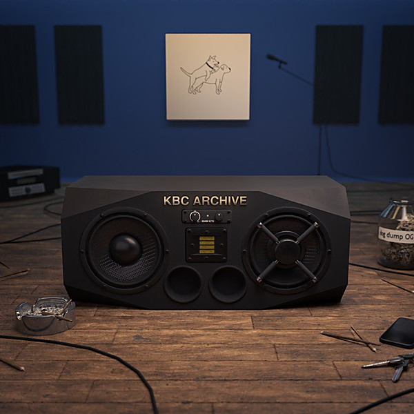

# K B C

By **KBC Band**

## Album Data

- **Catalog:** Beets
- **Format:** Digital, Album
- **Album:** K B C
- **Artist:** Kbc Band
- **Albumartist:** KBC Band
- **Genre:** Psychedelic Rock
- **MusicBrainz Album Artist ID:** 
- **MusicBrainz Album ID:** 
- **MusicBrainz Release Group ID:** 
- **Year:** 1987
- **Catalog #:** 
- **Label:** Arista
- **Total Tracks:** 00

## Album Tracks

### Track 01 - Mariel

- **Artist:** KBC
- **Format:** MP3
- **Genre:** Glitch
- **Length:** 4:36
- **MusicBrainz Track ID:** 
- **Title:** Mariel
- **Track:** 01
- **Year:** 1987

### Track 02 - It's Not You, It's Not Me

- **Artist:** KBC
- **Format:** MP3
- **Genre:** Glitch
- **Length:** 3:46
- **MusicBrainz Track ID:** 
- **Title:** It's Not You, It's Not Me
- **Track:** 02
- **Year:** 1987

### Track 03 - Hold Me

- **Artist:** KBC
- **Format:** MP3
- **Genre:** Glitch
- **Length:** 6:00
- **MusicBrainz Track ID:** 
- **Title:** Hold Me
- **Track:** 03
- **Year:** 1987

### Track 04 - America

- **Artist:** KBC
- **Format:** MP3
- **Genre:** Glitch
- **Length:** 6:19
- **MusicBrainz Track ID:** 
- **Title:** America
- **Track:** 04
- **Year:** 1987

### Track 05 - No More Heartaches

- **Artist:** KBC
- **Format:** MP3
- **Genre:** Glitch
- **Length:** 3:46
- **MusicBrainz Track ID:** 
- **Title:** No More Heartaches
- **Track:** 05
- **Year:** 1987

### Track 06 - Wrecking Crew

- **Artist:** KBC
- **Format:** MP3
- **Genre:** Glitch
- **Length:** 3:46
- **MusicBrainz Track ID:** 
- **Title:** Wrecking Crew
- **Track:** 06
- **Year:** 1987

### Track 07 - When Love Comes

- **Artist:** KBC
- **Format:** MP3
- **Genre:** Glitch
- **Length:** 4:24
- **MusicBrainz Track ID:** 
- **Title:** When Love Comes
- **Track:** 07
- **Year:** 1987

### Track 08 - Dream Motorcycle

- **Artist:** KBC
- **Format:** MP3
- **Genre:** Glitch
- **Length:** 3:53
- **MusicBrainz Track ID:** 
- **Title:** Dream Motorcycle
- **Track:** 08
- **Year:** 1987

### Track 09 - Sayonara

- **Artist:** KBC
- **Format:** MP3
- **Genre:** Glitch
- **Length:** 5:01
- **MusicBrainz Track ID:** 
- **Title:** Sayonara
- **Track:** 09
- **Year:** 1987

