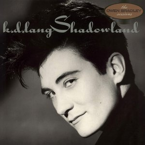

# Shadowland

By **k.d. lang**

## Album Data

- **Catalog:** Beets
- **Format:** Digital, Album
- **Album:** Shadowland
- **Artist:** K.d. Lang
- **Albumartist:** k.d. lang
- **Genre:** Jazz
- **MusicBrainz Album Artist ID:** [675c1c5e-5625-4a5e-97a2-b02aab5db2fc](https://musicbrainz.org/artist/675c1c5e-5625-4a5e-97a2-b02aab5db2fc)
- **MusicBrainz Album ID:** [47f6a493-6f92-43b2-b898-b3237c5662cf](https://musicbrainz.org/release/47f6a493-6f92-43b2-b898-b3237c5662cf)
- **MusicBrainz Release Group ID:** [054a2fdf-1357-3dbf-89c3-af8f11735dda](https://musicbrainz.org/release-group/054a2fdf-1357-3dbf-89c3-af8f11735dda)
- **Year:** 1988
- **Catalog #:** CD 25724
- **Label:** Sire Records
- **Total Tracks:** 12

## Album Tracks

### Track 01 - Western Stars

- **Artist:** k.d. lang
- **Format:** ALAC
- **Genre:** Alternative Country
- **Length:** 3:15
- **MusicBrainz Track ID:** [723e25cd-0e5c-4d1f-b176-93ce3ca83267](https://musicbrainz.org/recording/723e25cd-0e5c-4d1f-b176-93ce3ca83267)
- **Title:** Western Stars
- **Track:** 01
- **Year:** 1988

### Track 02 - Lock, Stock and Teardrops

- **Artist:** k.d. lang
- **Format:** ALAC
- **Genre:** Country
- **Length:** 3:32
- **MusicBrainz Track ID:** [6946de64-95c6-4510-b532-a2ffaf20fa6f](https://musicbrainz.org/recording/6946de64-95c6-4510-b532-a2ffaf20fa6f)
- **Title:** Lock, Stock and Teardrops
- **Track:** 02
- **Year:** 1988

### Track 03 - Sugar Moon

- **Artist:** k.d. lang
- **Format:** ALAC
- **Genre:** Alternative Country
- **Length:** 2:28
- **MusicBrainz Track ID:** [b362f61c-453c-4707-a028-cd3cc59e2b2f](https://musicbrainz.org/recording/b362f61c-453c-4707-a028-cd3cc59e2b2f)
- **Title:** Sugar Moon
- **Track:** 03
- **Year:** 1988

### Track 04 - I Wish I Didn't Love You So

- **Artist:** k.d. lang
- **Format:** ALAC
- **Genre:** Alternative Country
- **Length:** 3:09
- **MusicBrainz Track ID:** [6b874604-cf8c-4254-9c49-092d55fb34f9](https://musicbrainz.org/recording/6b874604-cf8c-4254-9c49-092d55fb34f9)
- **Title:** I Wish I Didn't Love You So
- **Track:** 04
- **Year:** 1988

### Track 05 - (Waltz Me) Once Again Around the Dance Floor

- **Artist:** k.d. lang
- **Format:** ALAC
- **Genre:** Americana
- **Length:** 2:38
- **MusicBrainz Track ID:** [744b6749-2c4a-4928-8aae-a2889c81229e](https://musicbrainz.org/recording/744b6749-2c4a-4928-8aae-a2889c81229e)
- **Title:** (Waltz Me) Once Again Around the Dance Floor
- **Track:** 05
- **Year:** 1988

### Track 06 - Black Coffee

- **Artist:** k.d. lang
- **Format:** ALAC
- **Genre:** Soft Rock
- **Length:** 3:20
- **MusicBrainz Track ID:** [990a3ed6-c2d6-42cc-a842-830567970522](https://musicbrainz.org/recording/990a3ed6-c2d6-42cc-a842-830567970522)
- **Title:** Black Coffee
- **Track:** 06
- **Year:** 1988

### Track 07 - Shadowland

- **Artist:** k.d. lang
- **Format:** ALAC
- **Genre:** Alternative Country
- **Length:** 2:31
- **MusicBrainz Track ID:** [bb6792fd-47db-4226-a7ca-a24581fd6240](https://musicbrainz.org/recording/bb6792fd-47db-4226-a7ca-a24581fd6240)
- **Title:** Shadowland
- **Track:** 07
- **Year:** 1988

### Track 08 - Don't Let the Stars Get in Your Eyes

- **Artist:** k.d. lang
- **Format:** ALAC
- **Genre:** Alternative Country
- **Length:** 2:23
- **MusicBrainz Track ID:** [903ed0dc-4616-4c7d-9d28-341d4b6b9e38](https://musicbrainz.org/recording/903ed0dc-4616-4c7d-9d28-341d4b6b9e38)
- **Title:** Don't Let the Stars Get in Your Eyes
- **Track:** 08
- **Year:** 1988

### Track 09 - Tears Don't Care Who Cries Them

- **Artist:** k.d. lang
- **Format:** ALAC
- **Genre:** Alternative Country
- **Length:** 3:06
- **MusicBrainz Track ID:** [ff24e1a6-e70e-4c40-9849-4e7de74c6833](https://musicbrainz.org/recording/ff24e1a6-e70e-4c40-9849-4e7de74c6833)
- **Title:** Tears Don't Care Who Cries Them
- **Track:** 09
- **Year:** 1988

### Track 10 - I'm Down to My Last Cigarette

- **Artist:** k.d. lang
- **Format:** ALAC
- **Genre:** Alternative Country
- **Length:** 2:49
- **MusicBrainz Track ID:** [963abb13-06ba-40ee-bb6a-37418914909f](https://musicbrainz.org/recording/963abb13-06ba-40ee-bb6a-37418914909f)
- **Title:** I'm Down to My Last Cigarette
- **Track:** 10
- **Year:** 1988

### Track 11 - Busy Being Blue

- **Artist:** k.d. lang
- **Format:** ALAC
- **Genre:** Alternative Country
- **Length:** 3:43
- **MusicBrainz Track ID:** [fe21cc36-c541-4e84-992d-513d6c93dcd1](https://musicbrainz.org/recording/fe21cc36-c541-4e84-992d-513d6c93dcd1)
- **Title:** Busy Being Blue
- **Track:** 11
- **Year:** 1988

### Track 12 - Honky Tonk Angels' Medley

- **Artist:** k.d. lang
- **Format:** ALAC
- **Genre:** Alternative Country
- **Length:** 2:55
- **MusicBrainz Track ID:** [9a4fa6f3-222b-44a8-8f88-3122f3d0b37c](https://musicbrainz.org/recording/9a4fa6f3-222b-44a8-8f88-3122f3d0b37c)
- **Title:** Honky Tonk Angels' Medley
- **Track:** 12
- **Year:** 1988

