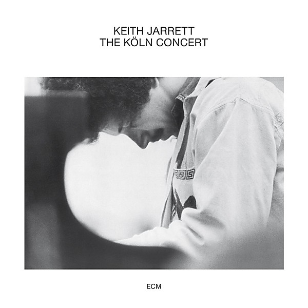

# The Köln Concert

By **Keith Jarrett**

## Album Data

- **Catalog:** Beets
- **Format:** Digital, Album
- **Album:** The Köln Concert
- **Artist:** Keith Jarrett
- **Albumartist:** Keith Jarrett
- **Genre:** Jazz
- **MusicBrainz Album Artist ID:** 
- **MusicBrainz Album ID:** 
- **MusicBrainz Release Group ID:** 
- **Year:** 1975
- **Catalog #:** 
- **Label:** 
- **Total Tracks:** 04

## Album Tracks

### Track 01 - Piste 01

- **Artist:** Keith Jarrett
- **Format:** ALAC
- **Genre:** Jazz
- **Length:** 26:01
- **MusicBrainz Track ID:** 
- **Title:** Piste 01
- **Track:** 01
- **Year:** 1975

### Track 02 - Piste 02

- **Artist:** Keith Jarrett
- **Format:** ALAC
- **Genre:** Jazz
- **Length:** 14:54
- **MusicBrainz Track ID:** 
- **Title:** Piste 02
- **Track:** 02
- **Year:** 1975

### Track 03 - Piste 03

- **Artist:** Keith Jarrett
- **Format:** ALAC
- **Genre:** Jazz
- **Length:** 18:13
- **MusicBrainz Track ID:** 
- **Title:** Piste 03
- **Track:** 03
- **Year:** 1975

### Track 04 - Piste 04

- **Artist:** Keith Jarrett
- **Format:** ALAC
- **Genre:** Jazz
- **Length:** 6:56
- **MusicBrainz Track ID:** 
- **Title:** Piste 04
- **Track:** 04
- **Year:** 1975

