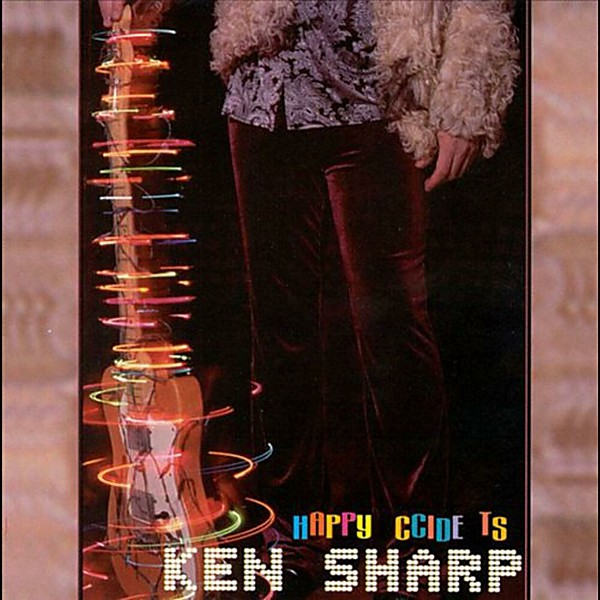

# Happy Accidents

By **Ken Sharp**

## Album Data

- **Catalog:** Beets
- **Format:** Digital, Album
- **Album:** Happy Accidents
- **Artist:** Ken Sharp
- **Albumartist:** Ken Sharp
- **Genre:** Power Pop
- **MusicBrainz Album Artist ID:** 
- **MusicBrainz Album ID:** 
- **MusicBrainz Release Group ID:** 
- **Year:** 2000
- **Catalog #:** 
- **Label:** 
- **Total Tracks:** 13

## Album Tracks

### Track 01 - Hello Hello

- **Artist:** Ken Sharp
- **Format:** ALAC
- **Genre:** Power Pop
- **Length:** 0:47
- **MusicBrainz Track ID:** [6a5ab8f9-ee83-431c-9a9e-fecfc69a8d42](https://musicbrainz.org/recording/6a5ab8f9-ee83-431c-9a9e-fecfc69a8d42)
- **Title:** Hello Hello
- **Track:** 01
- **Year:** 2007

### Track 02 - The Man Who Couldn’t Be Wrong

- **Artist:** Ken Sharp
- **Format:** ALAC
- **Genre:** Power Pop
- **Length:** 3:47
- **MusicBrainz Track ID:** [f39bd857-7226-4fb1-b280-0910b231ad62](https://musicbrainz.org/recording/f39bd857-7226-4fb1-b280-0910b231ad62)
- **Title:** The Man Who Couldn’t Be Wrong
- **Track:** 02
- **Year:** 2007

### Track 03 - Better Every Day

- **Artist:** Ken Sharp
- **Format:** ALAC
- **Genre:** Power Pop
- **Length:** 3:27
- **MusicBrainz Track ID:** [f91be37d-41c7-4825-96b9-38188ad85d32](https://musicbrainz.org/recording/f91be37d-41c7-4825-96b9-38188ad85d32)
- **Title:** Better Every Day
- **Track:** 03
- **Year:** 2007

### Track 04 - Melody Hill

- **Artist:** Ken Sharp
- **Format:** ALAC
- **Genre:** Power Pop
- **Length:** 2:53
- **MusicBrainz Track ID:** [d0b62012-9a75-4747-9ddd-3b8ed58aabfa](https://musicbrainz.org/recording/d0b62012-9a75-4747-9ddd-3b8ed58aabfa)
- **Title:** Melody Hill
- **Track:** 04
- **Year:** 2007

### Track 05 - New Attitude

- **Artist:** Ken Sharp
- **Format:** ALAC
- **Genre:** Power Pop
- **Length:** 4:02
- **MusicBrainz Track ID:** [bd494b83-03df-4b1b-8b45-2607253e1021](https://musicbrainz.org/recording/bd494b83-03df-4b1b-8b45-2607253e1021)
- **Title:** New Attitude
- **Track:** 05
- **Year:** 2007

### Track 06 - Orange Cellophane

- **Artist:** Ken Sharp
- **Format:** ALAC
- **Genre:** Power Pop
- **Length:** 3:54
- **MusicBrainz Track ID:** [31ce1c1e-d7f5-47a0-938b-48e02ff8bdd4](https://musicbrainz.org/recording/31ce1c1e-d7f5-47a0-938b-48e02ff8bdd4)
- **Title:** Orange Cellophane
- **Track:** 06
- **Year:** 2007

### Track 07 - So Simple Radio

- **Artist:** Ken Sharp
- **Format:** ALAC
- **Genre:** Power Pop
- **Length:** 3:10
- **MusicBrainz Track ID:** [0e421976-dc13-4b49-8b33-d4886677fdb0](https://musicbrainz.org/recording/0e421976-dc13-4b49-8b33-d4886677fdb0)
- **Title:** So Simple Radio
- **Track:** 07
- **Year:** 2007

### Track 08 - Candy

- **Artist:** Ken Sharp
- **Format:** ALAC
- **Genre:** Power Pop
- **Length:** 3:47
- **MusicBrainz Track ID:** [a1bf2a93-c2ca-4945-a49e-084d227eb2fc](https://musicbrainz.org/recording/a1bf2a93-c2ca-4945-a49e-084d227eb2fc)
- **Title:** Candy
- **Track:** 08
- **Year:** 2007

### Track 09 - Get Yourself Together

- **Artist:** Ken Sharp
- **Format:** ALAC
- **Genre:** Power Pop
- **Length:** 4:12
- **MusicBrainz Track ID:** [6b09da64-62ef-4c52-9db9-f7e41211341e](https://musicbrainz.org/recording/6b09da64-62ef-4c52-9db9-f7e41211341e)
- **Title:** Get Yourself Together
- **Track:** 09
- **Year:** 2007

### Track 10 - Rush Rush

- **Artist:** Ken Sharp
- **Format:** ALAC
- **Genre:** Power Pop
- **Length:** 3:51
- **MusicBrainz Track ID:** [a4206a08-f7fb-47f4-a7b2-44df877a2e9d](https://musicbrainz.org/recording/a4206a08-f7fb-47f4-a7b2-44df877a2e9d)
- **Title:** Rush Rush
- **Track:** 10
- **Year:** 2007

### Track 11 - Why Girls Cry

- **Artist:** Ken Sharp
- **Format:** ALAC
- **Genre:** Power Pop
- **Length:** 3:53
- **MusicBrainz Track ID:** [04615a83-1b05-47e2-9c71-36479680120f](https://musicbrainz.org/recording/04615a83-1b05-47e2-9c71-36479680120f)
- **Title:** Why Girls Cry
- **Track:** 11
- **Year:** 2007

### Track 12 - I Got Lost

- **Artist:** Ken Sharp
- **Format:** ALAC
- **Genre:** Power Pop
- **Length:** 4:06
- **MusicBrainz Track ID:** [5d244c32-1eb0-48b1-8307-11bf5536427e](https://musicbrainz.org/recording/5d244c32-1eb0-48b1-8307-11bf5536427e)
- **Title:** I Got Lost
- **Track:** 12
- **Year:** 2007

### Track 13 - …Remember

- **Artist:** Ken Sharp
- **Format:** ALAC
- **Genre:** Power Pop
- **Length:** 1:24
- **MusicBrainz Track ID:** [cd393562-55a2-4ba4-9823-27f97beeaab6](https://musicbrainz.org/recording/cd393562-55a2-4ba4-9823-27f97beeaab6)
- **Title:** …Remember
- **Track:** 13
- **Year:** 2007

## See also

- [Sonic Crayons](Sonic_Crayons.md)
