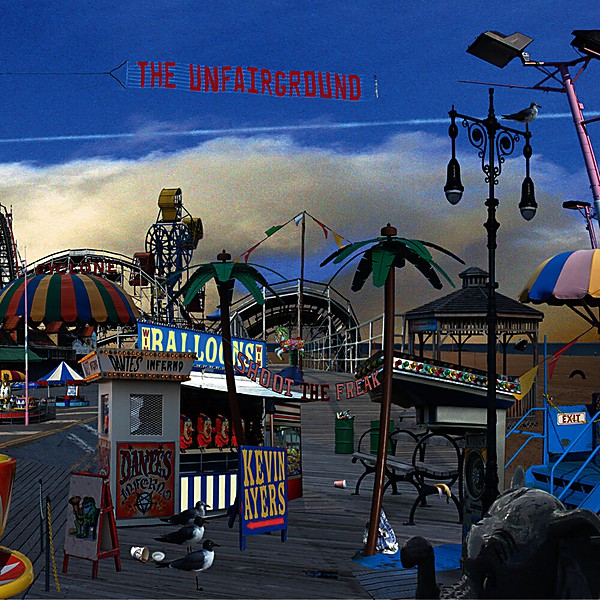

# Unfairground

By **Kevin Ayers**

## Album Data

- **Catalog:** Beets
- **Format:** Digital, Album
- **Album:** Unfairground
- **Artist:** Kevin Ayers
- **Albumartist:** Kevin Ayers
- **Genre:** Rock
- **MusicBrainz Album Artist ID:** 
- **MusicBrainz Album ID:** 
- **MusicBrainz Release Group ID:** 
- **Year:** 2007
- **Catalog #:** 
- **Label:** 
- **Total Tracks:** 10

## Album Tracks

### Track 01 - Only Heaven Knows

- **Artist:** Kevin Ayers
- **Format:** ALAC
- **Genre:** Rock
- **Length:** 2:47
- **MusicBrainz Track ID:** 
- **Title:** Only Heaven Knows
- **Track:** 01
- **Year:** 2007

### Track 02 - Cold Shoulder

- **Artist:** Kevin Ayers
- **Format:** ALAC
- **Genre:** Rock
- **Length:** 3:08
- **MusicBrainz Track ID:** 
- **Title:** Cold Shoulder
- **Track:** 02
- **Year:** 2009

### Track 03 - Baby Come Home

- **Artist:** Kevin Ayers
- **Format:** ALAC
- **Genre:** Rock
- **Length:** 3:14
- **MusicBrainz Track ID:** 
- **Title:** Baby Come Home
- **Track:** 03
- **Year:** 2009

### Track 04 - Wide Awake

- **Artist:** Kevin Ayers
- **Format:** ALAC
- **Genre:** Rock
- **Length:** 3:35
- **MusicBrainz Track ID:** 
- **Title:** Wide Awake
- **Track:** 04
- **Year:** 2009

### Track 05 - Walk On Water

- **Artist:** Kevin Ayers
- **Format:** ALAC
- **Genre:** Rock
- **Length:** 3:47
- **MusicBrainz Track ID:** 
- **Title:** Walk On Water
- **Track:** 05
- **Year:** 2009

### Track 06 - Friends & Strangers

- **Artist:** Kevin Ayers
- **Format:** ALAC
- **Genre:** Rock
- **Length:** 2:53
- **MusicBrainz Track ID:** 
- **Title:** Friends & Strangers
- **Track:** 06
- **Year:** 2009

### Track 07 - Shine A Light

- **Artist:** Kevin Ayers
- **Format:** ALAC
- **Genre:** Rock
- **Length:** 2:35
- **MusicBrainz Track ID:** 
- **Title:** Shine A Light
- **Track:** 07
- **Year:** 2009

### Track 08 - Brainstorm

- **Artist:** Kevin Ayers
- **Format:** ALAC
- **Genre:** Folk Rock
- **Length:** 4:31
- **MusicBrainz Track ID:** 
- **Title:** Brainstorm
- **Track:** 08
- **Year:** 2009

### Track 09 - Unfairground

- **Artist:** Kevin Ayers
- **Format:** ALAC
- **Genre:** Progressive Rock
- **Length:** 3:50
- **MusicBrainz Track ID:** 
- **Title:** Unfairground
- **Track:** 09
- **Year:** 2009

### Track 10 - Run Run Run

- **Artist:** Kevin Ayers
- **Format:** ALAC
- **Genre:** Rock
- **Length:** 3:36
- **MusicBrainz Track ID:** 
- **Title:** Run Run Run
- **Track:** 10
- **Year:** 2009

## See also

- [The Confessions Of Dr. Dream And Other Stories](The_Confessions_Of_Dr_Dream_And_Other_Stories.md)
