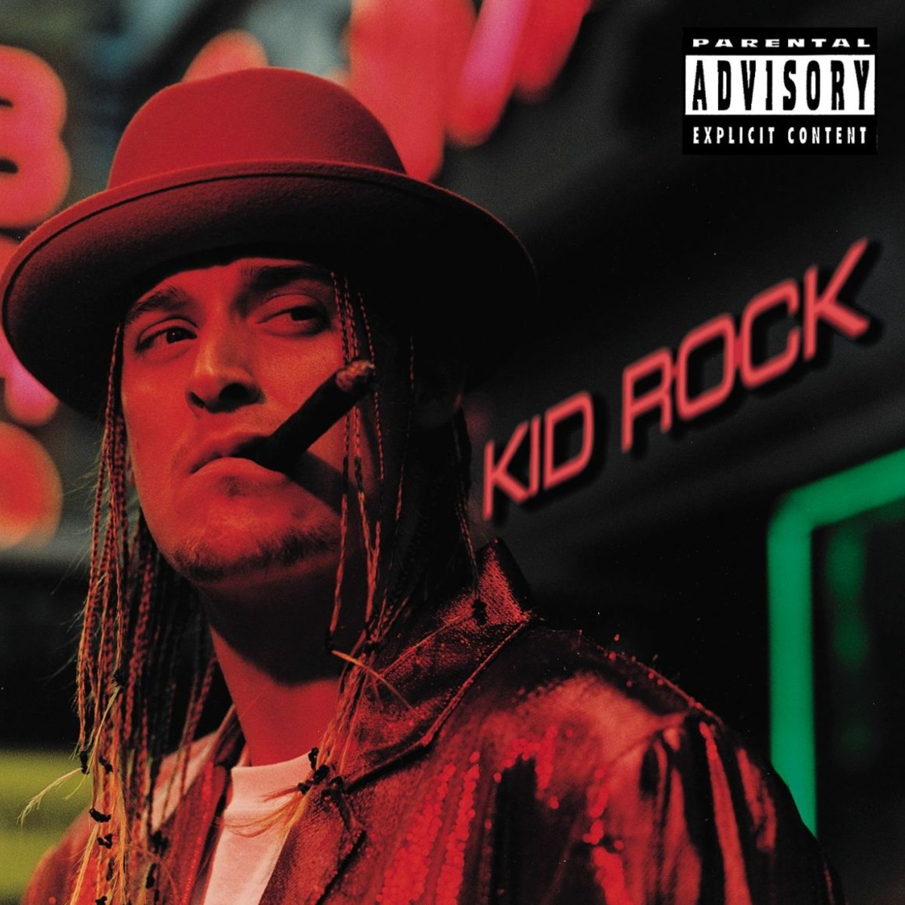

# Devil Without a Cause

By **Kid Rock**

## Album Data

- **Catalog:** Beets
- **Format:** Digital, Album
- **Album:** Devil Without a Cause
- **Artist:** Kid Rock
- **Albumartist:** Kid Rock
- **Genre:** Rap Metal
- **MusicBrainz Album Artist ID:** [ad0ecd8b-805e-406e-82cb-5b00c3a3a29e](https://musicbrainz.org/artist/ad0ecd8b-805e-406e-82cb-5b00c3a3a29e)
- **MusicBrainz Album ID:** [1837662d-ea85-484c-993f-0a2862ef8c40](https://musicbrainz.org/release/1837662d-ea85-484c-993f-0a2862ef8c40)
- **MusicBrainz Release Group ID:** [4a8ff174-fcd8-38d4-8ed3-a46334759251](https://musicbrainz.org/release-group/4a8ff174-fcd8-38d4-8ed3-a46334759251)
- **Year:** 2008
- **Catalog #:** 
- **Label:** Atlantic
- **Total Tracks:** 14

## Album Tracks

### Track 01 - Bawitdaba

- **Artist:** Kid Rock
- **Format:** MP3
- **Genre:** Rapcore
- **Length:** 4:36
- **MusicBrainz Track ID:** [bd5fc9d3-bd67-4c0e-916b-cbaf6fbc12fb](https://musicbrainz.org/recording/bd5fc9d3-bd67-4c0e-916b-cbaf6fbc12fb)
- **Title:** Bawitdaba
- **Track:** 01
- **Year:** 2008

### Track 02 - Cowboy

- **Artist:** Kid Rock
- **Format:** MP3
- **Genre:** Rapcore
- **Length:** 4:20
- **MusicBrainz Track ID:** [4de3d429-cb00-4f54-b01d-b02290ea9b8e](https://musicbrainz.org/recording/4de3d429-cb00-4f54-b01d-b02290ea9b8e)
- **Title:** Cowboy
- **Track:** 02
- **Year:** 2008

### Track 03 - Devil Without a Cause

- **Artist:** Kid Rock
- **Format:** MP3
- **Genre:** Rapcore
- **Length:** 5:36
- **MusicBrainz Track ID:** [b8679761-d9f5-4e6f-b553-5b2388347ade](https://musicbrainz.org/recording/b8679761-d9f5-4e6f-b553-5b2388347ade)
- **Title:** Devil Without a Cause
- **Track:** 03
- **Year:** 2008

### Track 04 - I Am the Bullgod

- **Artist:** Kid Rock
- **Format:** MP3
- **Genre:** Rapcore
- **Length:** 4:53
- **MusicBrainz Track ID:** [1d063565-7496-44d8-931c-078ce0e2604f](https://musicbrainz.org/recording/1d063565-7496-44d8-931c-078ce0e2604f)
- **Title:** I Am the Bullgod
- **Track:** 04
- **Year:** 2008

### Track 05 - Roving Gangster (Rollin’)

- **Artist:** Kid Rock
- **Format:** MP3
- **Genre:** Rap Metal
- **Length:** 4:30
- **MusicBrainz Track ID:** [29adc5fb-b4b2-4cc3-b4e7-e377b4c5b705](https://musicbrainz.org/recording/29adc5fb-b4b2-4cc3-b4e7-e377b4c5b705)
- **Title:** Roving Gangster (Rollin’)
- **Track:** 05
- **Year:** 2008

### Track 06 - Wasting Time

- **Artist:** Kid Rock
- **Format:** MP3
- **Genre:** Rapcore
- **Length:** 4:06
- **MusicBrainz Track ID:** [a3a7e4d9-6a6e-4a29-9424-7b60bd930325](https://musicbrainz.org/recording/a3a7e4d9-6a6e-4a29-9424-7b60bd930325)
- **Title:** Wasting Time
- **Track:** 06
- **Year:** 2008

### Track 07 - Welcome 2 the Party (Ode 2 the Old School)

- **Artist:** Kid Rock
- **Format:** MP3
- **Genre:** Rapcore
- **Length:** 5:16
- **MusicBrainz Track ID:** [6e4a095f-be99-4e3f-ae3c-fcc787524706](https://musicbrainz.org/recording/6e4a095f-be99-4e3f-ae3c-fcc787524706)
- **Title:** Welcome 2 the Party (Ode 2 the Old School)
- **Track:** 07
- **Year:** 2008

### Track 08 - I Got One for Ya’

- **Artist:** Kid Rock
- **Format:** MP3
- **Genre:** Rap Metal
- **Length:** 3:53
- **MusicBrainz Track ID:** [35f0c7de-8360-4025-a1f9-0f1cc82b7f46](https://musicbrainz.org/recording/35f0c7de-8360-4025-a1f9-0f1cc82b7f46)
- **Title:** I Got One for Ya’
- **Track:** 08
- **Year:** 2008

### Track 09 - Somebody’s Gotta Feel This

- **Artist:** Kid Rock
- **Format:** MP3
- **Genre:** Rap Metal
- **Length:** 3:09
- **MusicBrainz Track ID:** [b6fc0fc8-e8eb-4c50-ad72-ae00562888d8](https://musicbrainz.org/recording/b6fc0fc8-e8eb-4c50-ad72-ae00562888d8)
- **Title:** Somebody’s Gotta Feel This
- **Track:** 09
- **Year:** 2008

### Track 10 - Fist of Rage

- **Artist:** Kid Rock
- **Format:** MP3
- **Genre:** Rapcore
- **Length:** 3:25
- **MusicBrainz Track ID:** [b0a938a6-8443-4bdd-80cb-d1f77a746887](https://musicbrainz.org/recording/b0a938a6-8443-4bdd-80cb-d1f77a746887)
- **Title:** Fist of Rage
- **Track:** 10
- **Year:** 2008

### Track 11 - Only God Knows Why

- **Artist:** Kid Rock
- **Format:** MP3
- **Genre:** Rap Metal
- **Length:** 5:30
- **MusicBrainz Track ID:** [43e217d1-4ddc-4774-a6e4-e738761d8d35](https://musicbrainz.org/recording/43e217d1-4ddc-4774-a6e4-e738761d8d35)
- **Title:** Only God Knows Why
- **Track:** 11
- **Year:** 2008

### Track 12 - Fuck Off

- **Artist:** Kid Rock
- **Format:** MP3
- **Genre:** Rapcore
- **Length:** 4:16
- **MusicBrainz Track ID:** [e85890af-7d84-49ac-bb33-a426dc43ebc6](https://musicbrainz.org/recording/e85890af-7d84-49ac-bb33-a426dc43ebc6)
- **Title:** Fuck Off
- **Track:** 12
- **Year:** 2008

### Track 13 - Where U at Rock

- **Artist:** Kid Rock
- **Format:** MP3
- **Genre:** Rapcore
- **Length:** 6:35
- **MusicBrainz Track ID:** [980cb28b-4193-4f2f-bdde-169d5d4945af](https://musicbrainz.org/recording/980cb28b-4193-4f2f-bdde-169d5d4945af)
- **Title:** Where U at Rock
- **Track:** 13
- **Year:** 2008

### Track 14 - Black Chick, White Guy / I Am the Bullgod

- **Artist:** Kid Rock
- **Format:** MP3
- **Genre:** Rap Metal
- **Length:** 7:09
- **MusicBrainz Track ID:** [985561b3-4239-4854-a875-c01f37dfd2f2](https://musicbrainz.org/recording/985561b3-4239-4854-a875-c01f37dfd2f2)
- **Title:** Black Chick, White Guy / I Am the Bullgod
- **Track:** 14
- **Year:** 2008

## See also

- [Roon: Devil Without a Cause](../../Roon/Kid_Rock/Devil_Without_a_Cause.md)
- [Vinyl: Devil Without A Cause](../../Vinyl/Kid_Rock/Devil_Without_A_Cause.md)
- [Vinyl: ](../../Vinyl/Kid_Rock/Kid_Rock.md)
