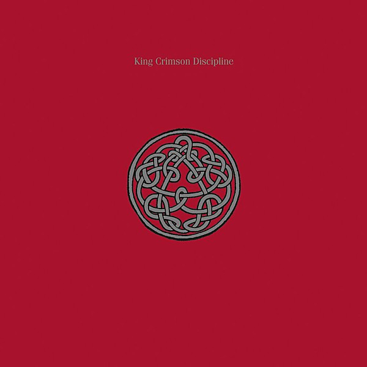

# Discipline

By **King Crimson**

## Album Data

- **Catalog:** Beets
- **Format:** Digital, Album
- **Album:** Discipline
- **Artist:** King Crimson
- **Albumartist:** King Crimson
- **Genre:** Progressive Rock
- **MusicBrainz Album Artist ID:** [b38225b8-8e5f-42aa-bcdc-7bae5b5bdab3](https://musicbrainz.org/artist/b38225b8-8e5f-42aa-bcdc-7bae5b5bdab3)
- **MusicBrainz Album ID:** [09a518d4-8194-3a97-b81f-535eecd839d7](https://musicbrainz.org/release/09a518d4-8194-3a97-b81f-535eecd839d7)
- **MusicBrainz Release Group ID:** [d498c31d-3b72-3748-a142-df0bf774a920](https://musicbrainz.org/release-group/d498c31d-3b72-3748-a142-df0bf774a920)
- **Year:** 1989
- **Catalog #:** 
- **Label:** 
- **Total Tracks:** 00

## Album Tracks

### Track 00 - 00 - KC_DISCIPLINE 1

- **Artist:** King Crimson
- **Format:** AAC
- **Genre:** Progressive Rock
- **Length:** 38:04
- **MusicBrainz Track ID:** 
- **Title:** 00 - KC_DISCIPLINE 1
- **Track:** 00
- **Year:** 1981

### Track 00 - 00 - KC_DISCIPLINE 2

- **Artist:** King Crimson
- **Format:** AAC
- **Genre:** Progressive Rock
- **Length:** 42:06
- **MusicBrainz Track ID:** 
- **Title:** 00 - KC_DISCIPLINE 2
- **Track:** 00
- **Year:** 1981

### Track 00 - 00 - KC_DISCIPLINE 4

- **Artist:** King Crimson
- **Format:** AAC
- **Genre:** Progressive Rock
- **Length:** 38:12
- **MusicBrainz Track ID:** 
- **Title:** 00 - KC_DISCIPLINE 4
- **Track:** 00
- **Year:** 1981

### Track 00 - 00 - KC_DISCIPLINE 5

- **Artist:** King Crimson
- **Format:** AAC
- **Genre:** Progressive Rock
- **Length:** 16:21
- **MusicBrainz Track ID:** 
- **Title:** 00 - KC_DISCIPLINE 5
- **Track:** 00
- **Year:** 1981

### Track 01 - Elephant Talk

- **Artist:** King Crimson
- **Format:** ALAC
- **Genre:** Progressive Rock
- **Length:** 4:43
- **MusicBrainz Track ID:** 
- **Title:** Elephant Talk
- **Track:** 01
- **Year:** 1981

### Track 02 - Frame by Frame

- **Artist:** King Crimson
- **Format:** ALAC
- **Genre:** Progressive Rock
- **Length:** 5:09
- **MusicBrainz Track ID:** 
- **Title:** Frame by Frame
- **Track:** 02
- **Year:** 1981

### Track 03 - Matte Kudasai

- **Artist:** King Crimson
- **Format:** ALAC
- **Genre:** Progressive Rock
- **Length:** 3:47
- **MusicBrainz Track ID:** 
- **Title:** Matte Kudasai
- **Track:** 03
- **Year:** 1981

### Track 04 - Indiscipline

- **Artist:** King Crimson
- **Format:** ALAC
- **Genre:** Progressive Rock
- **Length:** 4:34
- **MusicBrainz Track ID:** 
- **Title:** Indiscipline
- **Track:** 04
- **Year:** 1981

### Track 05 - Thela Hun Ginjeet

- **Artist:** King Crimson
- **Format:** ALAC
- **Genre:** Progressive Rock
- **Length:** 6:25
- **MusicBrainz Track ID:** 
- **Title:** Thela Hun Ginjeet
- **Track:** 05
- **Year:** 1981

### Track 06 - The Sheltering Sky

- **Artist:** King Crimson
- **Format:** ALAC
- **Genre:** Progressive Rock
- **Length:** 8:22
- **MusicBrainz Track ID:** 
- **Title:** The Sheltering Sky
- **Track:** 06
- **Year:** 1981

### Track 07 - Discipline

- **Artist:** King Crimson
- **Format:** ALAC
- **Genre:** Progressive Rock
- **Length:** 5:10
- **MusicBrainz Track ID:** 
- **Title:** Discipline
- **Track:** 07
- **Year:** 1981

### Track 08 - A selection of Adrian's vocal loops

- **Artist:** King Crimson
- **Format:** ALAC
- **Genre:** Progressive Rock
- **Length:** 0:18
- **MusicBrainz Track ID:** 
- **Title:** A selection of Adrian's vocal loops
- **Track:** 08
- **Year:** 1981

### Track 09 - A selection of Adrian's vocal loops

- **Artist:** King Crimson
- **Format:** ALAC
- **Genre:** Progressive Rock
- **Length:** 0:33
- **MusicBrainz Track ID:** 
- **Title:** A selection of Adrian's vocal loops
- **Track:** 09
- **Year:** 1981

### Track 10 - The Sheltering Sky (Alternate Mix—Steven Wilson)

- **Artist:** King Crimson
- **Format:** ALAC
- **Genre:** Progressive Rock
- **Length:** 8:26
- **MusicBrainz Track ID:** 
- **Title:** The Sheltering Sky (Alternate Mix—Steven Wilson)
- **Track:** 10
- **Year:** 1981

### Track 11 - Thela Hun Ginjeet (Alternate Mix—Steven Wilson)

- **Artist:** King Crimson
- **Format:** ALAC
- **Genre:** Progressive Rock
- **Length:** 6:31
- **MusicBrainz Track ID:** 
- **Title:** Thela Hun Ginjeet (Alternate Mix—Steven Wilson)
- **Track:** 11
- **Year:** 1981

## See also

- [Discipline (40th Anniversary Series)](Discipline_40th_Anniversary_Series.md)
- [In The Court Of The Crimson King (40th Anniversary Series)](In_The_Court_Of_The_Crimson_King_40th_Anniversary_Series.md)
- [In The Court Of The Crimson King (An Observation By King Crimson)](In_The_Court_Of_The_Crimson_King_An_Observation_By_King_Crimson.md)
- [In the Wake of Poseidon](In_the_Wake_of_Poseidon.md)
- [Larks' Tongues In Aspic (40th Anniversary Series)](Larks_Tongues_In_Aspic_40th_Anniversary_Series.md)
- [Lizard (40th Anniversary Series)](Lizard_40th_Anniversary_Series.md)
- [CD: In The Court Of The Crimson King - An Observation By King Crimson (Disc 1)](../../CD/King_Crimson/In_The_Court_Of_The_Crimson_King_-_An_Observation_By_King_Crimson_Disc_1.md)
- [CD: ](../../CD/King_Crimson/King_Crimson.md)
- [CD: Larks' Tongues In Aspic (40th Anniversary Edition)](../../CD/King_Crimson/Larks_Tongues_In_Aspic_40th_Anniversary_Edition.md)
- [CD: Lizard](../../CD/King_Crimson/Lizard.md)
- [CD: "On (And Off) the Road](../../CD/King_Crimson/On_And_Off_the_Road-_Studio__Live__Audio_and_Audio-Visual_1981-1984_Disc_1.md)
- [Roon: Discipline](../../Roon/King_Crimson/Discipline.md)
- [Roon: Earthbound (Live)](../../Roon/King_Crimson/Earthbound_Live.md)
- [Roon: Fracture (KC50, Vol. 20) (Steven Wilson Live Mix)](../../Roon/King_Crimson/Fracture_KC50__Vol_20_Steven_Wilson_Live_Mix.md)
- [Roon: In The Court Of The Crimson King](../../Roon/King_Crimson/In_The_Court_Of_The_Crimson_King.md)
- [Roon: Larks' Tongues In Aspic (Expanded & Remastered Original Album Mix)](../../Roon/King_Crimson/Larks_Tongues_In_Aspic_Expanded_and_Remastered_Original_Album_Mix.md)
- [Roon: Lizard](../../Roon/King_Crimson/Lizard.md)
- [Roon: Starless And Bible Black](../../Roon/King_Crimson/Starless_And_Bible_Black.md)
- [Roon: USA (Live)](../../Roon/King_Crimson/USA_Live.md)
- [Vinyl: In The Court Of The Crimson King](../../Vinyl/King_Crimson/In_The_Court_Of_The_Crimson_King.md)
- [Vinyl: ](../../Vinyl/King_Crimson/King_Crimson.md)
