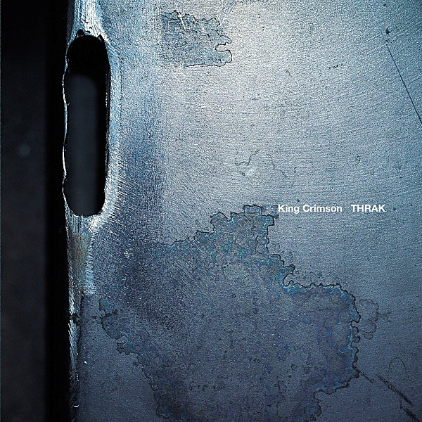

# Discipline (40th Anniversary Series)

By **King Crimson**

## Album Data

- **Catalog:** Beets
- **Format:** Digital, Album
- **Album:** Discipline (40th Anniversary Series)
- **Artist:** King Crimson
- **Albumartist:** King Crimson
- **Genre:** Progressive Rock
- **MusicBrainz Album Artist ID:** 
- **MusicBrainz Album ID:** 
- **MusicBrainz Release Group ID:** 
- **Year:** 1981
- **Catalog #:** 
- **Label:** 
- **Total Tracks:** 00

## Album Tracks

### Track 00 - 00 - 21st_Century_Schizoid_Man_Hyde_Park_1969

- **Artist:** King Crimson
- **Format:** AAC
- **Genre:** Progressive Rock
- **Length:** 1:45
- **MusicBrainz Track ID:** 
- **Title:** 00 - 21st_Century_Schizoid_Man_Hyde_Park_1969
- **Track:** 00
- **Year:** 1969

### Track 00 - 00 - In_The_Court_Of_The_Crimson_King_5.1_pt1

- **Artist:** King Crimson
- **Format:** AAC
- **Genre:** Progressive Rock
- **Length:** 40:44
- **MusicBrainz Track ID:** 
- **Title:** 00 - In_The_Court_Of_The_Crimson_King_5.1_pt1
- **Track:** 00
- **Year:** 1969

### Track 00 - 00 - In_The_Court_Of_The_Crimson_King_5.1_pt2

- **Artist:** King Crimson
- **Format:** AAC
- **Genre:** Progressive Rock
- **Length:** 37:22
- **MusicBrainz Track ID:** 
- **Title:** 00 - In_The_Court_Of_The_Crimson_King_5.1_pt2
- **Track:** 00
- **Year:** 1969

### Track 00 - 00 - In_The_Court_Of_The_Crimson_King_5.1_pt3

- **Artist:** King Crimson
- **Format:** AAC
- **Genre:** Progressive Rock
- **Length:** 30:33
- **MusicBrainz Track ID:** 
- **Title:** 00 - In_The_Court_Of_The_Crimson_King_5.1_pt3
- **Track:** 00
- **Year:** 1969

### Track 01 - 21st Century Schizoid Man (Including ''Mirrors'')

- **Artist:** King Crimson
- **Format:** ALAC
- **Genre:** Progressive Rock
- **Length:** 7:24
- **MusicBrainz Track ID:** 
- **Title:** 21st Century Schizoid Man (Including ''Mirrors'')
- **Track:** 01
- **Year:** 1969

### Track 02 - I Talk To The Wind

- **Artist:** King Crimson
- **Format:** ALAC
- **Genre:** Progressive Rock
- **Length:** 6:00
- **MusicBrainz Track ID:** 
- **Title:** I Talk To The Wind
- **Track:** 02
- **Year:** 1969

### Track 03 - Epitaph (Including ''March For No Reason'' And ''Tomorrow And Tomorrow'')

- **Artist:** King Crimson
- **Format:** ALAC
- **Genre:** Progressive Rock
- **Length:** 8:52
- **MusicBrainz Track ID:** 
- **Title:** Epitaph (Including ''March For No Reason'' And ''Tomorrow And Tomorrow'')
- **Track:** 03
- **Year:** 1969

### Track 04 - Moonchild (Including ''The Dream And ''The Illusion'')

- **Artist:** King Crimson
- **Format:** ALAC
- **Genre:** Progressive Rock
- **Length:** 9:02
- **MusicBrainz Track ID:** 
- **Title:** Moonchild (Including ''The Dream And ''The Illusion'')
- **Track:** 04
- **Year:** 1969

### Track 05 - The Court Of The Crimson King (Including ''The Return Of The Fire Witch'' And ''The Dance Of The Puppets'')

- **Artist:** King Crimson
- **Format:** ALAC
- **Genre:** Progressive Rock
- **Length:** 9:31
- **MusicBrainz Track ID:** 
- **Title:** The Court Of The Crimson King (Including ''The Return Of The Fire Witch'' And ''The Dance Of The Puppets'')
- **Track:** 05
- **Year:** 1969

### Track 06 - Moonchild [Full Version]

- **Artist:** King Crimson
- **Format:** ALAC
- **Genre:** Progressive Rock
- **Length:** 12:15
- **MusicBrainz Track ID:** 
- **Title:** Moonchild [Full Version]
- **Track:** 06
- **Year:** 1969

### Track 07 - I Talk To The Wind [Duo Version]

- **Artist:** King Crimson
- **Format:** ALAC
- **Genre:** Progressive Rock
- **Length:** 4:55
- **MusicBrainz Track ID:** 
- **Title:** I Talk To The Wind [Duo Version]
- **Track:** 07
- **Year:** 1969

### Track 08 - I Talk To The Wind [Alternate Mix]

- **Artist:** King Crimson
- **Format:** ALAC
- **Genre:** Progressive Rock
- **Length:** 6:36
- **MusicBrainz Track ID:** 
- **Title:** I Talk To The Wind [Alternate Mix]
- **Track:** 08
- **Year:** 1969

### Track 09 - Epitaph [Backing Track]

- **Artist:** King Crimson
- **Format:** ALAC
- **Genre:** Progressive Rock
- **Length:** 9:05
- **MusicBrainz Track ID:** 
- **Title:** Epitaph [Backing Track]
- **Track:** 09
- **Year:** 1969

### Track 10 - Wind Session [21st Century Schizoid Man Intro]

- **Artist:** King Crimson
- **Format:** ALAC
- **Genre:** Progressive Rock
- **Length:** 4:31
- **MusicBrainz Track ID:** 
- **Title:** Wind Session [21st Century Schizoid Man Intro]
- **Track:** 10
- **Year:** 1969

## See also

- [Discipline](Discipline.md)
- [In The Court Of The Crimson King (40th Anniversary Series)](In_The_Court_Of_The_Crimson_King_40th_Anniversary_Series.md)
- [In The Court Of The Crimson King (An Observation By King Crimson)](In_The_Court_Of_The_Crimson_King_An_Observation_By_King_Crimson.md)
- [In the Wake of Poseidon](In_the_Wake_of_Poseidon.md)
- [Larks' Tongues In Aspic (40th Anniversary Series)](Larks_Tongues_In_Aspic_40th_Anniversary_Series.md)
- [Lizard (40th Anniversary Series)](Lizard_40th_Anniversary_Series.md)
- [CD: In The Court Of The Crimson King - An Observation By King Crimson (Disc 1)](../../CD/King_Crimson/In_The_Court_Of_The_Crimson_King_-_An_Observation_By_King_Crimson_Disc_1.md)
- [CD: ](../../CD/King_Crimson/King_Crimson.md)
- [CD: Larks' Tongues In Aspic (40th Anniversary Edition)](../../CD/King_Crimson/Larks_Tongues_In_Aspic_40th_Anniversary_Edition.md)
- [CD: Lizard](../../CD/King_Crimson/Lizard.md)
- [CD: "On (And Off) the Road](../../CD/King_Crimson/On_And_Off_the_Road-_Studio__Live__Audio_and_Audio-Visual_1981-1984_Disc_1.md)
- [Roon: Discipline](../../Roon/King_Crimson/Discipline.md)
- [Roon: Earthbound (Live)](../../Roon/King_Crimson/Earthbound_Live.md)
- [Roon: Fracture (KC50, Vol. 20) (Steven Wilson Live Mix)](../../Roon/King_Crimson/Fracture_KC50__Vol_20_Steven_Wilson_Live_Mix.md)
- [Roon: In The Court Of The Crimson King](../../Roon/King_Crimson/In_The_Court_Of_The_Crimson_King.md)
- [Roon: Larks' Tongues In Aspic (Expanded & Remastered Original Album Mix)](../../Roon/King_Crimson/Larks_Tongues_In_Aspic_Expanded_and_Remastered_Original_Album_Mix.md)
- [Roon: Lizard](../../Roon/King_Crimson/Lizard.md)
- [Roon: Starless And Bible Black](../../Roon/King_Crimson/Starless_And_Bible_Black.md)
- [Roon: USA (Live)](../../Roon/King_Crimson/USA_Live.md)
- [Vinyl: In The Court Of The Crimson King](../../Vinyl/King_Crimson/In_The_Court_Of_The_Crimson_King.md)
- [Vinyl: ](../../Vinyl/King_Crimson/King_Crimson.md)
