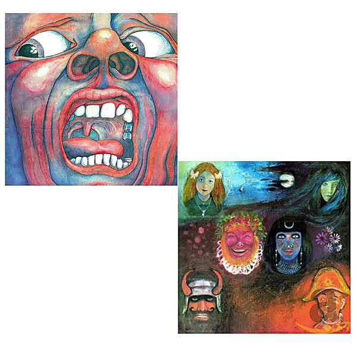

# In The Court Of The Crimson King (40th Anniversary Series)

By **King Crimson**

## Album Data

- **Catalog:** Beets
- **Format:** Digital, Album
- **Album:** In The Court Of The Crimson King (40th Anniversary Series)
- **Artist:** King Crimson
- **Albumartist:** King Crimson
- **Genre:** Progressive Rock
- **MusicBrainz Album Artist ID:** 
- **MusicBrainz Album ID:** 
- **MusicBrainz Release Group ID:** 
- **Year:** 1969
- **Catalog #:** 
- **Label:** 
- **Total Tracks:** 05

## Album Tracks

### Track 01 - 21st Century Schizoid Man (Including “Mirrors”)

- **Artist:** King Crimson
- **Format:** ALAC
- **Genre:** Progressive Rock
- **Length:** 7:24
- **MusicBrainz Track ID:** 
- **Title:** 21st Century Schizoid Man (Including “Mirrors”)
- **Track:** 01
- **Year:** 1969

### Track 03 - Epitaph (Including “March For No Reason” And “Tomorrow And Tomorrow”)

- **Artist:** King Crimson
- **Format:** ALAC
- **Genre:** Progressive Rock
- **Length:** 8:47
- **MusicBrainz Track ID:** 
- **Title:** Epitaph (Including “March For No Reason” And “Tomorrow And Tomorrow”)
- **Track:** 03
- **Year:** 1969

### Track 04 - Moonchild (Including “The Dream” And “The Illusion”)

- **Artist:** King Crimson
- **Format:** ALAC
- **Genre:** Progressive Rock
- **Length:** 12:13
- **MusicBrainz Track ID:** 
- **Title:** Moonchild (Including “The Dream” And “The Illusion”)
- **Track:** 04
- **Year:** 1969

### Track 05 - The Court Of The Crimson King (Including “The Return Of The Fire Witch” And “The Dance Of The Puppets”)

- **Artist:** King Crimson
- **Format:** ALAC
- **Genre:** Progressive Rock
- **Length:** 9:22
- **MusicBrainz Track ID:** 
- **Title:** The Court Of The Crimson King (Including “The Return Of The Fire Witch” And “The Dance Of The Puppets”)
- **Track:** 05
- **Year:** 1969

