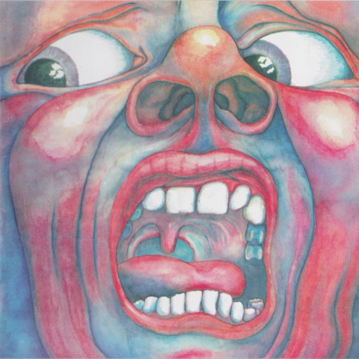

# In The Court Of The Crimson King (An Observation By King Crimson)

By **King Crimson**

## Album Data

- **Catalog:** Beets
- **Format:** Digital, Album
- **Album:** In The Court Of The Crimson King (An Observation By King Crimson)
- **Artist:** King Crimson
- **Albumartist:** King Crimson
- **Genre:** Progressive Rock
- **MusicBrainz Album Artist ID:** 
- **MusicBrainz Album ID:** 
- **MusicBrainz Release Group ID:** 
- **Year:** 1969
- **Catalog #:** DGM0502
- **Label:** Discipline Global Mobile
- **Total Tracks:** 10

## Album Tracks

### Track 01 - Peace

- **Artist:** King Crimson
- **Format:** ALAC
- **Genre:** Progressive Rock
- **Length:** 0:50
- **MusicBrainz Track ID:** [5bfdf595-4a6e-4629-be60-a80ecc262b22](https://musicbrainz.org/recording/5bfdf595-4a6e-4629-be60-a80ecc262b22)
- **Title:** Peace
- **Track:** 01
- **Year:** 2004

### Track 02 - Pictures of a City (including 42nd at Treadmill)

- **Artist:** King Crimson
- **Format:** ALAC
- **Genre:** Progressive Rock
- **Length:** 8:01
- **MusicBrainz Track ID:** [7e96c6a3-c686-4793-8336-9d34bbe2df8b](https://musicbrainz.org/recording/7e96c6a3-c686-4793-8336-9d34bbe2df8b)
- **Title:** Pictures of a City (including 42nd at Treadmill)
- **Track:** 02
- **Year:** 2004

### Track 03 - Cadence and Cascade

- **Artist:** King Crimson
- **Format:** ALAC
- **Genre:** Progressive Rock
- **Length:** 4:37
- **MusicBrainz Track ID:** [f5fa47a9-d423-4d07-a790-03bf4815374b](https://musicbrainz.org/recording/f5fa47a9-d423-4d07-a790-03bf4815374b)
- **Title:** Cadence and Cascade
- **Track:** 03
- **Year:** 2004

### Track 04 - In the Wake of Poseidon (including Libra’s Theme)

- **Artist:** King Crimson
- **Format:** ALAC
- **Genre:** Progressive Rock
- **Length:** 7:56
- **MusicBrainz Track ID:** [0442915a-5d67-4f0e-b080-a542f0622405](https://musicbrainz.org/recording/0442915a-5d67-4f0e-b080-a542f0622405)
- **Title:** In the Wake of Poseidon (including Libra’s Theme)
- **Track:** 04
- **Year:** 2004

### Track 05 - Peace

- **Artist:** King Crimson
- **Format:** ALAC
- **Genre:** Progressive Rock
- **Length:** 1:15
- **MusicBrainz Track ID:** [18276db9-e9cb-4a38-af9c-70ffd3bcdb8b](https://musicbrainz.org/recording/18276db9-e9cb-4a38-af9c-70ffd3bcdb8b)
- **Title:** Peace
- **Track:** 05
- **Year:** 2004

### Track 06 - Cat Food

- **Artist:** King Crimson
- **Format:** ALAC
- **Genre:** Progressive Rock
- **Length:** 4:52
- **MusicBrainz Track ID:** [829e6536-5b68-43b2-a919-f14fd5c3929b](https://musicbrainz.org/recording/829e6536-5b68-43b2-a919-f14fd5c3929b)
- **Title:** Cat Food
- **Track:** 06
- **Year:** 2004

### Track 07 - The Devil’s Triangle (including Merday Morn / Hand of Sceiron / Garden of Worm)

- **Artist:** King Crimson
- **Format:** ALAC
- **Genre:** Progressive Rock
- **Length:** 11:37
- **MusicBrainz Track ID:** [3f8faafa-a731-4c87-a830-08dc67e538b0](https://musicbrainz.org/recording/3f8faafa-a731-4c87-a830-08dc67e538b0)
- **Title:** The Devil’s Triangle (including Merday Morn / Hand of Sceiron / Garden of Worm)
- **Track:** 07
- **Year:** 2004

### Track 08 - Peace

- **Artist:** King Crimson
- **Format:** ALAC
- **Genre:** Progressive Rock
- **Length:** 2:53
- **MusicBrainz Track ID:** [56a39a35-55da-4f5e-9216-bd6ef558e606](https://musicbrainz.org/recording/56a39a35-55da-4f5e-9216-bd6ef558e606)
- **Title:** Peace
- **Track:** 08
- **Year:** 2004

### Track 09 - Cat Food (single version)

- **Artist:** King Crimson
- **Format:** ALAC
- **Genre:** Progressive Rock
- **Length:** 2:47
- **MusicBrainz Track ID:** [6bc4265a-cf94-4dd7-b501-288abbdfdca3](https://musicbrainz.org/recording/6bc4265a-cf94-4dd7-b501-288abbdfdca3)
- **Title:** Cat Food (single version)
- **Track:** 09
- **Year:** 2004

### Track 10 - Groon

- **Artist:** King Crimson
- **Format:** ALAC
- **Genre:** Psychedelic Rock
- **Length:** 3:31
- **MusicBrainz Track ID:** [2fd800e2-f8f4-44ac-bd39-456f95c3afa2](https://musicbrainz.org/recording/2fd800e2-f8f4-44ac-bd39-456f95c3afa2)
- **Title:** Groon
- **Track:** 10
- **Year:** 2004

## See also

- [Discipline (40th Anniversary Series)](Discipline_40th_Anniversary_Series.md)
- [Discipline](Discipline.md)
- [In The Court Of The Crimson King (40th Anniversary Series)](In_The_Court_Of_The_Crimson_King_40th_Anniversary_Series.md)
- [In the Wake of Poseidon](In_the_Wake_of_Poseidon.md)
- [Larks' Tongues In Aspic (40th Anniversary Series)](Larks_Tongues_In_Aspic_40th_Anniversary_Series.md)
- [Lizard (40th Anniversary Series)](Lizard_40th_Anniversary_Series.md)
- [CD: In The Court Of The Crimson King - An Observation By King Crimson (Disc 1)](../../CD/King_Crimson/In_The_Court_Of_The_Crimson_King_-_An_Observation_By_King_Crimson_Disc_1.md)
- [CD: ](../../CD/King_Crimson/King_Crimson.md)
- [CD: Larks' Tongues In Aspic (40th Anniversary Edition)](../../CD/King_Crimson/Larks_Tongues_In_Aspic_40th_Anniversary_Edition.md)
- [CD: Lizard](../../CD/King_Crimson/Lizard.md)
- [CD: "On (And Off) the Road](../../CD/King_Crimson/On_And_Off_the_Road-_Studio__Live__Audio_and_Audio-Visual_1981-1984_Disc_1.md)
- [Roon: Discipline](../../Roon/King_Crimson/Discipline.md)
- [Roon: Earthbound (Live)](../../Roon/King_Crimson/Earthbound_Live.md)
- [Roon: Fracture (KC50, Vol. 20) (Steven Wilson Live Mix)](../../Roon/King_Crimson/Fracture_KC50__Vol_20_Steven_Wilson_Live_Mix.md)
- [Roon: In The Court Of The Crimson King](../../Roon/King_Crimson/In_The_Court_Of_The_Crimson_King.md)
- [Roon: Larks' Tongues In Aspic (Expanded & Remastered Original Album Mix)](../../Roon/King_Crimson/Larks_Tongues_In_Aspic_Expanded_and_Remastered_Original_Album_Mix.md)
- [Roon: Lizard](../../Roon/King_Crimson/Lizard.md)
- [Roon: Starless And Bible Black](../../Roon/King_Crimson/Starless_And_Bible_Black.md)
- [Roon: USA (Live)](../../Roon/King_Crimson/USA_Live.md)
- [Vinyl: In The Court Of The Crimson King](../../Vinyl/King_Crimson/In_The_Court_Of_The_Crimson_King.md)
- [Vinyl: ](../../Vinyl/King_Crimson/King_Crimson.md)
