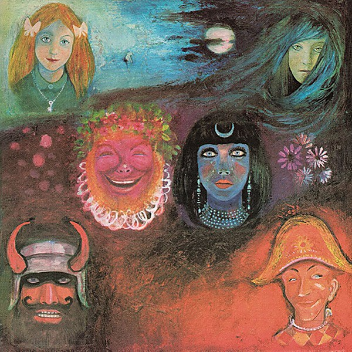

# In the Wake of Poseidon

By **King Crimson**

## Album Data

- **Catalog:** Beets
- **Format:** Digital, Album
- **Album:** In the Wake of Poseidon
- **Artist:** King Crimson
- **Albumartist:** King Crimson
- **Genre:** Progressive Rock
- **MusicBrainz Album Artist ID:** [b38225b8-8e5f-42aa-bcdc-7bae5b5bdab3](https://musicbrainz.org/artist/b38225b8-8e5f-42aa-bcdc-7bae5b5bdab3)
- **MusicBrainz Album ID:** [ee2b839f-9df1-4639-be48-4b906375c30b](https://musicbrainz.org/release/ee2b839f-9df1-4639-be48-4b906375c30b)
- **MusicBrainz Release Group ID:** [ef9dfb95-3217-3006-84e2-92037460eb27](https://musicbrainz.org/release-group/ef9dfb95-3217-3006-84e2-92037460eb27)
- **Year:** 2004
- **Catalog #:** 
- **Label:** 
- **Total Tracks:** 00

## Album Tracks

### Track 00 - 00 - Larks_Tongues_In_Aspic_pt1

- **Artist:** King Crimson
- **Format:** AAC
- **Genre:** Progressive Rock
- **Length:** 46:45
- **MusicBrainz Track ID:** 
- **Title:** 00 - Larks_Tongues_In_Aspic_pt1
- **Track:** 00
- **Year:** 1973

### Track 00 - 00 - Larks_Tongues_In_Aspic_pt2

- **Artist:** King Crimson
- **Format:** AAC
- **Genre:** Progressive Rock
- **Length:** 50:47
- **MusicBrainz Track ID:** 
- **Title:** 00 - Larks_Tongues_In_Aspic_pt2
- **Track:** 00
- **Year:** 1973

### Track 00 - 00 - Larks_Tongues_In_Aspic_Video

- **Artist:** King Crimson
- **Format:** AAC
- **Genre:** Progressive Rock
- **Length:** 47:34
- **MusicBrainz Track ID:** 
- **Title:** 00 - Larks_Tongues_In_Aspic_Video
- **Track:** 00
- **Year:** 1973

### Track 01 - Larks Tongues' In Aspic, Part One

- **Artist:** King Crimson
- **Format:** ALAC
- **Genre:** Progressive Rock
- **Length:** 13:34
- **MusicBrainz Track ID:** 
- **Title:** Larks Tongues' In Aspic, Part One
- **Track:** 01
- **Year:** 1973

### Track 02 - Book Of Saturday

- **Artist:** King Crimson
- **Format:** ALAC
- **Genre:** Progressive Rock
- **Length:** 2:56
- **MusicBrainz Track ID:** 
- **Title:** Book Of Saturday
- **Track:** 02
- **Year:** 1973

### Track 03 - Exiles

- **Artist:** King Crimson
- **Format:** ALAC
- **Genre:** Progressive Rock
- **Length:** 7:40
- **MusicBrainz Track ID:** 
- **Title:** Exiles
- **Track:** 03
- **Year:** 1973

### Track 04 - Easy Money

- **Artist:** King Crimson
- **Format:** ALAC
- **Genre:** Progressive Rock
- **Length:** 7:54
- **MusicBrainz Track ID:** 
- **Title:** Easy Money
- **Track:** 04
- **Year:** 1973

### Track 05 - The Talking Drum

- **Artist:** King Crimson
- **Format:** ALAC
- **Genre:** Progressive Rock
- **Length:** 7:23
- **MusicBrainz Track ID:** 
- **Title:** The Talking Drum
- **Track:** 05
- **Year:** 1973

### Track 06 - Larks' Tongues In Aspic, Part Two

- **Artist:** King Crimson
- **Format:** ALAC
- **Genre:** Progressive Rock
- **Length:** 7:23
- **MusicBrainz Track ID:** 
- **Title:** Larks' Tongues In Aspic, Part Two
- **Track:** 06
- **Year:** 1973

### Track 07 - Larks' Tongues In Aspic, Part One [Alternative Mix]

- **Artist:** King Crimson
- **Format:** ALAC
- **Genre:** Progressive Rock
- **Length:** 11:13
- **MusicBrainz Track ID:** 
- **Title:** Larks' Tongues In Aspic, Part One [Alternative Mix]
- **Track:** 07
- **Year:** 1973

### Track 08 - Book Of Saturday [Alternative Take]

- **Artist:** King Crimson
- **Format:** ALAC
- **Genre:** Progressive Rock
- **Length:** 2:56
- **MusicBrainz Track ID:** 
- **Title:** Book Of Saturday [Alternative Take]
- **Track:** 08
- **Year:** 1973

### Track 09 - The Talking Drum [Alternative Mix]

- **Artist:** King Crimson
- **Format:** ALAC
- **Genre:** Progressive Rock
- **Length:** 6:58
- **MusicBrainz Track ID:** 
- **Title:** The Talking Drum [Alternative Mix]
- **Track:** 09
- **Year:** 1973

## See also

- [Discipline (40th Anniversary Series)](Discipline_40th_Anniversary_Series.md)
- [Discipline](Discipline.md)
- [In The Court Of The Crimson King (40th Anniversary Series)](In_The_Court_Of_The_Crimson_King_40th_Anniversary_Series.md)
- [In The Court Of The Crimson King (An Observation By King Crimson)](In_The_Court_Of_The_Crimson_King_An_Observation_By_King_Crimson.md)
- [Larks' Tongues In Aspic (40th Anniversary Series)](Larks_Tongues_In_Aspic_40th_Anniversary_Series.md)
- [Lizard (40th Anniversary Series)](Lizard_40th_Anniversary_Series.md)
- [CD: In The Court Of The Crimson King - An Observation By King Crimson (Disc 1)](../../CD/King_Crimson/In_The_Court_Of_The_Crimson_King_-_An_Observation_By_King_Crimson_Disc_1.md)
- [CD: ](../../CD/King_Crimson/King_Crimson.md)
- [CD: Larks' Tongues In Aspic (40th Anniversary Edition)](../../CD/King_Crimson/Larks_Tongues_In_Aspic_40th_Anniversary_Edition.md)
- [CD: Lizard](../../CD/King_Crimson/Lizard.md)
- [CD: "On (And Off) the Road](../../CD/King_Crimson/On_And_Off_the_Road-_Studio__Live__Audio_and_Audio-Visual_1981-1984_Disc_1.md)
- [Roon: Discipline](../../Roon/King_Crimson/Discipline.md)
- [Roon: Earthbound (Live)](../../Roon/King_Crimson/Earthbound_Live.md)
- [Roon: Fracture (KC50, Vol. 20) (Steven Wilson Live Mix)](../../Roon/King_Crimson/Fracture_KC50__Vol_20_Steven_Wilson_Live_Mix.md)
- [Roon: In The Court Of The Crimson King](../../Roon/King_Crimson/In_The_Court_Of_The_Crimson_King.md)
- [Roon: Larks' Tongues In Aspic (Expanded & Remastered Original Album Mix)](../../Roon/King_Crimson/Larks_Tongues_In_Aspic_Expanded_and_Remastered_Original_Album_Mix.md)
- [Roon: Lizard](../../Roon/King_Crimson/Lizard.md)
- [Roon: Starless And Bible Black](../../Roon/King_Crimson/Starless_And_Bible_Black.md)
- [Roon: USA (Live)](../../Roon/King_Crimson/USA_Live.md)
- [Vinyl: In The Court Of The Crimson King](../../Vinyl/King_Crimson/In_The_Court_Of_The_Crimson_King.md)
- [Vinyl: ](../../Vinyl/King_Crimson/King_Crimson.md)
