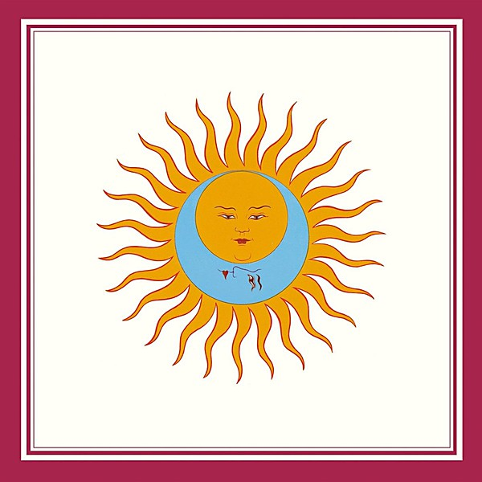

# Larks' Tongues In Aspic (40th Anniversary Series)

By **King Crimson**

## Album Data

- **Catalog:** Beets
- **Format:** Digital, Album
- **Album:** Larks' Tongues In Aspic (40th Anniversary Series)
- **Artist:** King Crimson
- **Albumartist:** King Crimson
- **Genre:** Progressive Rock
- **MusicBrainz Album Artist ID:** 
- **MusicBrainz Album ID:** 
- **MusicBrainz Release Group ID:** 
- **Year:** 1973
- **Catalog #:** 
- **Label:** 
- **Total Tracks:** 00

## Album Tracks

### Track 00 - 00 - Lizard_5.1_pt1

- **Artist:** King Crimson
- **Format:** AAC
- **Genre:** Progressive Rock
- **Length:** 42:52
- **MusicBrainz Track ID:** 
- **Title:** 00 - Lizard_5.1_pt1
- **Track:** 00
- **Year:** 1970

### Track 00 - 00 - Lizard_5.1_pt2

- **Artist:** King Crimson
- **Format:** AAC
- **Genre:** Progressive Rock
- **Length:** 42:51
- **MusicBrainz Track ID:** 
- **Title:** 00 - Lizard_5.1_pt2
- **Track:** 00
- **Year:** 1970

### Track 01 - Cirkus (Including Entry Of The Chameleons)

- **Artist:** King Crimson
- **Format:** ALAC
- **Genre:** Progressive Rock
- **Length:** 6:42
- **MusicBrainz Track ID:** 
- **Title:** Cirkus (Including Entry Of The Chameleons)
- **Track:** 01
- **Year:** 1970

### Track 02 - Indoor Games

- **Artist:** King Crimson
- **Format:** ALAC
- **Genre:** Progressive Rock
- **Length:** 5:35
- **MusicBrainz Track ID:** 
- **Title:** Indoor Games
- **Track:** 02
- **Year:** 1970

### Track 03 - Happy Family

- **Artist:** King Crimson
- **Format:** ALAC
- **Genre:** Progressive Rock
- **Length:** 4:17
- **MusicBrainz Track ID:** 
- **Title:** Happy Family
- **Track:** 03
- **Year:** 1970

### Track 04 - Lady Of The Dancing Water

- **Artist:** King Crimson
- **Format:** ALAC
- **Genre:** Progressive Rock
- **Length:** 2:48
- **MusicBrainz Track ID:** 
- **Title:** Lady Of The Dancing Water
- **Track:** 04
- **Year:** 1970

### Track 05 - Lizard

- **Artist:** King Crimson
- **Format:** ALAC
- **Genre:** Progressive Rock
- **Length:** 23:35
- **MusicBrainz Track ID:** 
- **Title:** Lizard
- **Track:** 05
- **Year:** 1970

### Track 06 - Lady Of The Dancing Water (Mix)

- **Artist:** King Crimson
- **Format:** ALAC
- **Genre:** Progressive Rock
- **Length:** 2:50
- **MusicBrainz Track ID:** 
- **Title:** Lady Of The Dancing Water (Mix)
- **Track:** 06
- **Year:** 1970

### Track 07 - Bolero (Frame By Frame Mix)

- **Artist:** King Crimson
- **Format:** ALAC
- **Genre:** Progressive Rock
- **Length:** 6:48
- **MusicBrainz Track ID:** 
- **Title:** Bolero (Frame By Frame Mix)
- **Track:** 07
- **Year:** 1970

### Track 08 - Cirkus (Studio Run Through)

- **Artist:** King Crimson
- **Format:** ALAC
- **Genre:** Progressive Rock
- **Length:** 6:31
- **MusicBrainz Track ID:** 
- **Title:** Cirkus (Studio Run Through)
- **Track:** 08
- **Year:** 1970

