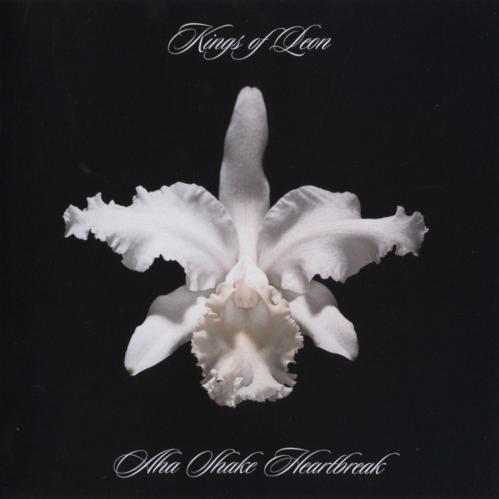

# Aha Shake Heartbreak

By **Kings of Leon**

## Album Data

- **Catalog:** Beets
- **Format:** Digital, Album
- **Album:** Aha Shake Heartbreak
- **Artist:** Kings Of Leon
- **Albumartist:** Kings of Leon
- **Genre:** Indie Rock
- **MusicBrainz Album Artist ID:** [6ffb8ea9-2370-44d8-b678-e9237bbd347b](https://musicbrainz.org/artist/6ffb8ea9-2370-44d8-b678-e9237bbd347b)
- **MusicBrainz Album ID:** [ce21627f-440b-4ef8-b94f-ef411e47237f](https://musicbrainz.org/release/ce21627f-440b-4ef8-b94f-ef411e47237f)
- **MusicBrainz Release Group ID:** [d8dcba72-fe4f-314e-ab75-c96f51137be2](https://musicbrainz.org/release-group/d8dcba72-fe4f-314e-ab75-c96f51137be2)
- **Year:** 2004
- **Catalog #:** 
- **Label:** RCA
- **Total Tracks:** 13

## Album Tracks

### Track 01 - Knocked Up

- **Artist:** Kings of Leon
- **Format:** ALAC
- **Genre:** Indie Rock
- **Length:** 7:10
- **MusicBrainz Track ID:** [6956c27e-3c15-494f-bff9-af2241f2506c](https://musicbrainz.org/recording/6956c27e-3c15-494f-bff9-af2241f2506c)
- **Title:** Knocked Up
- **Track:** 01
- **Year:** 2007

### Track 02 - Charmer

- **Artist:** Kings of Leon
- **Format:** ALAC
- **Genre:** Indie Rock
- **Length:** 2:56
- **MusicBrainz Track ID:** [006f6df6-8b50-4aa5-ab61-0009b81dc1eb](https://musicbrainz.org/recording/006f6df6-8b50-4aa5-ab61-0009b81dc1eb)
- **Title:** Charmer
- **Track:** 02
- **Year:** 2007

### Track 03 - On Call

- **Artist:** Kings of Leon
- **Format:** ALAC
- **Genre:** Indie Rock
- **Length:** 3:21
- **MusicBrainz Track ID:** [64bb5513-8f8c-487b-b69d-1eadf0662b1a](https://musicbrainz.org/recording/64bb5513-8f8c-487b-b69d-1eadf0662b1a)
- **Title:** On Call
- **Track:** 03
- **Year:** 2007

### Track 04 - McFearless

- **Artist:** Kings of Leon
- **Format:** ALAC
- **Genre:** Indie Rock
- **Length:** 3:09
- **MusicBrainz Track ID:** [3ff453e3-dc5a-42ad-a9d5-862cf4550bd0](https://musicbrainz.org/recording/3ff453e3-dc5a-42ad-a9d5-862cf4550bd0)
- **Title:** McFearless
- **Track:** 04
- **Year:** 2007

### Track 05 - Black Thumbnail

- **Artist:** Kings of Leon
- **Format:** ALAC
- **Genre:** Indie Rock
- **Length:** 3:59
- **MusicBrainz Track ID:** [c2d8d5c7-7f2b-47f5-aceb-ca1b56d5dc72](https://musicbrainz.org/recording/c2d8d5c7-7f2b-47f5-aceb-ca1b56d5dc72)
- **Title:** Black Thumbnail
- **Track:** 05
- **Year:** 2007

### Track 06 - My Party

- **Artist:** Kings of Leon
- **Format:** ALAC
- **Genre:** Indie Rock
- **Length:** 4:10
- **MusicBrainz Track ID:** [ab147005-c47f-4bf9-a0ed-897dc2525164](https://musicbrainz.org/recording/ab147005-c47f-4bf9-a0ed-897dc2525164)
- **Title:** My Party
- **Track:** 06
- **Year:** 2007

### Track 07 - True Love Way

- **Artist:** Kings of Leon
- **Format:** ALAC
- **Genre:** Indie Rock
- **Length:** 4:02
- **MusicBrainz Track ID:** [7fc354e5-58f3-49c3-add2-04ecb55035cf](https://musicbrainz.org/recording/7fc354e5-58f3-49c3-add2-04ecb55035cf)
- **Title:** True Love Way
- **Track:** 07
- **Year:** 2007

### Track 08 - Ragoo

- **Artist:** Kings of Leon
- **Format:** ALAC
- **Genre:** Indie Rock
- **Length:** 3:01
- **MusicBrainz Track ID:** [1d28b797-d323-477a-bdca-3283549322f2](https://musicbrainz.org/recording/1d28b797-d323-477a-bdca-3283549322f2)
- **Title:** Ragoo
- **Track:** 08
- **Year:** 2007

### Track 09 - Fans

- **Artist:** Kings of Leon
- **Format:** ALAC
- **Genre:** Indie Rock
- **Length:** 3:36
- **MusicBrainz Track ID:** [1e873fa6-9821-4abf-bf37-6a0c4a19cfc2](https://musicbrainz.org/recording/1e873fa6-9821-4abf-bf37-6a0c4a19cfc2)
- **Title:** Fans
- **Track:** 09
- **Year:** 2007

### Track 10 - The Runner

- **Artist:** Kings of Leon
- **Format:** ALAC
- **Genre:** Indie Rock
- **Length:** 4:16
- **MusicBrainz Track ID:** [88cbbd1a-0173-4608-871e-e5dc2d1cf6d0](https://musicbrainz.org/recording/88cbbd1a-0173-4608-871e-e5dc2d1cf6d0)
- **Title:** The Runner
- **Track:** 10
- **Year:** 2007

### Track 11 - Trunk

- **Artist:** Kings of Leon
- **Format:** ALAC
- **Genre:** Indie Rock
- **Length:** 3:57
- **MusicBrainz Track ID:** [4ce98259-9c43-4dd4-bfb9-0e684e38f4e3](https://musicbrainz.org/recording/4ce98259-9c43-4dd4-bfb9-0e684e38f4e3)
- **Title:** Trunk
- **Track:** 11
- **Year:** 2007

### Track 12 - Camaro

- **Artist:** Kings of Leon
- **Format:** ALAC
- **Genre:** Indie Rock
- **Length:** 3:06
- **MusicBrainz Track ID:** [43aad699-0795-4e04-bf0d-a70dbf699f95](https://musicbrainz.org/recording/43aad699-0795-4e04-bf0d-a70dbf699f95)
- **Title:** Camaro
- **Track:** 12
- **Year:** 2007

### Track 13 - Arizona

- **Artist:** Kings of Leon
- **Format:** ALAC
- **Genre:** Indie Rock
- **Length:** 4:50
- **MusicBrainz Track ID:** [49f8ebea-495f-4f34-aa43-73d6a890911c](https://musicbrainz.org/recording/49f8ebea-495f-4f34-aa43-73d6a890911c)
- **Title:** Arizona
- **Track:** 13
- **Year:** 2007

## See also

- [Because of the Times](Because_of_the_Times.md)
- [Come Around Sundown](Come_Around_Sundown.md)
- [Holy Roller Novocaine](Holy_Roller_Novocaine.md)
- [iTunes Festival](iTunes_Festival.md)
- [Mechanical Bull (Deluxe Version)](Mechanical_Bull_Deluxe_Version.md)
- [Mechanical Bull](Mechanical_Bull.md)
- [Only By The Night](Only_By_The_Night.md)
- [WALLS](WALLS.md)
- [Youth & Young Manhood](Youth_and_Young_Manhood.md)
- [Vinyl: ](../../Vinyl/Kings_Of_Leon/Kings_Of_Leon.md)
- [Vinyl: WALLS](../../Vinyl/Kings_Of_Leon/WALLS.md)
