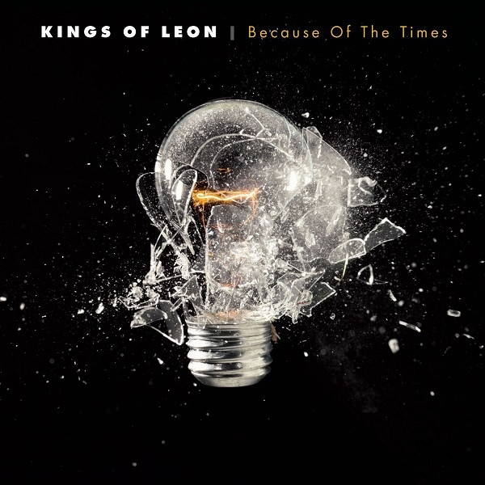

# Because of the Times

By **Kings of Leon**

## Album Data

- **Catalog:** Beets
- **Format:** Digital, Album
- **Album:** Because of the Times
- **Artist:** Kings Of Leon
- **Albumartist:** Kings of Leon
- **Genre:** Indie Rock
- **MusicBrainz Album Artist ID:** [6ffb8ea9-2370-44d8-b678-e9237bbd347b](https://musicbrainz.org/artist/6ffb8ea9-2370-44d8-b678-e9237bbd347b)
- **MusicBrainz Album ID:** [66e0430f-bb1a-46fd-9cca-5cf61c274e05](https://musicbrainz.org/release/66e0430f-bb1a-46fd-9cca-5cf61c274e05)
- **MusicBrainz Release Group ID:** [20de4fa6-4cf7-31c1-b8f2-d5c46b754d07](https://musicbrainz.org/release-group/20de4fa6-4cf7-31c1-b8f2-d5c46b754d07)
- **Year:** 2007
- **Catalog #:** 88697-64968-2
- **Label:** RCA
- **Total Tracks:** 13

## Album Tracks

### Track 01 - The End

- **Artist:** Kings of Leon
- **Format:** AAC
- **Genre:** Indie Rock
- **Length:** 4:24
- **MusicBrainz Track ID:** [4bce035a-3956-4d28-82d9-2143ef230e3b](https://musicbrainz.org/recording/4bce035a-3956-4d28-82d9-2143ef230e3b)
- **Title:** The End
- **Track:** 01
- **Year:** 2010

### Track 02 - Radioactive

- **Artist:** Kings of Leon
- **Format:** AAC
- **Genre:** Indie Rock
- **Length:** 3:26
- **MusicBrainz Track ID:** [e5d0bb87-6e74-4ca7-8519-c2d4adb23b70](https://musicbrainz.org/recording/e5d0bb87-6e74-4ca7-8519-c2d4adb23b70)
- **Title:** Radioactive
- **Track:** 02
- **Year:** 2010

### Track 03 - Pyro

- **Artist:** Kings of Leon
- **Format:** AAC
- **Genre:** Indie Rock
- **Length:** 4:10
- **MusicBrainz Track ID:** [13eca25f-802f-4b46-882d-27000eca6fdf](https://musicbrainz.org/recording/13eca25f-802f-4b46-882d-27000eca6fdf)
- **Title:** Pyro
- **Track:** 03
- **Year:** 2010

### Track 04 - Mary

- **Artist:** Kings of Leon
- **Format:** AAC
- **Genre:** Indie Rock
- **Length:** 3:25
- **MusicBrainz Track ID:** [2d2a64cc-6d06-4400-a82f-83f9d3d01c4a](https://musicbrainz.org/recording/2d2a64cc-6d06-4400-a82f-83f9d3d01c4a)
- **Title:** Mary
- **Track:** 04
- **Year:** 2010

### Track 05 - The Face

- **Artist:** Kings of Leon
- **Format:** AAC
- **Genre:** Indie Rock
- **Length:** 3:28
- **MusicBrainz Track ID:** [96eb10d0-319d-42ed-8a38-022b05fe97cc](https://musicbrainz.org/recording/96eb10d0-319d-42ed-8a38-022b05fe97cc)
- **Title:** The Face
- **Track:** 05
- **Year:** 2010

### Track 06 - The Immortals

- **Artist:** Kings of Leon
- **Format:** AAC
- **Genre:** Indie Rock
- **Length:** 3:29
- **MusicBrainz Track ID:** [687ace70-1816-45dd-9065-709a2fe523ed](https://musicbrainz.org/recording/687ace70-1816-45dd-9065-709a2fe523ed)
- **Title:** The Immortals
- **Track:** 06
- **Year:** 2010

### Track 07 - Back Down South

- **Artist:** Kings of Leon
- **Format:** AAC
- **Genre:** Indie Rock
- **Length:** 4:01
- **MusicBrainz Track ID:** [8b0fb5c2-d075-4ba8-bfea-6bfc4ba30a2f](https://musicbrainz.org/recording/8b0fb5c2-d075-4ba8-bfea-6bfc4ba30a2f)
- **Title:** Back Down South
- **Track:** 07
- **Year:** 2010

### Track 08 - Beach Side

- **Artist:** Kings of Leon
- **Format:** AAC
- **Genre:** Indie Rock
- **Length:** 2:51
- **MusicBrainz Track ID:** [b41c9e04-b322-4010-a484-eea75039c960](https://musicbrainz.org/recording/b41c9e04-b322-4010-a484-eea75039c960)
- **Title:** Beach Side
- **Track:** 08
- **Year:** 2010

### Track 09 - No Money

- **Artist:** Kings of Leon
- **Format:** AAC
- **Genre:** Indie Rock
- **Length:** 3:05
- **MusicBrainz Track ID:** [7a508359-b567-4086-8f89-3303dd85702a](https://musicbrainz.org/recording/7a508359-b567-4086-8f89-3303dd85702a)
- **Title:** No Money
- **Track:** 09
- **Year:** 2010

### Track 10 - Pony Up

- **Artist:** Kings of Leon
- **Format:** AAC
- **Genre:** Indie Rock
- **Length:** 3:04
- **MusicBrainz Track ID:** [3b1b2562-5a10-48a5-9f64-44e2c9eb7ec3](https://musicbrainz.org/recording/3b1b2562-5a10-48a5-9f64-44e2c9eb7ec3)
- **Title:** Pony Up
- **Track:** 10
- **Year:** 2010

### Track 11 - Birthday

- **Artist:** Kings of Leon
- **Format:** AAC
- **Genre:** Indie Rock
- **Length:** 3:16
- **MusicBrainz Track ID:** [52e35f72-b1a0-4c9f-b807-fde83c5268f9](https://musicbrainz.org/recording/52e35f72-b1a0-4c9f-b807-fde83c5268f9)
- **Title:** Birthday
- **Track:** 11
- **Year:** 2010

### Track 12 - Mi Amigo

- **Artist:** Kings of Leon
- **Format:** AAC
- **Genre:** Indie Rock
- **Length:** 4:06
- **MusicBrainz Track ID:** [7a68cd64-98a4-4de2-bcd9-1be5d256c3ea](https://musicbrainz.org/recording/7a68cd64-98a4-4de2-bcd9-1be5d256c3ea)
- **Title:** Mi Amigo
- **Track:** 12
- **Year:** 2010

### Track 13 - Pickup Truck

- **Artist:** Kings of Leon
- **Format:** AAC
- **Genre:** Indie Rock
- **Length:** 4:44
- **MusicBrainz Track ID:** [9a16fb24-0923-4fa1-8aea-ec2e024cb619](https://musicbrainz.org/recording/9a16fb24-0923-4fa1-8aea-ec2e024cb619)
- **Title:** Pickup Truck
- **Track:** 13
- **Year:** 2010

## See also

- [Aha Shake Heartbreak](Aha_Shake_Heartbreak.md)
- [Come Around Sundown](Come_Around_Sundown.md)
- [Holy Roller Novocaine](Holy_Roller_Novocaine.md)
- [iTunes Festival](iTunes_Festival.md)
- [Mechanical Bull (Deluxe Version)](Mechanical_Bull_Deluxe_Version.md)
- [Mechanical Bull](Mechanical_Bull.md)
- [Only By The Night](Only_By_The_Night.md)
- [WALLS](WALLS.md)
- [Youth & Young Manhood](Youth_and_Young_Manhood.md)
- [Vinyl: ](../../Vinyl/Kings_Of_Leon/Kings_Of_Leon.md)
- [Vinyl: WALLS](../../Vinyl/Kings_Of_Leon/WALLS.md)
