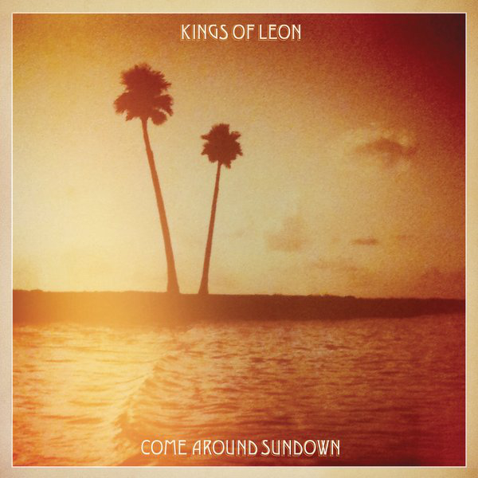

# Come Around Sundown

By **Kings of Leon**

## Album Data

- **Catalog:** Beets
- **Format:** Digital, Album
- **Album:** Come Around Sundown
- **Artist:** Kings Of Leon
- **Albumartist:** Kings of Leon
- **Genre:** Indie Rock
- **MusicBrainz Album Artist ID:** [6ffb8ea9-2370-44d8-b678-e9237bbd347b](https://musicbrainz.org/artist/6ffb8ea9-2370-44d8-b678-e9237bbd347b)
- **MusicBrainz Album ID:** [6f89d1f8-722a-425d-8747-848bb1506267](https://musicbrainz.org/release/6f89d1f8-722a-425d-8747-848bb1506267)
- **MusicBrainz Release Group ID:** [b44f35b2-0ae7-461c-a526-df86123edb91](https://musicbrainz.org/release-group/b44f35b2-0ae7-461c-a526-df86123edb91)
- **Year:** 2010
- **Catalog #:** 
- **Label:** 
- **Total Tracks:** 05

## Album Tracks

### Track 01 - Molly's Chambers

- **Artist:** Kings of Leon
- **Format:** ALAC
- **Genre:** Indie Rock
- **Length:** 2:17
- **MusicBrainz Track ID:** [d0f768e3-258f-432d-afe9-7626015adba9](https://musicbrainz.org/recording/d0f768e3-258f-432d-afe9-7626015adba9)
- **Title:** Molly's Chambers
- **Track:** 01
- **Year:** 2003

### Track 02 - Wasted Time

- **Artist:** Kings of Leon
- **Format:** ALAC
- **Genre:** Indie Rock
- **Length:** 2:47
- **MusicBrainz Track ID:** [3e5d5d56-cf33-41d4-ab81-c243fa4453f6](https://musicbrainz.org/recording/3e5d5d56-cf33-41d4-ab81-c243fa4453f6)
- **Title:** Wasted Time
- **Track:** 02
- **Year:** 2003

### Track 03 - California Waiting

- **Artist:** Kings of Leon
- **Format:** ALAC
- **Genre:** Indie Rock
- **Length:** 3:30
- **MusicBrainz Track ID:** [040f3051-1b63-4cb1-895b-b1e5010a5973](https://musicbrainz.org/recording/040f3051-1b63-4cb1-895b-b1e5010a5973)
- **Title:** California Waiting
- **Track:** 03
- **Year:** 2003

### Track 04 - Wicker Chair

- **Artist:** Kings of Leon
- **Format:** ALAC
- **Genre:** Indie Rock
- **Length:** 3:10
- **MusicBrainz Track ID:** [ab41f738-e860-492c-8dde-1a051ea8679a](https://musicbrainz.org/recording/ab41f738-e860-492c-8dde-1a051ea8679a)
- **Title:** Wicker Chair
- **Track:** 04
- **Year:** 2003

### Track 05 - Holy Roller Novocaine

- **Artist:** Kings of Leon
- **Format:** ALAC
- **Genre:** Indie Rock
- **Length:** 4:01
- **MusicBrainz Track ID:** [43e56713-1ce1-42d6-bd8c-ce86f1255506](https://musicbrainz.org/recording/43e56713-1ce1-42d6-bd8c-ce86f1255506)
- **Title:** Holy Roller Novocaine
- **Track:** 05
- **Year:** 2003

## See also

- [Aha Shake Heartbreak](Aha_Shake_Heartbreak.md)
- [Because of the Times](Because_of_the_Times.md)
- [Holy Roller Novocaine](Holy_Roller_Novocaine.md)
- [iTunes Festival](iTunes_Festival.md)
- [Mechanical Bull (Deluxe Version)](Mechanical_Bull_Deluxe_Version.md)
- [Mechanical Bull](Mechanical_Bull.md)
- [Only By The Night](Only_By_The_Night.md)
- [WALLS](WALLS.md)
- [Youth & Young Manhood](Youth_and_Young_Manhood.md)
- [Vinyl: ](../../Vinyl/Kings_Of_Leon/Kings_Of_Leon.md)
- [Vinyl: WALLS](../../Vinyl/Kings_Of_Leon/WALLS.md)
