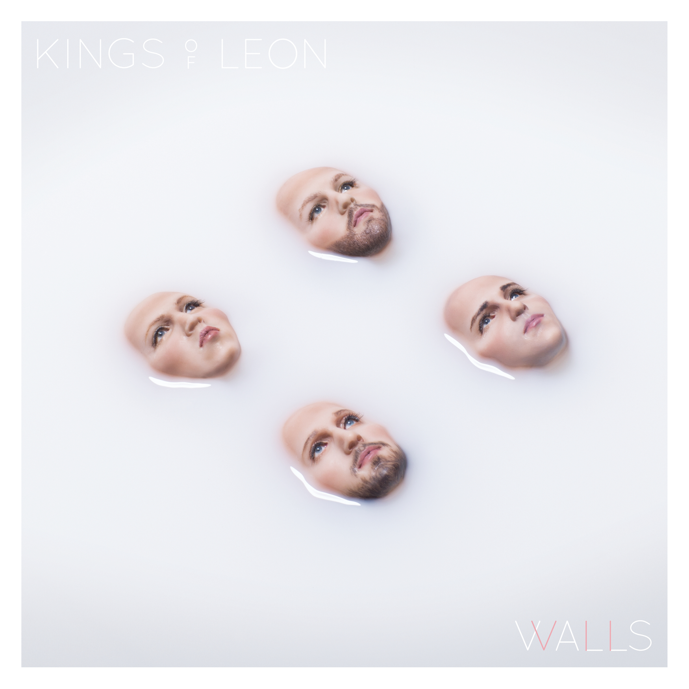

# WALLS

By **Kings of Leon**

## Album Data

- **Catalog:** Beets
- **Format:** Digital, Album
- **Album:** WALLS
- **Artist:** Kings Of Leon
- **Albumartist:** Kings of Leon
- **Genre:** Indie Rock
- **MusicBrainz Album Artist ID:** [6ffb8ea9-2370-44d8-b678-e9237bbd347b](https://musicbrainz.org/artist/6ffb8ea9-2370-44d8-b678-e9237bbd347b)
- **MusicBrainz Album ID:** [8f65be4e-72a5-4b90-b78e-c3205f7a006f](https://musicbrainz.org/release/8f65be4e-72a5-4b90-b78e-c3205f7a006f)
- **MusicBrainz Release Group ID:** [0cd14270-9999-4c8b-ac84-06a52cad5c64](https://musicbrainz.org/release-group/0cd14270-9999-4c8b-ac84-06a52cad5c64)
- **Year:** 2016
- **Catalog #:** 82876 52394-2
- **Label:** RCA
- **Total Tracks:** 11

## Album Tracks

### Track 01 - Red Morning Light

- **Artist:** Kings of Leon
- **Format:** ALAC
- **Genre:** Indie Rock
- **Length:** 3:00
- **MusicBrainz Track ID:** [af3cc7c7-df74-458c-94b5-9f8028eb8de2](https://musicbrainz.org/recording/af3cc7c7-df74-458c-94b5-9f8028eb8de2)
- **Title:** Red Morning Light
- **Track:** 01
- **Year:** 2003

### Track 02 - Happy Alone

- **Artist:** Kings of Leon
- **Format:** ALAC
- **Genre:** Indie Rock
- **Length:** 3:59
- **MusicBrainz Track ID:** [f7040f7d-d9e8-4c66-a507-62f93acbdbc2](https://musicbrainz.org/recording/f7040f7d-d9e8-4c66-a507-62f93acbdbc2)
- **Title:** Happy Alone
- **Track:** 02
- **Year:** 2003

### Track 03 - Wasted Time

- **Artist:** Kings of Leon
- **Format:** ALAC
- **Genre:** Indie Rock
- **Length:** 2:46
- **MusicBrainz Track ID:** [3e5d5d56-cf33-41d4-ab81-c243fa4453f6](https://musicbrainz.org/recording/3e5d5d56-cf33-41d4-ab81-c243fa4453f6)
- **Title:** Wasted Time
- **Track:** 03
- **Year:** 2003

### Track 04 - Joe’s Head

- **Artist:** Kings of Leon
- **Format:** ALAC
- **Genre:** Indie Rock
- **Length:** 3:21
- **MusicBrainz Track ID:** [d5cb0c3f-378a-4d8b-bf6e-d90c1ae6c8e5](https://musicbrainz.org/recording/d5cb0c3f-378a-4d8b-bf6e-d90c1ae6c8e5)
- **Title:** Joe’s Head
- **Track:** 04
- **Year:** 2003

### Track 05 - Trani

- **Artist:** Kings of Leon
- **Format:** ALAC
- **Genre:** Indie Rock
- **Length:** 5:00
- **MusicBrainz Track ID:** [a1271f8a-5419-4207-be0c-4e6f4453765b](https://musicbrainz.org/recording/a1271f8a-5419-4207-be0c-4e6f4453765b)
- **Title:** Trani
- **Track:** 05
- **Year:** 2003

### Track 06 - California Waiting

- **Artist:** Kings of Leon
- **Format:** ALAC
- **Genre:** Indie Rock
- **Length:** 3:28
- **MusicBrainz Track ID:** [040f3051-1b63-4cb1-895b-b1e5010a5973](https://musicbrainz.org/recording/040f3051-1b63-4cb1-895b-b1e5010a5973)
- **Title:** California Waiting
- **Track:** 06
- **Year:** 2003

### Track 07 - Spiral Staircase

- **Artist:** Kings of Leon
- **Format:** ALAC
- **Genre:** Indie Rock
- **Length:** 2:55
- **MusicBrainz Track ID:** [9d9eace3-7e4e-4734-bf96-5b05cbba1a7f](https://musicbrainz.org/recording/9d9eace3-7e4e-4734-bf96-5b05cbba1a7f)
- **Title:** Spiral Staircase
- **Track:** 07
- **Year:** 2003

### Track 08 - Molly’s Chambers

- **Artist:** Kings of Leon
- **Format:** ALAC
- **Genre:** Indie Rock
- **Length:** 2:15
- **MusicBrainz Track ID:** [d0f768e3-258f-432d-afe9-7626015adba9](https://musicbrainz.org/recording/d0f768e3-258f-432d-afe9-7626015adba9)
- **Title:** Molly’s Chambers
- **Track:** 08
- **Year:** 2003

### Track 09 - Genius

- **Artist:** Kings of Leon
- **Format:** ALAC
- **Genre:** Indie Rock
- **Length:** 2:48
- **MusicBrainz Track ID:** [c521460d-68b4-4cb2-b465-728eda5f5dc0](https://musicbrainz.org/recording/c521460d-68b4-4cb2-b465-728eda5f5dc0)
- **Title:** Genius
- **Track:** 09
- **Year:** 2003

### Track 10 - Dusty

- **Artist:** Kings of Leon
- **Format:** ALAC
- **Genre:** Indie Rock
- **Length:** 4:21
- **MusicBrainz Track ID:** [b0124ef4-572b-460c-a364-382affc63abb](https://musicbrainz.org/recording/b0124ef4-572b-460c-a364-382affc63abb)
- **Title:** Dusty
- **Track:** 10
- **Year:** 2003

### Track 11 - Holy Roller Novocaine / Talihina Sky

- **Artist:** Kings of Leon
- **Format:** ALAC
- **Genre:** Indie Rock
- **Length:** 12:08
- **MusicBrainz Track ID:** [baa6f05c-ef36-4ded-8a08-dfaa7a172062](https://musicbrainz.org/recording/baa6f05c-ef36-4ded-8a08-dfaa7a172062)
- **Title:** Holy Roller Novocaine / Talihina Sky
- **Track:** 11
- **Year:** 2003

## See also

- [Aha Shake Heartbreak](Aha_Shake_Heartbreak.md)
- [Because of the Times](Because_of_the_Times.md)
- [Come Around Sundown](Come_Around_Sundown.md)
- [Holy Roller Novocaine](Holy_Roller_Novocaine.md)
- [iTunes Festival](iTunes_Festival.md)
- [Mechanical Bull (Deluxe Version)](Mechanical_Bull_Deluxe_Version.md)
- [Mechanical Bull](Mechanical_Bull.md)
- [Only By The Night](Only_By_The_Night.md)
- [Youth & Young Manhood](Youth_and_Young_Manhood.md)
- [Vinyl: ](../../Vinyl/Kings_Of_Leon/Kings_Of_Leon.md)
- [Vinyl: WALLS](../../Vinyl/Kings_Of_Leon/WALLS.md)
