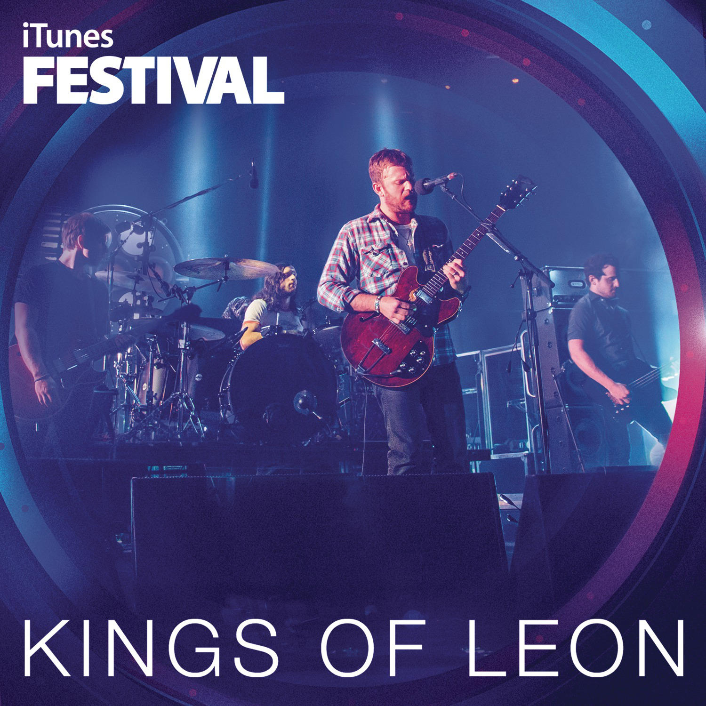

# iTunes Festival

By **Kings of Leon**

## Album Data

- **Catalog:** Beets
- **Format:** Digital, Album
- **Album:** iTunes Festival
- **Artist:** Kings Of Leon
- **Albumartist:** Kings of Leon
- **Genre:** Indie Rock
- **MusicBrainz Album Artist ID:** [6ffb8ea9-2370-44d8-b678-e9237bbd347b](https://musicbrainz.org/artist/6ffb8ea9-2370-44d8-b678-e9237bbd347b)
- **MusicBrainz Album ID:** [24675020-404b-4955-b896-0009010a41e9](https://musicbrainz.org/release/24675020-404b-4955-b896-0009010a41e9)
- **MusicBrainz Release Group ID:** [c1f5cd15-ce8e-4187-badd-2c0efeebc007](https://musicbrainz.org/release-group/c1f5cd15-ce8e-4187-badd-2c0efeebc007)
- **Year:** 2014
- **Catalog #:** 
- **Label:** 
- **Total Tracks:** 13

## Album Tracks

### Track 01 - Supersoaker

- **Artist:** Kings of Leon
- **Format:** ALAC
- **Genre:** Indie Rock
- **Length:** 3:50
- **MusicBrainz Track ID:** [1f498114-87b9-45aa-8215-4e172b2be5a2](https://musicbrainz.org/recording/1f498114-87b9-45aa-8215-4e172b2be5a2)
- **Title:** Supersoaker
- **Track:** 01
- **Year:** 2013

### Track 02 - Rock City

- **Artist:** Kings of Leon
- **Format:** ALAC
- **Genre:** Indie Rock
- **Length:** 2:56
- **MusicBrainz Track ID:** [124014ed-f276-40e9-b6c0-d3cb0611409a](https://musicbrainz.org/recording/124014ed-f276-40e9-b6c0-d3cb0611409a)
- **Title:** Rock City
- **Track:** 02
- **Year:** 2013

### Track 03 - Don’t Matter

- **Artist:** Kings of Leon
- **Format:** ALAC
- **Genre:** Indie Rock
- **Length:** 2:50
- **MusicBrainz Track ID:** [a2835af0-dc17-485d-8d5a-585f5104cc66](https://musicbrainz.org/recording/a2835af0-dc17-485d-8d5a-585f5104cc66)
- **Title:** Don’t Matter
- **Track:** 03
- **Year:** 2013

### Track 04 - Beautiful War

- **Artist:** Kings of Leon
- **Format:** ALAC
- **Genre:** Indie Rock
- **Length:** 5:09
- **MusicBrainz Track ID:** [a2d4b9f6-90b5-4c56-b21a-f3cbacc7cc59](https://musicbrainz.org/recording/a2d4b9f6-90b5-4c56-b21a-f3cbacc7cc59)
- **Title:** Beautiful War
- **Track:** 04
- **Year:** 2013

### Track 05 - Temple

- **Artist:** Kings of Leon
- **Format:** ALAC
- **Genre:** Indie Rock
- **Length:** 4:10
- **MusicBrainz Track ID:** [132df6ab-4d69-49ac-93da-fd60de6b9183](https://musicbrainz.org/recording/132df6ab-4d69-49ac-93da-fd60de6b9183)
- **Title:** Temple
- **Track:** 05
- **Year:** 2013

### Track 06 - Wait For Me

- **Artist:** Kings of Leon
- **Format:** ALAC
- **Genre:** Indie Rock
- **Length:** 3:30
- **MusicBrainz Track ID:** [5c17e90e-ce0c-449c-b27b-7841c47f00cf](https://musicbrainz.org/recording/5c17e90e-ce0c-449c-b27b-7841c47f00cf)
- **Title:** Wait For Me
- **Track:** 06
- **Year:** 2013

### Track 07 - Family Tree

- **Artist:** Kings of Leon
- **Format:** ALAC
- **Genre:** Indie Rock
- **Length:** 3:50
- **MusicBrainz Track ID:** [dfd4d56f-8eba-41fa-af08-45fc5e6278c6](https://musicbrainz.org/recording/dfd4d56f-8eba-41fa-af08-45fc5e6278c6)
- **Title:** Family Tree
- **Track:** 07
- **Year:** 2013

### Track 08 - Comeback Story

- **Artist:** Kings of Leon
- **Format:** ALAC
- **Genre:** Indie Rock
- **Length:** 3:59
- **MusicBrainz Track ID:** [d2245b0d-5246-4702-b6fb-d2ea9098a322](https://musicbrainz.org/recording/d2245b0d-5246-4702-b6fb-d2ea9098a322)
- **Title:** Comeback Story
- **Track:** 08
- **Year:** 2013

### Track 09 - Tonight

- **Artist:** Kings of Leon
- **Format:** ALAC
- **Genre:** Indie Rock
- **Length:** 4:33
- **MusicBrainz Track ID:** [96e5f812-ca8c-464d-81c9-2f4de616308b](https://musicbrainz.org/recording/96e5f812-ca8c-464d-81c9-2f4de616308b)
- **Title:** Tonight
- **Track:** 09
- **Year:** 2013

### Track 10 - Coming Back Again

- **Artist:** Kings of Leon
- **Format:** ALAC
- **Genre:** Indie Rock
- **Length:** 3:28
- **MusicBrainz Track ID:** [4ce09ee7-8813-4037-b6d4-d25d811c6aa8](https://musicbrainz.org/recording/4ce09ee7-8813-4037-b6d4-d25d811c6aa8)
- **Title:** Coming Back Again
- **Track:** 10
- **Year:** 2013

### Track 11 - On the Chin

- **Artist:** Kings of Leon
- **Format:** ALAC
- **Genre:** Indie Rock
- **Length:** 4:16
- **MusicBrainz Track ID:** [9fccfa72-7161-43e4-b683-63326d6d67d2](https://musicbrainz.org/recording/9fccfa72-7161-43e4-b683-63326d6d67d2)
- **Title:** On the Chin
- **Track:** 11
- **Year:** 2013

### Track 12 - Work On Me

- **Artist:** Kings of Leon
- **Format:** ALAC
- **Genre:** Indie Rock
- **Length:** 4:04
- **MusicBrainz Track ID:** [8910b2af-9ab4-480b-8341-81363fd5a718](https://musicbrainz.org/recording/8910b2af-9ab4-480b-8341-81363fd5a718)
- **Title:** Work On Me
- **Track:** 12
- **Year:** 2013

### Track 13 - Last Mile Home

- **Artist:** Kings of Leon
- **Format:** ALAC
- **Genre:** Indie Rock
- **Length:** 4:11
- **MusicBrainz Track ID:** [3c275d16-1b1c-4409-8898-9a10f50c3af5](https://musicbrainz.org/recording/3c275d16-1b1c-4409-8898-9a10f50c3af5)
- **Title:** Last Mile Home
- **Track:** 13
- **Year:** 2013

## See also

- [Aha Shake Heartbreak](Aha_Shake_Heartbreak.md)
- [Because of the Times](Because_of_the_Times.md)
- [Come Around Sundown](Come_Around_Sundown.md)
- [Holy Roller Novocaine](Holy_Roller_Novocaine.md)
- [Mechanical Bull (Deluxe Version)](Mechanical_Bull_Deluxe_Version.md)
- [Mechanical Bull](Mechanical_Bull.md)
- [Only By The Night](Only_By_The_Night.md)
- [WALLS](WALLS.md)
- [Youth & Young Manhood](Youth_and_Young_Manhood.md)
- [Vinyl: ](../../Vinyl/Kings_Of_Leon/Kings_Of_Leon.md)
- [Vinyl: WALLS](../../Vinyl/Kings_Of_Leon/WALLS.md)
