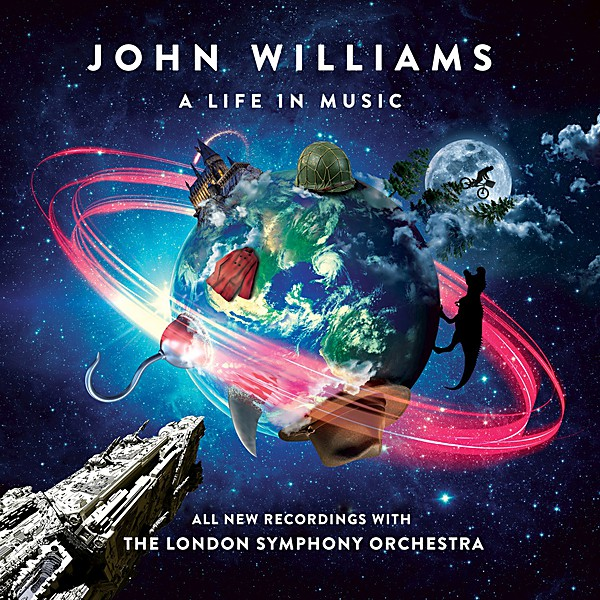

# Meets The London Symphony Orchestra

By **Kitaro**

## Album Data

- **Catalog:** Beets
- **Format:** Digital, Album
- **Album:** Meets The London Symphony Orchestra
- **Artist:** Kitaro
- **Albumartist:** Kitaro
- **Genre:** Ambient
- **MusicBrainz Album Artist ID:** 
- **MusicBrainz Album ID:** 
- **MusicBrainz Release Group ID:** 
- **Year:** 1980
- **Catalog #:** 
- **Label:** 
- **Total Tracks:** 00

## Album Tracks

### Track 01 - Tienshan

- **Artist:** Kitaro
- **Format:** MP3
- **Genre:** New Wave
- **Length:** 5:46
- **MusicBrainz Track ID:** 
- **Title:** Tienshan
- **Track:** 01
- **Year:** 1980

### Track 02 - Peace

- **Artist:** Kitaro
- **Format:** MP3
- **Genre:** Progressive Rock
- **Length:** 5:33
- **MusicBrainz Track ID:** 
- **Title:** Peace
- **Track:** 02
- **Year:** 1980

### Track 03 - Journey Beyond Horizon

- **Artist:** Kitaro
- **Format:** MP3
- **Genre:** Pop
- **Length:** 4:00
- **MusicBrainz Track ID:** 
- **Title:** Journey Beyond Horizon
- **Track:** 03
- **Year:** 1980

