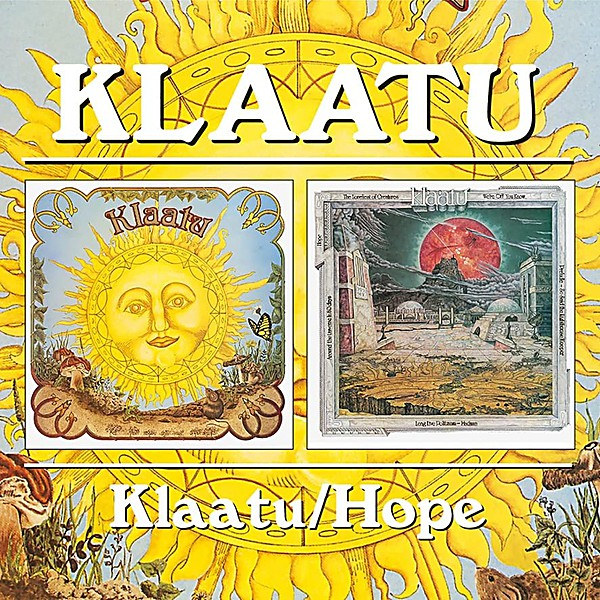

# Klaatu / Hope

By **Klaatu**

## Album Data

- **Catalog:** Beets
- **Format:** Digital, Album
- **Album:** Klaatu / Hope
- **Artist:** Klaatu
- **Albumartist:** Klaatu
- **Genre:** Psychedelic Rock
- **MusicBrainz Album Artist ID:** [dafcd725-9cb6-4347-be21-fd9a950e8064](https://musicbrainz.org/artist/dafcd725-9cb6-4347-be21-fd9a950e8064)
- **MusicBrainz Album ID:** [a462b01f-0aa3-4a93-a848-77f415cd73d9](https://musicbrainz.org/release/a462b01f-0aa3-4a93-a848-77f415cd73d9)
- **MusicBrainz Release Group ID:** [4a7d57d2-5c63-3e2d-bc4d-993d1d37bc47](https://musicbrainz.org/release-group/4a7d57d2-5c63-3e2d-bc4d-993d1d37bc47)
- **Year:** 1992
- **Catalog #:** CDP 7 97800 2
- **Label:** Capitol Records
- **Total Tracks:** 16

## Album Tracks

### Track 01 - Calling Occupants of Interplanetary Craft

- **Artist:** Klaatu
- **Format:** ALAC
- **Genre:** Space Rock
- **Length:** 7:17
- **MusicBrainz Track ID:** [34b5ea7b-fe0c-4e35-8d95-bfc599d89c46](https://musicbrainz.org/recording/34b5ea7b-fe0c-4e35-8d95-bfc599d89c46)
- **Title:** Calling Occupants of Interplanetary Craft
- **Track:** 01
- **Year:** 1992

### Track 02 - California Jam

- **Artist:** Klaatu
- **Format:** ALAC
- **Genre:** Progressive Rock
- **Length:** 3:02
- **MusicBrainz Track ID:** [ebb313d9-cc96-4749-ad36-e631b4f18a94](https://musicbrainz.org/recording/ebb313d9-cc96-4749-ad36-e631b4f18a94)
- **Title:** California Jam
- **Track:** 02
- **Year:** 1992

### Track 03 - Anus of Uranus

- **Artist:** Klaatu
- **Format:** ALAC
- **Genre:** Progressive Rock
- **Length:** 3:21
- **MusicBrainz Track ID:** [246f5923-9e57-4be5-a1c2-d41cf5e0b6ee](https://musicbrainz.org/recording/246f5923-9e57-4be5-a1c2-d41cf5e0b6ee)
- **Title:** Anus of Uranus
- **Track:** 03
- **Year:** 1992

### Track 04 - Sub-Rosa Subway

- **Artist:** Klaatu
- **Format:** ALAC
- **Genre:** Symphonic
- **Length:** 4:38
- **MusicBrainz Track ID:** [63188b72-87d8-4005-9428-b0057d70e25a](https://musicbrainz.org/recording/63188b72-87d8-4005-9428-b0057d70e25a)
- **Title:** Sub-Rosa Subway
- **Track:** 04
- **Year:** 1992

### Track 05 - True Life Hero

- **Artist:** Klaatu
- **Format:** ALAC
- **Genre:** Pop Rock
- **Length:** 3:24
- **MusicBrainz Track ID:** [9cd44aa8-3f75-4683-96b7-c80a6ab37c10](https://musicbrainz.org/recording/9cd44aa8-3f75-4683-96b7-c80a6ab37c10)
- **Title:** True Life Hero
- **Track:** 05
- **Year:** 1992

### Track 06 - Doctor Marvello

- **Artist:** Klaatu
- **Format:** ALAC
- **Genre:** Pop Rock
- **Length:** 3:37
- **MusicBrainz Track ID:** [42784080-c120-491f-acfd-25799e7843a8](https://musicbrainz.org/recording/42784080-c120-491f-acfd-25799e7843a8)
- **Title:** Doctor Marvello
- **Track:** 06
- **Year:** 1992

### Track 07 - Sir Bodsworth Rugglesby III

- **Artist:** Klaatu
- **Format:** ALAC
- **Genre:** Ragtime
- **Length:** 3:24
- **MusicBrainz Track ID:** [30332f27-9d7f-44b7-8b28-801a50c38196](https://musicbrainz.org/recording/30332f27-9d7f-44b7-8b28-801a50c38196)
- **Title:** Sir Bodsworth Rugglesby III
- **Track:** 07
- **Year:** 1992

### Track 08 - Little Neutrino

- **Artist:** Klaatu
- **Format:** ALAC
- **Genre:** Space Rock
- **Length:** 8:14
- **MusicBrainz Track ID:** [e4ce819e-4203-4aad-91f1-7253efda5345](https://musicbrainz.org/recording/e4ce819e-4203-4aad-91f1-7253efda5345)
- **Title:** Little Neutrino
- **Track:** 08
- **Year:** 1992

### Track 09 - We're Off You Know

- **Artist:** Klaatu
- **Format:** ALAC
- **Genre:** Progressive Rock
- **Length:** 4:02
- **MusicBrainz Track ID:** [61e2da48-d5fc-4673-b92a-df50a947c5bf](https://musicbrainz.org/recording/61e2da48-d5fc-4673-b92a-df50a947c5bf)
- **Title:** We're Off You Know
- **Track:** 09
- **Year:** 1992

### Track 10 - Madman

- **Artist:** Klaatu
- **Format:** ALAC
- **Genre:** Psychedelic Rock
- **Length:** 2:40
- **MusicBrainz Track ID:** [480eb854-65fc-4639-b9f2-e2841bf9bbb5](https://musicbrainz.org/recording/480eb854-65fc-4639-b9f2-e2841bf9bbb5)
- **Title:** Madman
- **Track:** 10
- **Year:** 1992

### Track 11 - Around the Universe in Eighty Days

- **Artist:** Klaatu
- **Format:** ALAC
- **Genre:** Progressive Rock
- **Length:** 4:59
- **MusicBrainz Track ID:** [a14a93a7-ecc8-442d-b01e-618da13a1fbc](https://musicbrainz.org/recording/a14a93a7-ecc8-442d-b01e-618da13a1fbc)
- **Title:** Around the Universe in Eighty Days
- **Track:** 11
- **Year:** 1992

### Track 12 - Long Live Politzania

- **Artist:** Klaatu
- **Format:** ALAC
- **Genre:** Psychedelic Pop
- **Length:** 9:13
- **MusicBrainz Track ID:** [a202087d-7700-49fb-bdd3-2942401594d2](https://musicbrainz.org/recording/a202087d-7700-49fb-bdd3-2942401594d2)
- **Title:** Long Live Politzania
- **Track:** 12
- **Year:** 1992

### Track 13 - The Loneliest of Creatures

- **Artist:** Klaatu
- **Format:** ALAC
- **Genre:** Baroque Pop
- **Length:** 9:35
- **MusicBrainz Track ID:** [c765767c-21fa-4491-bdf2-990af363e4de](https://musicbrainz.org/recording/c765767c-21fa-4491-bdf2-990af363e4de)
- **Title:** The Loneliest of Creatures
- **Track:** 13
- **Year:** 1992

### Track 14 - Prelude

- **Artist:** Klaatu
- **Format:** ALAC
- **Genre:** Progressive Rock
- **Length:** 5:55
- **MusicBrainz Track ID:** [c9d095bb-ab84-4a77-8687-3ad98238f74b](https://musicbrainz.org/recording/c9d095bb-ab84-4a77-8687-3ad98238f74b)
- **Title:** Prelude
- **Track:** 14
- **Year:** 1992

### Track 15 - So Said the Lighthouse Keeper

- **Artist:** Klaatu
- **Format:** ALAC
- **Genre:** Rock
- **Length:** 3:53
- **MusicBrainz Track ID:** [4909235a-bb46-49ae-9657-b1bd40129c9b](https://musicbrainz.org/recording/4909235a-bb46-49ae-9657-b1bd40129c9b)
- **Title:** So Said the Lighthouse Keeper
- **Track:** 15
- **Year:** 1992

### Track 16 - Hope

- **Artist:** Klaatu
- **Format:** ALAC
- **Genre:** Rock
- **Length:** 0:52
- **MusicBrainz Track ID:** [a5e298d9-7559-429a-9521-43994ed78277](https://musicbrainz.org/recording/a5e298d9-7559-429a-9521-43994ed78277)
- **Title:** Hope
- **Track:** 16
- **Year:** 1992

