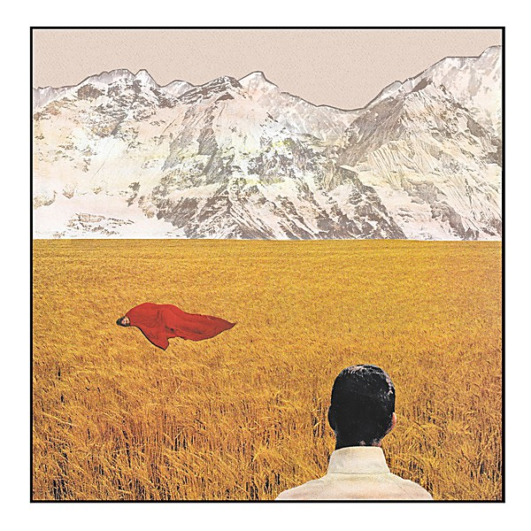

# After

By **Lady Lamb**

## Album Data

- **Catalog:** Beets
- **Format:** Digital, Album
- **Album:** After
- **Artist:** Lady Lamb
- **Albumartist:** Lady Lamb
- **Genre:** Indie Rock
- **MusicBrainz Album Artist ID:** [21cc73d7-e205-4586-b16c-e28a17a0a539](https://musicbrainz.org/artist/21cc73d7-e205-4586-b16c-e28a17a0a539)
- **MusicBrainz Album ID:** [52da6dde-b984-4037-8040-05cce9f6218d](https://musicbrainz.org/release/52da6dde-b984-4037-8040-05cce9f6218d)
- **MusicBrainz Release Group ID:** [ae29a18c-4ade-4273-9db5-44b89f6b619a](https://musicbrainz.org/release-group/ae29a18c-4ade-4273-9db5-44b89f6b619a)
- **Year:** 2015
- **Catalog #:** 
- **Label:** Mom+Pop
- **Total Tracks:** 12

## Album Tracks

### Track 01 - Vena Cava

- **Artist:** Lady Lamb
- **Format:** ALAC
- **Genre:** Indie Rock
- **Length:** 3:54
- **MusicBrainz Track ID:** [8dd8086c-cb68-4524-9094-a0df186d27de](https://musicbrainz.org/recording/8dd8086c-cb68-4524-9094-a0df186d27de)
- **Title:** Vena Cava
- **Track:** 01
- **Year:** 2015

### Track 02 - Billions of Eyes

- **Artist:** Lady Lamb
- **Format:** ALAC
- **Genre:** Indie Rock
- **Length:** 5:12
- **MusicBrainz Track ID:** [5af33bf1-406c-4340-a5eb-194afc3a7e42](https://musicbrainz.org/recording/5af33bf1-406c-4340-a5eb-194afc3a7e42)
- **Title:** Billions of Eyes
- **Track:** 02
- **Year:** 2015

### Track 03 - Violet Clementine

- **Artist:** Lady Lamb
- **Format:** ALAC
- **Genre:** Indie Rock
- **Length:** 4:46
- **MusicBrainz Track ID:** [67c6d305-ad76-454f-a1c9-ec1c22b1a747](https://musicbrainz.org/recording/67c6d305-ad76-454f-a1c9-ec1c22b1a747)
- **Title:** Violet Clementine
- **Track:** 03
- **Year:** 2015

### Track 04 - Heretic

- **Artist:** Lady Lamb
- **Format:** ALAC
- **Genre:** Indie Rock
- **Length:** 4:15
- **MusicBrainz Track ID:** [811dc68b-8781-45e9-aec6-55987d9ab2bb](https://musicbrainz.org/recording/811dc68b-8781-45e9-aec6-55987d9ab2bb)
- **Title:** Heretic
- **Track:** 04
- **Year:** 2015

### Track 05 - Sunday Shoes

- **Artist:** Lady Lamb
- **Format:** ALAC
- **Genre:** Indie Rock
- **Length:** 5:20
- **MusicBrainz Track ID:** [3f8566db-ba19-4f1f-bd16-dff94b116854](https://musicbrainz.org/recording/3f8566db-ba19-4f1f-bd16-dff94b116854)
- **Title:** Sunday Shoes
- **Track:** 05
- **Year:** 2015

### Track 06 - Spat Out Spit

- **Artist:** Lady Lamb
- **Format:** ALAC
- **Genre:** Indie Rock
- **Length:** 4:30
- **MusicBrainz Track ID:** [f7411c3d-b2c1-46fd-80b3-cc51e50005f1](https://musicbrainz.org/recording/f7411c3d-b2c1-46fd-80b3-cc51e50005f1)
- **Title:** Spat Out Spit
- **Track:** 06
- **Year:** 2015

### Track 07 - Penny Licks

- **Artist:** Lady Lamb
- **Format:** ALAC
- **Genre:** Indie Rock
- **Length:** 5:12
- **MusicBrainz Track ID:** [66dcadc9-4721-4c4a-a823-93e156fd8f7c](https://musicbrainz.org/recording/66dcadc9-4721-4c4a-a823-93e156fd8f7c)
- **Title:** Penny Licks
- **Track:** 07
- **Year:** 2015

### Track 08 - Dear Arkansas Daughter

- **Artist:** Lady Lamb
- **Format:** ALAC
- **Genre:** Indie Rock
- **Length:** 5:54
- **MusicBrainz Track ID:** [f0b18ebd-b392-4c64-9517-ea2597917f4d](https://musicbrainz.org/recording/f0b18ebd-b392-4c64-9517-ea2597917f4d)
- **Title:** Dear Arkansas Daughter
- **Track:** 08
- **Year:** 2015

### Track 09 - Milk Duds

- **Artist:** Lady Lamb
- **Format:** ALAC
- **Genre:** Indie Rock
- **Length:** 3:11
- **MusicBrainz Track ID:** [0a593506-d335-4da7-b435-360183000cf9](https://musicbrainz.org/recording/0a593506-d335-4da7-b435-360183000cf9)
- **Title:** Milk Duds
- **Track:** 09
- **Year:** 2015

### Track 10 - Ten

- **Artist:** Lady Lamb
- **Format:** ALAC
- **Genre:** Indie Rock
- **Length:** 4:47
- **MusicBrainz Track ID:** [9d48f340-4f77-4ad1-bf59-5ee0307a924d](https://musicbrainz.org/recording/9d48f340-4f77-4ad1-bf59-5ee0307a924d)
- **Title:** Ten
- **Track:** 10
- **Year:** 2015

### Track 11 - Batter

- **Artist:** Lady Lamb
- **Format:** ALAC
- **Genre:** Indie Rock
- **Length:** 2:52
- **MusicBrainz Track ID:** [5c9a1286-6be0-4c4c-a7dc-17c5d9896ebe](https://musicbrainz.org/recording/5c9a1286-6be0-4c4c-a7dc-17c5d9896ebe)
- **Title:** Batter
- **Track:** 11
- **Year:** 2015

### Track 12 - Atlas

- **Artist:** Lady Lamb
- **Format:** ALAC
- **Genre:** Indie Rock
- **Length:** 6:04
- **MusicBrainz Track ID:** [15ae18c6-5489-45d3-99ab-bed2249b501a](https://musicbrainz.org/recording/15ae18c6-5489-45d3-99ab-bed2249b501a)
- **Title:** Atlas
- **Track:** 12
- **Year:** 2015

## See also

- [Roon: After](../../Roon/Lady_Lamb/After.md)
