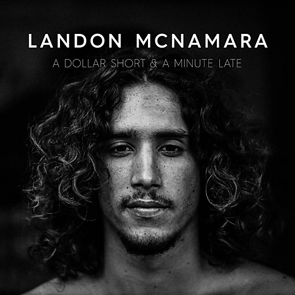

# A Dollar Short & A Minute Late

By **Landon McNamara**

## Album Data

- **Catalog:** Beets
- **Format:** Digital, Album
- **Album:** A Dollar Short & A Minute Late
- **Artist:** Landon Mcnamara
- **Albumartist:** Landon McNamara
- **Genre:** Reggae
- **MusicBrainz Album Artist ID:** [90250a61-02f4-402b-8da5-24d4da8a7dcd](https://musicbrainz.org/artist/90250a61-02f4-402b-8da5-24d4da8a7dcd)
- **MusicBrainz Album ID:** [f09d6056-4f09-49f8-94ca-923263569382](https://musicbrainz.org/release/f09d6056-4f09-49f8-94ca-923263569382)
- **MusicBrainz Release Group ID:** [3885030c-6779-4456-ab8f-24a967e61dd9](https://musicbrainz.org/release-group/3885030c-6779-4456-ab8f-24a967e61dd9)
- **Year:** 2016
- **Catalog #:** 
- **Label:** 
- **Total Tracks:** 11

## Album Tracks

### Track 01 - Promised Thing

- **Artist:** Landon McNamara
- **Format:** ALAC
- **Genre:** Reggae
- **Length:** 3:06
- **MusicBrainz Track ID:** [15b0522e-5846-4775-9655-d76789917b97](https://musicbrainz.org/recording/15b0522e-5846-4775-9655-d76789917b97)
- **Title:** Promised Thing
- **Track:** 01
- **Year:** 2016

### Track 02 - Jam With You (feat The Late Ones)

- **Artist:** Landon McNamara
- **Format:** ALAC
- **Genre:** Reggae
- **Length:** 3:45
- **MusicBrainz Track ID:** [f51a3d01-af37-4a70-a23c-1126951a0500](https://musicbrainz.org/recording/f51a3d01-af37-4a70-a23c-1126951a0500)
- **Title:** Jam With You (feat The Late Ones)
- **Track:** 02
- **Year:** 2016

### Track 03 - Don't Go Away

- **Artist:** Landon McNamara
- **Format:** ALAC
- **Genre:** Reggae
- **Length:** 3:34
- **MusicBrainz Track ID:** [638ed711-cf59-4715-8d1f-a50f3a29a7ce](https://musicbrainz.org/recording/638ed711-cf59-4715-8d1f-a50f3a29a7ce)
- **Title:** Don't Go Away
- **Track:** 03
- **Year:** 2016

### Track 04 - Time To Waste

- **Artist:** Landon McNamara
- **Format:** ALAC
- **Genre:** Reggae
- **Length:** 3:31
- **MusicBrainz Track ID:** [e7c1c86c-e694-43bf-8287-8aff965fd419](https://musicbrainz.org/recording/e7c1c86c-e694-43bf-8287-8aff965fd419)
- **Title:** Time To Waste
- **Track:** 04
- **Year:** 2016

### Track 05 - Losin' It

- **Artist:** Landon McNamara
- **Format:** ALAC
- **Genre:** Reggae
- **Length:** 3:44
- **MusicBrainz Track ID:** [bafec09b-e1a7-417d-b2b6-b661470a2399](https://musicbrainz.org/recording/bafec09b-e1a7-417d-b2b6-b661470a2399)
- **Title:** Losin' It
- **Track:** 05
- **Year:** 2016

### Track 06 - Deep Water

- **Artist:** Landon McNamara
- **Format:** ALAC
- **Genre:** Reggae
- **Length:** 2:52
- **MusicBrainz Track ID:** [f2f8b31b-e9dd-4aa0-833a-5998334ee377](https://musicbrainz.org/recording/f2f8b31b-e9dd-4aa0-833a-5998334ee377)
- **Title:** Deep Water
- **Track:** 06
- **Year:** 2016

### Track 07 - Hard Times

- **Artist:** Landon McNamara
- **Format:** ALAC
- **Genre:** Reggae
- **Length:** 3:27
- **MusicBrainz Track ID:** [ee47e73a-3b6a-491b-885b-48b618287b8a](https://musicbrainz.org/recording/ee47e73a-3b6a-491b-885b-48b618287b8a)
- **Title:** Hard Times
- **Track:** 07
- **Year:** 2016

### Track 08 - Spare Change

- **Artist:** Landon McNamara
- **Format:** ALAC
- **Genre:** Reggae
- **Length:** 4:01
- **MusicBrainz Track ID:** [307135ec-d000-414f-8b9d-d590ccb77601](https://musicbrainz.org/recording/307135ec-d000-414f-8b9d-d590ccb77601)
- **Title:** Spare Change
- **Track:** 08
- **Year:** 2016

### Track 09 - Perfect High

- **Artist:** Landon McNamara
- **Format:** ALAC
- **Genre:** Reggae
- **Length:** 2:27
- **MusicBrainz Track ID:** [968716d3-e346-4b9c-bb81-4281223a6a5a](https://musicbrainz.org/recording/968716d3-e346-4b9c-bb81-4281223a6a5a)
- **Title:** Perfect High
- **Track:** 09
- **Year:** 2016

### Track 10 - I Do What I Do

- **Artist:** Landon McNamara
- **Format:** ALAC
- **Genre:** Reggae
- **Length:** 5:47
- **MusicBrainz Track ID:** [66d45acd-c1e7-420a-9951-20afcaac5004](https://musicbrainz.org/recording/66d45acd-c1e7-420a-9951-20afcaac5004)
- **Title:** I Do What I Do
- **Track:** 10
- **Year:** 2016

### Track 11 - Everybody (Live In Studio)

- **Artist:** Landon McNamara
- **Format:** ALAC
- **Genre:** Reggae
- **Length:** 5:07
- **MusicBrainz Track ID:** [a7f9a7a0-80d4-4e6e-a129-436ca25d7469](https://musicbrainz.org/recording/a7f9a7a0-80d4-4e6e-a129-436ca25d7469)
- **Title:** Everybody (Live In Studio)
- **Track:** 11
- **Year:** 2016

