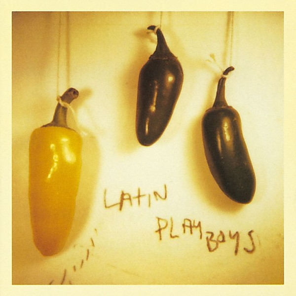

# Latin Playboys

By **Latin Playboys**

## Album Data

- **Catalog:** Beets
- **Format:** Digital, Album
- **Album:** Latin Playboys
- **Artist:** Latin Playboys
- **Albumartist:** Latin Playboys
- **Genre:** Rock And Roll
- **MusicBrainz Album Artist ID:** [f052725a-f7aa-4764-b5ec-0ff39619fa78](https://musicbrainz.org/artist/f052725a-f7aa-4764-b5ec-0ff39619fa78)
- **MusicBrainz Album ID:** [fe4d0355-674d-4e79-a37a-1b6a7c44afe8](https://musicbrainz.org/release/fe4d0355-674d-4e79-a37a-1b6a7c44afe8)
- **MusicBrainz Release Group ID:** [79afe86a-d700-380e-a0c9-ec8cad0836f5](https://musicbrainz.org/release-group/79afe86a-d700-380e-a0c9-ec8cad0836f5)
- **Year:** 1997
- **Catalog #:** 9 45543-2
- **Label:** Warner Bros. Records
- **Total Tracks:** 14

## Album Tracks

### Track 01 - Viva La Raza

- **Artist:** Latin Playboys
- **Format:** MP3
- **Genre:** Rock And Roll
- **Length:** 2:48
- **MusicBrainz Track ID:** [2af487f2-1156-40ca-9f51-3a204fb6f6b1](https://musicbrainz.org/recording/2af487f2-1156-40ca-9f51-3a204fb6f6b1)
- **Title:** Viva La Raza
- **Track:** 01
- **Year:** 1997

### Track 02 - Ten Believers

- **Artist:** Latin Playboys
- **Format:** MP3
- **Genre:** Rock And Roll
- **Length:** 3:17
- **MusicBrainz Track ID:** [88da85ed-5524-4851-bcce-9bf5af678c6c](https://musicbrainz.org/recording/88da85ed-5524-4851-bcce-9bf5af678c6c)
- **Title:** Ten Believers
- **Track:** 02
- **Year:** 1997

### Track 03 - Chinese Surprize

- **Artist:** Latin Playboys
- **Format:** MP3
- **Genre:** Rock And Roll
- **Length:** 3:06
- **MusicBrainz Track ID:** [baf38021-1ac5-4ed3-a86a-f08621de0952](https://musicbrainz.org/recording/baf38021-1ac5-4ed3-a86a-f08621de0952)
- **Title:** Chinese Surprize
- **Track:** 03
- **Year:** 1997

### Track 04 - Mira!

- **Artist:** Latin Playboys
- **Format:** MP3
- **Genre:** Rock And Roll
- **Length:** 1:25
- **MusicBrainz Track ID:** [f5b465e9-c346-4009-ada6-83b99653faf8](https://musicbrainz.org/recording/f5b465e9-c346-4009-ada6-83b99653faf8)
- **Title:** Mira!
- **Track:** 04
- **Year:** 1997

### Track 05 - Manifold de Amour

- **Artist:** Latin Playboys
- **Format:** MP3
- **Genre:** Ambient
- **Length:** 2:02
- **MusicBrainz Track ID:** [c7482c21-60f3-4bcc-9fd7-c5b2b03c2d53](https://musicbrainz.org/recording/c7482c21-60f3-4bcc-9fd7-c5b2b03c2d53)
- **Title:** Manifold de Amour
- **Track:** 05
- **Year:** 1997

### Track 06 - New Zandu

- **Artist:** Latin Playboys
- **Format:** MP3
- **Genre:** Rock And Roll
- **Length:** 3:13
- **MusicBrainz Track ID:** [a17d82a7-5d65-4866-ba68-199e281c06c2](https://musicbrainz.org/recording/a17d82a7-5d65-4866-ba68-199e281c06c2)
- **Title:** New Zandu
- **Track:** 06
- **Year:** 1997

### Track 07 - Rudy’s Party

- **Artist:** Latin Playboys
- **Format:** MP3
- **Genre:** Rock And Roll
- **Length:** 2:31
- **MusicBrainz Track ID:** [1134cdb5-68c6-443a-82b3-9ee46eac1ad4](https://musicbrainz.org/recording/1134cdb5-68c6-443a-82b3-9ee46eac1ad4)
- **Title:** Rudy’s Party
- **Track:** 07
- **Year:** 1997

### Track 08 - If

- **Artist:** Latin Playboys
- **Format:** MP3
- **Genre:** Rock And Roll
- **Length:** 1:41
- **MusicBrainz Track ID:** [647b49bd-a8ad-4ec6-bcc3-b512425eb3ae](https://musicbrainz.org/recording/647b49bd-a8ad-4ec6-bcc3-b512425eb3ae)
- **Title:** If
- **Track:** 08
- **Year:** 1997

### Track 09 - Same Brown Earth

- **Artist:** Latin Playboys
- **Format:** MP3
- **Genre:** Electronic
- **Length:** 3:45
- **MusicBrainz Track ID:** [784932ea-0ec7-42e9-8924-eb5fdf86edfd](https://musicbrainz.org/recording/784932ea-0ec7-42e9-8924-eb5fdf86edfd)
- **Title:** Same Brown Earth
- **Track:** 09
- **Year:** 1997

### Track 10 - Lagoon

- **Artist:** Latin Playboys
- **Format:** MP3
- **Genre:** Rock And Roll
- **Length:** 2:27
- **MusicBrainz Track ID:** [53d93061-670a-4e98-a285-77ad55fdfeff](https://musicbrainz.org/recording/53d93061-670a-4e98-a285-77ad55fdfeff)
- **Title:** Lagoon
- **Track:** 10
- **Year:** 1997

### Track 11 - Gone

- **Artist:** Latin Playboys
- **Format:** MP3
- **Genre:** Rock And Roll
- **Length:** 2:52
- **MusicBrainz Track ID:** [2c315176-9cba-4604-94d8-12f64c4600ca](https://musicbrainz.org/recording/2c315176-9cba-4604-94d8-12f64c4600ca)
- **Title:** Gone
- **Track:** 11
- **Year:** 1997

### Track 12 - Crayon Sun

- **Artist:** Latin Playboys
- **Format:** MP3
- **Genre:** Lo-Fi
- **Length:** 3:09
- **MusicBrainz Track ID:** [2394850a-0c2d-4e3d-ad97-a1e41ff5e9d6](https://musicbrainz.org/recording/2394850a-0c2d-4e3d-ad97-a1e41ff5e9d6)
- **Title:** Crayon Sun
- **Track:** 12
- **Year:** 1997

### Track 13 - Pink Steps

- **Artist:** Latin Playboys
- **Format:** MP3
- **Genre:** Rock And Roll
- **Length:** 2:06
- **MusicBrainz Track ID:** [635ef684-e6f3-4d12-8e5b-5858f658fd81](https://musicbrainz.org/recording/635ef684-e6f3-4d12-8e5b-5858f658fd81)
- **Title:** Pink Steps
- **Track:** 13
- **Year:** 1997

### Track 14 - Forever Night Shade Mary

- **Artist:** Latin Playboys
- **Format:** MP3
- **Genre:** Rock
- **Length:** 3:03
- **MusicBrainz Track ID:** [8669e114-5381-4ba4-8062-e14e325c0ba7](https://musicbrainz.org/recording/8669e114-5381-4ba4-8062-e14e325c0ba7)
- **Title:** Forever Night Shade Mary
- **Track:** 14
- **Year:** 1997

