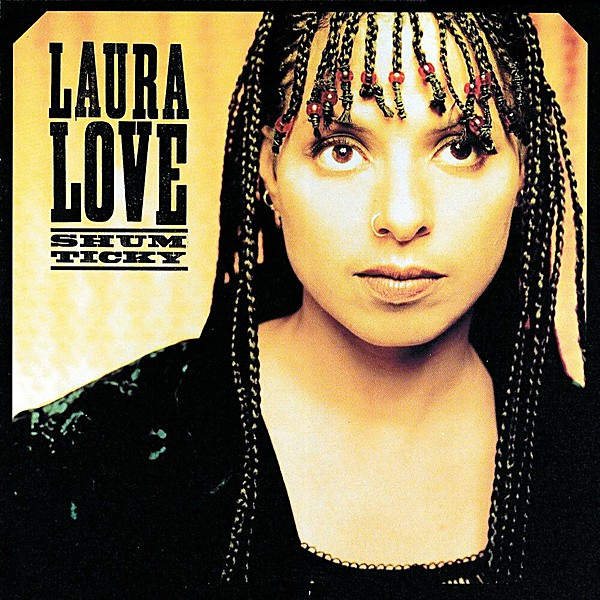

# Shum Ticky

By **Laura Love**

## Album Data

- **Catalog:** Beets
- **Format:** Digital, Album
- **Album:** Shum Ticky
- **Artist:** Laura Love
- **Albumartist:** Laura Love
- **Genre:** Indie Pop
- **MusicBrainz Album Artist ID:** [53299fed-ec27-464f-94eb-5fda2db2902a](https://musicbrainz.org/artist/53299fed-ec27-464f-94eb-5fda2db2902a)
- **MusicBrainz Album ID:** [2f53d950-d37a-44f4-8e55-ef91bd7f9a3e](https://musicbrainz.org/release/2f53d950-d37a-44f4-8e55-ef91bd7f9a3e)
- **MusicBrainz Release Group ID:** [66a6c69c-f5d3-306a-bb99-00105ef6dad9](https://musicbrainz.org/release-group/66a6c69c-f5d3-306a-bb99-00105ef6dad9)
- **Year:** 1998
- **Catalog #:** 
- **Label:** Mercury
- **Total Tracks:** 13

## Album Tracks

### Track 01 - Woe Is Me

- **Artist:** Laura Love
- **Format:** MP3
- **Genre:** Indie Pop
- **Length:** 3:59
- **MusicBrainz Track ID:** [9d764fad-2667-4421-b9b7-25d5a3e33c62](https://musicbrainz.org/recording/9d764fad-2667-4421-b9b7-25d5a3e33c62)
- **Title:** Woe Is Me
- **Track:** 01
- **Year:** 1998

### Track 02 - Mahbootay

- **Artist:** Laura Love
- **Format:** MP3
- **Genre:** Blues
- **Length:** 5:04
- **MusicBrainz Track ID:** [086f093a-8961-4466-a4de-9b42c302480d](https://musicbrainz.org/recording/086f093a-8961-4466-a4de-9b42c302480d)
- **Title:** Mahbootay
- **Track:** 02
- **Year:** 1998

### Track 03 - Aha Me a Riddle I Day

- **Artist:** Laura Love
- **Format:** MP3
- **Genre:** Indie Pop
- **Length:** 4:33
- **MusicBrainz Track ID:** [32e463c0-8e87-4e01-adb8-a34eccc00cd4](https://musicbrainz.org/recording/32e463c0-8e87-4e01-adb8-a34eccc00cd4)
- **Title:** Aha Me a Riddle I Day
- **Track:** 03
- **Year:** 1998

### Track 04 - The Clapping Song

- **Artist:** Laura Love
- **Format:** MP3
- **Genre:** Indie Pop
- **Length:** 5:30
- **MusicBrainz Track ID:** [0e350c7a-5919-4ae8-9d08-c38e04e4f643](https://musicbrainz.org/recording/0e350c7a-5919-4ae8-9d08-c38e04e4f643)
- **Title:** The Clapping Song
- **Track:** 04
- **Year:** 1998

### Track 05 - I'm a Givin' Way

- **Artist:** Laura Love
- **Format:** MP3
- **Genre:** Vocal Jazz
- **Length:** 4:17
- **MusicBrainz Track ID:** [b6102e16-60e9-4c60-851f-85cf8bfe554f](https://musicbrainz.org/recording/b6102e16-60e9-4c60-851f-85cf8bfe554f)
- **Title:** I'm a Givin' Way
- **Track:** 05
- **Year:** 1998

### Track 06 - Punctured and Hissing

- **Artist:** Laura Love
- **Format:** MP3
- **Genre:** Indie Pop
- **Length:** 4:08
- **MusicBrainz Track ID:** [4555cc70-656b-4501-afbd-54e7667b4706](https://musicbrainz.org/recording/4555cc70-656b-4501-afbd-54e7667b4706)
- **Title:** Punctured and Hissing
- **Track:** 06
- **Year:** 1998

### Track 07 - Longfellow Creek

- **Artist:** Laura Love
- **Format:** MP3
- **Genre:** Indie Pop
- **Length:** 3:37
- **MusicBrainz Track ID:** [29c591f4-67ca-4267-8966-91491ab3261b](https://musicbrainz.org/recording/29c591f4-67ca-4267-8966-91491ab3261b)
- **Title:** Longfellow Creek
- **Track:** 07
- **Year:** 1998

### Track 08 - Less Is More

- **Artist:** Laura Love
- **Format:** MP3
- **Genre:** Vocal Jazz
- **Length:** 5:26
- **MusicBrainz Track ID:** [97f61e58-cf9f-4d75-975b-78775d4ff316](https://musicbrainz.org/recording/97f61e58-cf9f-4d75-975b-78775d4ff316)
- **Title:** Less Is More
- **Track:** 08
- **Year:** 1998

### Track 09 - Shum Ticky

- **Artist:** Laura Love
- **Format:** MP3
- **Genre:** Indie Pop
- **Length:** 3:00
- **MusicBrainz Track ID:** [221389c2-7b09-411d-9d7a-d9fdcdfcd09f](https://musicbrainz.org/recording/221389c2-7b09-411d-9d7a-d9fdcdfcd09f)
- **Title:** Shum Ticky
- **Track:** 09
- **Year:** 1998

### Track 10 - Sorry

- **Artist:** Laura Love
- **Format:** MP3
- **Genre:** Indie Pop
- **Length:** 4:54
- **MusicBrainz Track ID:** [123c2835-a199-42a3-9df2-410f9d1063b3](https://musicbrainz.org/recording/123c2835-a199-42a3-9df2-410f9d1063b3)
- **Title:** Sorry
- **Track:** 10
- **Year:** 1998

### Track 11 - Serenity

- **Artist:** Laura Love
- **Format:** MP3
- **Genre:** Indie Pop
- **Length:** 3:20
- **MusicBrainz Track ID:** [01fee33d-d6cb-489c-9c5e-d627a8fddde5](https://musicbrainz.org/recording/01fee33d-d6cb-489c-9c5e-d627a8fddde5)
- **Title:** Serenity
- **Track:** 11
- **Year:** 1998

### Track 12 - Give Me Five

- **Artist:** Laura Love
- **Format:** MP3
- **Genre:** Indie Pop
- **Length:** 3:24
- **MusicBrainz Track ID:** [6d007eaf-0366-47b1-9ee9-2ca5fcaa552c](https://musicbrainz.org/recording/6d007eaf-0366-47b1-9ee9-2ca5fcaa552c)
- **Title:** Give Me Five
- **Track:** 12
- **Year:** 1998

### Track 13 - Bang Bang

- **Artist:** Laura Love
- **Format:** MP3
- **Genre:** Vocal Jazz
- **Length:** 4:56
- **MusicBrainz Track ID:** [33326c34-6011-489e-9476-7b860da7031b](https://musicbrainz.org/recording/33326c34-6011-489e-9476-7b860da7031b)
- **Title:** Bang Bang
- **Track:** 13
- **Year:** 1998

