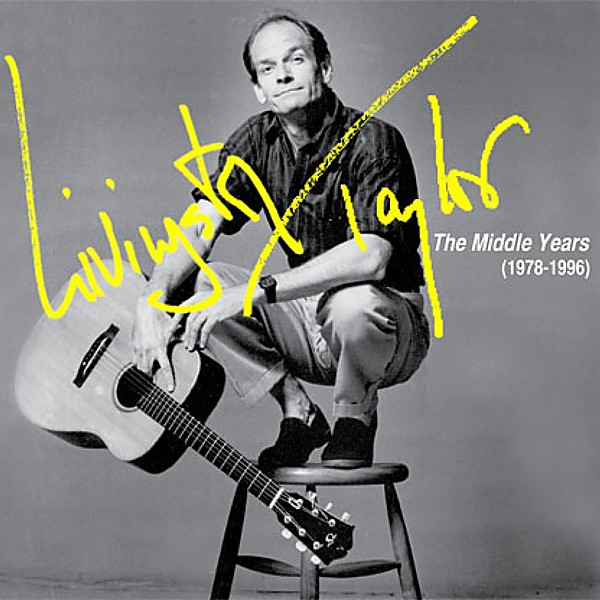

# 1978

By **Laura Taylor**

## Album Data

- **Catalog:** Beets
- **Format:** Digital, Album
- **Album:** 1978
- **Artist:** Laura Taylor
- **Albumartist:** Laura Taylor
- **Genre:** Funk
- **MusicBrainz Album Artist ID:** 
- **MusicBrainz Album ID:** 
- **MusicBrainz Release Group ID:** 
- **Year:** 1978
- **Catalog #:** 
- **Label:** 
- **Total Tracks:** 00

## Album Tracks

### Track 01 - Dancin' In My Feet (Theme From 'disco Magic')

- **Artist:** Laura Taylor
- **Format:** MP3
- **Genre:** Funk
- **Length:** 5:58
- **MusicBrainz Track ID:** 
- **Title:** Dancin' In My Feet (Theme From 'disco Magic')
- **Track:** 01
- **Year:** 1978

