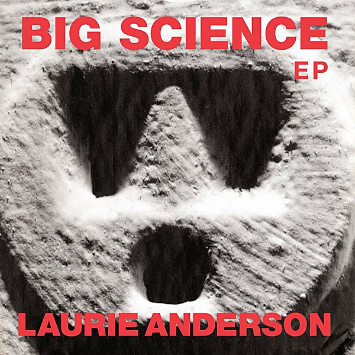

# Big Science

By **Laurie Anderson**

## Album Data

- **Catalog:** Beets
- **Format:** Digital, Album
- **Album:** Big Science
- **Artist:** Laurie Anderson
- **Albumartist:** Laurie Anderson
- **Genre:** Art Rock
- **MusicBrainz Album Artist ID:** 
- **MusicBrainz Album ID:** 
- **MusicBrainz Release Group ID:** 
- **Year:** 2007
- **Catalog #:** 
- **Label:** 
- **Total Tracks:** 00

## Album Tracks

### Track 12 - O Superman

- **Artist:** Laurie Anderson
- **Format:** AAC
- **Genre:** New Wave
- **Length:** 8:26
- **MusicBrainz Track ID:** 
- **Title:** O Superman
- **Track:** 12
- **Year:** 2007

### Track 01 - From the Air

- **Artist:** Laurie Anderson
- **Format:** AAC
- **Genre:** Experimental Rock
- **Length:** 4:33
- **MusicBrainz Track ID:** 
- **Title:** From the Air
- **Track:** 01
- **Year:** 2007

### Track 02 - Big Science

- **Artist:** Laurie Anderson
- **Format:** AAC
- **Genre:** Progressive Rock
- **Length:** 6:22
- **MusicBrainz Track ID:** 
- **Title:** Big Science
- **Track:** 02
- **Year:** 2007

### Track 03 - Sweaters

- **Artist:** Laurie Anderson
- **Format:** AAC
- **Genre:** Experimental Rock
- **Length:** 2:23
- **MusicBrainz Track ID:** 
- **Title:** Sweaters
- **Track:** 03
- **Year:** 2007

### Track 04 - Walking and Falling

- **Artist:** Laurie Anderson
- **Format:** AAC
- **Genre:** Avant-Garde
- **Length:** 2:13
- **MusicBrainz Track ID:** 
- **Title:** Walking and Falling
- **Track:** 04
- **Year:** 2007

### Track 05 - Born, Never Asked

- **Artist:** Laurie Anderson
- **Format:** AAC
- **Genre:** Indie Rock
- **Length:** 4:56
- **MusicBrainz Track ID:** 
- **Title:** Born, Never Asked
- **Track:** 05
- **Year:** 2007

### Track 06 - O Superman

- **Artist:** Laurie Anderson
- **Format:** AAC
- **Genre:** New Wave
- **Length:** 8:25
- **MusicBrainz Track ID:** 
- **Title:** O Superman
- **Track:** 06
- **Year:** 2007

### Track 07 - Example #22

- **Artist:** Laurie Anderson
- **Format:** AAC
- **Genre:** Psychedelic Rock
- **Length:** 2:59
- **MusicBrainz Track ID:** 
- **Title:** Example #22
- **Track:** 07
- **Year:** 2007

### Track 08 - Let X=X

- **Artist:** Laurie Anderson
- **Format:** AAC
- **Genre:** Post-Punk
- **Length:** 3:54
- **MusicBrainz Track ID:** 
- **Title:** Let X=X
- **Track:** 08
- **Year:** 2007

### Track 09 - It Tango

- **Artist:** Laurie Anderson
- **Format:** AAC
- **Genre:** Post-Punk
- **Length:** 3:02
- **MusicBrainz Track ID:** 
- **Title:** It Tango
- **Track:** 09
- **Year:** 2007

### Track 10 - Walk the Dog

- **Artist:** Laurie Anderson
- **Format:** AAC
- **Genre:** Electronica
- **Length:** 5:51
- **MusicBrainz Track ID:** 
- **Title:** Walk the Dog
- **Track:** 10
- **Year:** 2007

### Track 11 - Big Science 2

- **Artist:** Laurie Anderson
- **Format:** AAC
- **Genre:** Avant-Garde Jazz
- **Length:** 3:36
- **MusicBrainz Track ID:** 
- **Title:** Big Science 2
- **Track:** 11
- **Year:** 2007

