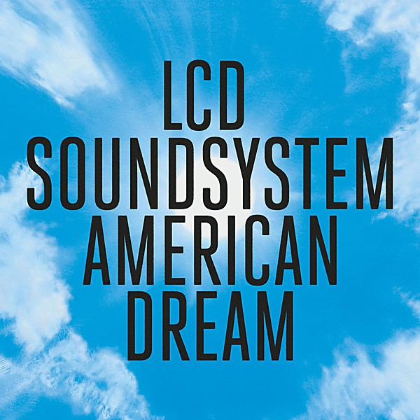

# American Dream

By **LCD Soundsystem**

## Album Data

- **Catalog:** Beets
- **Format:** Digital, Album
- **Album:** American Dream
- **Artist:** Lcd Soundsystem
- **Albumartist:** LCD Soundsystem
- **Genre:** Synthpop
- **MusicBrainz Album Artist ID:** [2aaf7396-6ab8-40f3-9776-a41c42c8e26b](https://musicbrainz.org/artist/2aaf7396-6ab8-40f3-9776-a41c42c8e26b)
- **MusicBrainz Album ID:** [0ed955af-fd15-49c4-915a-d95ebc730664](https://musicbrainz.org/release/0ed955af-fd15-49c4-915a-d95ebc730664)
- **MusicBrainz Release Group ID:** [bfedb7ca-9067-4cdb-8921-1f0cd920f2e9](https://musicbrainz.org/release-group/bfedb7ca-9067-4cdb-8921-1f0cd920f2e9)
- **Year:** 2017
- **Catalog #:** 
- **Label:** Columbia
- **Total Tracks:** 10

## Album Tracks

### Track 01 - Oh Baby

- **Artist:** LCD Soundsystem
- **Format:** ALAC
- **Genre:** New Wave
- **Length:** 5:49
- **MusicBrainz Track ID:** [88b29d0a-2dd8-46cb-8111-99c3d169639d](https://musicbrainz.org/recording/88b29d0a-2dd8-46cb-8111-99c3d169639d)
- **Title:** Oh Baby
- **Track:** 01
- **Year:** 2017

### Track 02 - Other Voices

- **Artist:** LCD Soundsystem
- **Format:** ALAC
- **Genre:** Synthpop
- **Length:** 6:43
- **MusicBrainz Track ID:** [16fb6137-0d71-4a42-bbf5-5168ea90c452](https://musicbrainz.org/recording/16fb6137-0d71-4a42-bbf5-5168ea90c452)
- **Title:** Other Voices
- **Track:** 02
- **Year:** 2017

### Track 03 - I Used To

- **Artist:** LCD Soundsystem
- **Format:** ALAC
- **Genre:** New Wave
- **Length:** 5:32
- **MusicBrainz Track ID:** [1c183339-c319-4398-9d7f-95a84026c928](https://musicbrainz.org/recording/1c183339-c319-4398-9d7f-95a84026c928)
- **Title:** I Used To
- **Track:** 03
- **Year:** 2017

### Track 04 - Change Yr Mind

- **Artist:** LCD Soundsystem
- **Format:** ALAC
- **Genre:** Art Rock
- **Length:** 4:57
- **MusicBrainz Track ID:** [340098d8-c27d-4816-ab21-8dbb76db4d13](https://musicbrainz.org/recording/340098d8-c27d-4816-ab21-8dbb76db4d13)
- **Title:** Change Yr Mind
- **Track:** 04
- **Year:** 2017

### Track 05 - How Do You Sleep?

- **Artist:** LCD Soundsystem
- **Format:** ALAC
- **Genre:** New Wave
- **Length:** 9:12
- **MusicBrainz Track ID:** [1e9db879-03e8-430d-b251-e5834fa315bb](https://musicbrainz.org/recording/1e9db879-03e8-430d-b251-e5834fa315bb)
- **Title:** How Do You Sleep?
- **Track:** 05
- **Year:** 2017

### Track 06 - Tonite

- **Artist:** LCD Soundsystem
- **Format:** ALAC
- **Genre:** Dance-Punk
- **Length:** 5:47
- **MusicBrainz Track ID:** [bcd98960-9c26-4d53-97d7-592c57d713a6](https://musicbrainz.org/recording/bcd98960-9c26-4d53-97d7-592c57d713a6)
- **Title:** Tonite
- **Track:** 06
- **Year:** 2017

### Track 07 - Call the Police

- **Artist:** LCD Soundsystem
- **Format:** ALAC
- **Genre:** Dance-Punk
- **Length:** 6:58
- **MusicBrainz Track ID:** [c1b98731-748b-4db6-9ea2-091458fffacf](https://musicbrainz.org/recording/c1b98731-748b-4db6-9ea2-091458fffacf)
- **Title:** Call the Police
- **Track:** 07
- **Year:** 2017

### Track 08 - American Dream

- **Artist:** LCD Soundsystem
- **Format:** ALAC
- **Genre:** Electronica
- **Length:** 6:06
- **MusicBrainz Track ID:** [7eeeb7c0-4083-48e8-89b0-0a2f6ecdbe20](https://musicbrainz.org/recording/7eeeb7c0-4083-48e8-89b0-0a2f6ecdbe20)
- **Title:** American Dream
- **Track:** 08
- **Year:** 2017

### Track 09 - Emotional Haircut

- **Artist:** LCD Soundsystem
- **Format:** ALAC
- **Genre:** Dance-Punk
- **Length:** 5:29
- **MusicBrainz Track ID:** [34d68b06-1bdb-48fa-b969-4c0093a72499](https://musicbrainz.org/recording/34d68b06-1bdb-48fa-b969-4c0093a72499)
- **Title:** Emotional Haircut
- **Track:** 09
- **Year:** 2017

### Track 10 - Black Screen

- **Artist:** LCD Soundsystem
- **Format:** ALAC
- **Genre:** Electronic Rock
- **Length:** 12:05
- **MusicBrainz Track ID:** [0837295b-e171-4d72-bc88-ba544688103c](https://musicbrainz.org/recording/0837295b-e171-4d72-bc88-ba544688103c)
- **Title:** Black Screen
- **Track:** 10
- **Year:** 2017

