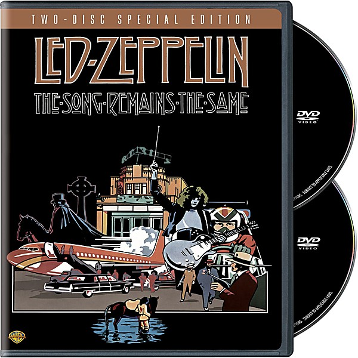

# BBC Sessions [Live] [Disc 1]

By **Led Zeppelin**

## Album Data

- **Catalog:** Beets
- **Format:** Digital, Album
- **Album:** BBC Sessions [Live] [Disc 1]
- **Artist:** Led Zeppelin
- **Albumartist:** Led Zeppelin
- **Genre:** Progressive Rock
- **MusicBrainz Album Artist ID:** 
- **MusicBrainz Album ID:** 
- **MusicBrainz Release Group ID:** 
- **Year:** 1997
- **Catalog #:** 
- **Label:** 
- **Total Tracks:** 10

## Album Tracks

### Track 01 - Immigrant Song

- **Artist:** Led Zeppelin
- **Format:** ALAC
- **Genre:** Progressive Rock
- **Length:** 3:21
- **MusicBrainz Track ID:** 
- **Title:** Immigrant Song
- **Track:** 01
- **Year:** 1997

### Track 02 - Heartbreaker

- **Artist:** Led Zeppelin
- **Format:** ALAC
- **Genre:** Progressive Rock
- **Length:** 5:15
- **MusicBrainz Track ID:** 
- **Title:** Heartbreaker
- **Track:** 02
- **Year:** 1997

### Track 03 - Since I've Been Loving You

- **Artist:** Led Zeppelin
- **Format:** ALAC
- **Genre:** Progressive Rock
- **Length:** 6:56
- **MusicBrainz Track ID:** 
- **Title:** Since I've Been Loving You
- **Track:** 03
- **Year:** 1997

### Track 04 - Black Dog

- **Artist:** Led Zeppelin
- **Format:** ALAC
- **Genre:** Progressive Rock
- **Length:** 5:17
- **MusicBrainz Track ID:** 
- **Title:** Black Dog
- **Track:** 04
- **Year:** 1997

### Track 05 - Dazed And Confused

- **Artist:** Led Zeppelin
- **Format:** ALAC
- **Genre:** Psychedelic Rock
- **Length:** 18:36
- **MusicBrainz Track ID:** 
- **Title:** Dazed And Confused
- **Track:** 05
- **Year:** 1997

### Track 06 - Stairway To Heaven

- **Artist:** Led Zeppelin
- **Format:** ALAC
- **Genre:** Progressive Rock
- **Length:** 8:49
- **MusicBrainz Track ID:** 
- **Title:** Stairway To Heaven
- **Track:** 06
- **Year:** 1997

### Track 07 - Going To California

- **Artist:** Led Zeppelin
- **Format:** ALAC
- **Genre:** Hard Rock
- **Length:** 3:54
- **MusicBrainz Track ID:** 
- **Title:** Going To California
- **Track:** 07
- **Year:** 1997

### Track 08 - That's The Way

- **Artist:** Led Zeppelin
- **Format:** ALAC
- **Genre:** Heavy Metal
- **Length:** 5:43
- **MusicBrainz Track ID:** 
- **Title:** That's The Way
- **Track:** 08
- **Year:** 1997

### Track 09 - Whole Lotta Love (Medley)

- **Artist:** Led Zeppelin
- **Format:** ALAC
- **Genre:** Hard Rock
- **Length:** 13:45
- **MusicBrainz Track ID:** 
- **Title:** Whole Lotta Love (Medley)
- **Track:** 09
- **Year:** 1997

### Track 10 - Thank You

- **Artist:** Led Zeppelin
- **Format:** ALAC
- **Genre:** Progressive Rock
- **Length:** 6:39
- **MusicBrainz Track ID:** 
- **Title:** Thank You
- **Track:** 10
- **Year:** 1997

## See also

- [BBC Sessions [Live] [Disc 2]](BBC_Sessions_[Live]_[Disc_2].md)
- [Houses of the Holy](Houses_of_the_Holy.md)
- [How the West Was Won](How_the_West_Was_Won.md)
- [Led Zeppelin II](Led_Zeppelin_II.md)
- [Physical Graffiti](Physical_Graffiti.md)
- [The Complete BBC Sessions](The_Complete_BBC_Sessions.md)
- [CD: Early Days - The Best Of Led Zeppelin Vol. 1](../../CD/Led_Zeppelin/Early_Days_-_The_Best_Of_Led_Zeppelin_Vol_1.md)
- [CD: How The West Was Won (Disc 1)](../../CD/Led_Zeppelin/How_The_West_Was_Won_Disc_1.md)
- [CD: How The West Was Won (Disc 2)](../../CD/Led_Zeppelin/How_The_West_Was_Won_Disc_2.md)
- [CD: ](../../CD/Led_Zeppelin/Led_Zeppelin.md)
- [CD: Physical Graffiti (Disc 1) (Disc 1)](../../CD/Led_Zeppelin/Physical_Graffiti_Disc_1_Disc_1.md)
- [CD: The Complete Bbc Sessions (Disc 1)](../../CD/Led_Zeppelin/The_Complete_Bbc_Sessions_Disc_1.md)
- [CD: The Complete Bbc Sessions (Disc 2)](../../CD/Led_Zeppelin/The_Complete_Bbc_Sessions_Disc_2.md)
- [CD: The Complete Bbc Sessions (Disc 3)](../../CD/Led_Zeppelin/The_Complete_Bbc_Sessions_Disc_3.md)
- [Roon: Houses Of The Holy (HD Remastered Edition) (Remaster)](../../Roon/Led_Zeppelin/Houses_Of_The_Holy_HD_Remastered_Edition_Remaster.md)
- [Roon: Led Zeppelin (HD Remastered Edition) (Remaster)](../../Roon/Led_Zeppelin/Led_Zeppelin_HD_Remastered_Edition_Remaster.md)
- [Roon: Led Zeppelin II (HD Remastered Deluxe Edition) (Deluxe Edition)](../../Roon/Led_Zeppelin/Led_Zeppelin_II_HD_Remastered_Deluxe_Edition_Deluxe_Edition.md)
- [Roon: Led Zeppelin III (HD Remastered Edition) (Remaster)](../../Roon/Led_Zeppelin/Led_Zeppelin_III_HD_Remastered_Edition_Remaster.md)
- [Roon: Led Zeppelin IV (HD Remastered Deluxe Edition) (Deluxe Edition)](../../Roon/Led_Zeppelin/Led_Zeppelin_IV_HD_Remastered_Deluxe_Edition_Deluxe_Edition.md)
- [Roon: Physical Graffiti (HD Remastered Deluxe Edition) (Deluxe Edition)](../../Roon/Led_Zeppelin/Physical_Graffiti_HD_Remastered_Deluxe_Edition_Deluxe_Edition.md)
- [Vinyl: Houses Of The Holy](../../Vinyl/Led_Zeppelin/Houses_Of_The_Holy.md)
- [Vinyl: Led Zeppelin III](../../Vinyl/Led_Zeppelin/Led_Zeppelin_III.md)
- [Vinyl: Led Zeppelin II](../../Vinyl/Led_Zeppelin/Led_Zeppelin_II.md)
- [Vinyl: ](../../Vinyl/Led_Zeppelin/Led_Zeppelin_index.md)
- [Vinyl: Led Zeppelin](../../Vinyl/Led_Zeppelin/Led_Zeppelin.md)
- [Vinyl: Physical Graffiti](../../Vinyl/Led_Zeppelin/Physical_Graffiti.md)
- [Vinyl: Untitled](../../Vinyl/Led_Zeppelin/Untitled.md)
- [Vinyl: Whole Lotta Love](../../Vinyl/Led_Zeppelin/Whole_Lotta_Love.md)
