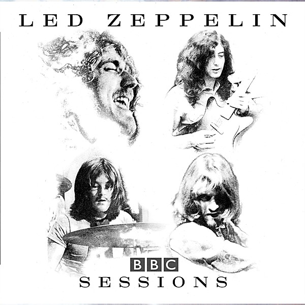

# BBC Sessions [Live] [Disc 2]

By **Led Zeppelin**

## Album Data

- **Catalog:** Beets
- **Format:** Digital, Album
- **Album:** BBC Sessions [Live] [Disc 2]
- **Artist:** Led Zeppelin
- **Albumartist:** Led Zeppelin
- **Genre:** Progressive Rock
- **MusicBrainz Album Artist ID:** 
- **MusicBrainz Album ID:** 
- **MusicBrainz Release Group ID:** 
- **Year:** 1997
- **Catalog #:** SD 7255
- **Label:** Atlantic
- **Total Tracks:** 08

## Album Tracks

### Track 01 - The Song Remains the Same

- **Artist:** Led Zeppelin
- **Format:** ALAC
- **Genre:** Psychedelic Rock
- **Length:** 5:29
- **MusicBrainz Track ID:** [0d16494f-2ba4-4f4f-adf9-ae1f3ee1673d](https://musicbrainz.org/recording/0d16494f-2ba4-4f4f-adf9-ae1f3ee1673d)
- **Title:** The Song Remains the Same
- **Track:** 01
- **Year:** 1973

### Track 02 - The Rain Song

- **Artist:** Led Zeppelin
- **Format:** ALAC
- **Genre:** Progressive Rock
- **Length:** 7:39
- **MusicBrainz Track ID:** [ff650e55-0136-4bb5-bbe5-dc429edae5c5](https://musicbrainz.org/recording/ff650e55-0136-4bb5-bbe5-dc429edae5c5)
- **Title:** The Rain Song
- **Track:** 02
- **Year:** 1973

### Track 03 - Over the Hills and Far Away

- **Artist:** Led Zeppelin
- **Format:** ALAC
- **Genre:** Progressive Rock
- **Length:** 4:50
- **MusicBrainz Track ID:** [f52edb9a-aff7-4ff9-ba76-85b84399ff9b](https://musicbrainz.org/recording/f52edb9a-aff7-4ff9-ba76-85b84399ff9b)
- **Title:** Over the Hills and Far Away
- **Track:** 03
- **Year:** 1973

### Track 04 - The Crunge

- **Artist:** Led Zeppelin
- **Format:** ALAC
- **Genre:** Uk Garage
- **Length:** 3:17
- **MusicBrainz Track ID:** [8b8216e5-137b-4ebd-a94f-a29fb7a3f014](https://musicbrainz.org/recording/8b8216e5-137b-4ebd-a94f-a29fb7a3f014)
- **Title:** The Crunge
- **Track:** 04
- **Year:** 1973

### Track 05 - Dancing Days

- **Artist:** Led Zeppelin
- **Format:** ALAC
- **Genre:** Progressive Rock
- **Length:** 3:43
- **MusicBrainz Track ID:** [f6603ffa-54c7-4e5b-a744-70a13a1c9dc3](https://musicbrainz.org/recording/f6603ffa-54c7-4e5b-a744-70a13a1c9dc3)
- **Title:** Dancing Days
- **Track:** 05
- **Year:** 1973

### Track 06 - D’yer Mak’er

- **Artist:** Led Zeppelin
- **Format:** ALAC
- **Genre:** Rock
- **Length:** 4:22
- **MusicBrainz Track ID:** [0cfbca12-01e1-4014-932e-e634293ba770](https://musicbrainz.org/recording/0cfbca12-01e1-4014-932e-e634293ba770)
- **Title:** D’yer Mak’er
- **Track:** 06
- **Year:** 1973

### Track 07 - No Quarter

- **Artist:** Led Zeppelin
- **Format:** ALAC
- **Genre:** Psychedelic Rock
- **Length:** 7:00
- **MusicBrainz Track ID:** [2822a034-283d-4082-8464-6189ff29fbb9](https://musicbrainz.org/recording/2822a034-283d-4082-8464-6189ff29fbb9)
- **Title:** No Quarter
- **Track:** 07
- **Year:** 1973

### Track 08 - The Ocean

- **Artist:** Led Zeppelin
- **Format:** ALAC
- **Genre:** Progressive Rock
- **Length:** 4:31
- **MusicBrainz Track ID:** [9868d850-a37b-4e03-b097-8e2b5d26429c](https://musicbrainz.org/recording/9868d850-a37b-4e03-b097-8e2b5d26429c)
- **Title:** The Ocean
- **Track:** 08
- **Year:** 1973

## See also

- [BBC Sessions [Live] [Disc 1]](BBC_Sessions_[Live]_[Disc_1].md)
- [Houses of the Holy](Houses_of_the_Holy.md)
- [How the West Was Won](How_the_West_Was_Won.md)
- [Led Zeppelin II](Led_Zeppelin_II.md)
- [Physical Graffiti](Physical_Graffiti.md)
- [The Complete BBC Sessions](The_Complete_BBC_Sessions.md)
- [CD: Early Days - The Best Of Led Zeppelin Vol. 1](../../CD/Led_Zeppelin/Early_Days_-_The_Best_Of_Led_Zeppelin_Vol_1.md)
- [CD: How The West Was Won (Disc 1)](../../CD/Led_Zeppelin/How_The_West_Was_Won_Disc_1.md)
- [CD: How The West Was Won (Disc 2)](../../CD/Led_Zeppelin/How_The_West_Was_Won_Disc_2.md)
- [CD: ](../../CD/Led_Zeppelin/Led_Zeppelin.md)
- [CD: Physical Graffiti (Disc 1) (Disc 1)](../../CD/Led_Zeppelin/Physical_Graffiti_Disc_1_Disc_1.md)
- [CD: The Complete Bbc Sessions (Disc 1)](../../CD/Led_Zeppelin/The_Complete_Bbc_Sessions_Disc_1.md)
- [CD: The Complete Bbc Sessions (Disc 2)](../../CD/Led_Zeppelin/The_Complete_Bbc_Sessions_Disc_2.md)
- [CD: The Complete Bbc Sessions (Disc 3)](../../CD/Led_Zeppelin/The_Complete_Bbc_Sessions_Disc_3.md)
- [Roon: Houses Of The Holy (HD Remastered Edition) (Remaster)](../../Roon/Led_Zeppelin/Houses_Of_The_Holy_HD_Remastered_Edition_Remaster.md)
- [Roon: Led Zeppelin (HD Remastered Edition) (Remaster)](../../Roon/Led_Zeppelin/Led_Zeppelin_HD_Remastered_Edition_Remaster.md)
- [Roon: Led Zeppelin II (HD Remastered Deluxe Edition) (Deluxe Edition)](../../Roon/Led_Zeppelin/Led_Zeppelin_II_HD_Remastered_Deluxe_Edition_Deluxe_Edition.md)
- [Roon: Led Zeppelin III (HD Remastered Edition) (Remaster)](../../Roon/Led_Zeppelin/Led_Zeppelin_III_HD_Remastered_Edition_Remaster.md)
- [Roon: Led Zeppelin IV (HD Remastered Deluxe Edition) (Deluxe Edition)](../../Roon/Led_Zeppelin/Led_Zeppelin_IV_HD_Remastered_Deluxe_Edition_Deluxe_Edition.md)
- [Roon: Physical Graffiti (HD Remastered Deluxe Edition) (Deluxe Edition)](../../Roon/Led_Zeppelin/Physical_Graffiti_HD_Remastered_Deluxe_Edition_Deluxe_Edition.md)
- [Vinyl: Houses Of The Holy](../../Vinyl/Led_Zeppelin/Houses_Of_The_Holy.md)
- [Vinyl: Led Zeppelin III](../../Vinyl/Led_Zeppelin/Led_Zeppelin_III.md)
- [Vinyl: Led Zeppelin II](../../Vinyl/Led_Zeppelin/Led_Zeppelin_II.md)
- [Vinyl: ](../../Vinyl/Led_Zeppelin/Led_Zeppelin_index.md)
- [Vinyl: Led Zeppelin](../../Vinyl/Led_Zeppelin/Led_Zeppelin.md)
- [Vinyl: Physical Graffiti](../../Vinyl/Led_Zeppelin/Physical_Graffiti.md)
- [Vinyl: Untitled](../../Vinyl/Led_Zeppelin/Untitled.md)
- [Vinyl: Whole Lotta Love](../../Vinyl/Led_Zeppelin/Whole_Lotta_Love.md)
