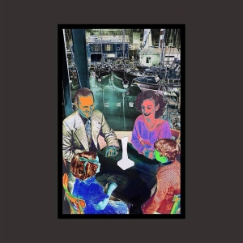

# Led Zeppelin II

By **Led Zeppelin**

## Album Data

- **Catalog:** Beets
- **Format:** Digital, Album
- **Album:** Led Zeppelin II
- **Artist:** Led Zeppelin
- **Albumartist:** Led Zeppelin
- **Genre:** Heavy Metal
- **MusicBrainz Album Artist ID:** [678d88b2-87b0-403b-b63d-5da7465aecc3](https://musicbrainz.org/artist/678d88b2-87b0-403b-b63d-5da7465aecc3)
- **MusicBrainz Album ID:** [ee5fd8b2-59da-4ba3-8356-25d7a04efb41](https://musicbrainz.org/release/ee5fd8b2-59da-4ba3-8356-25d7a04efb41)
- **MusicBrainz Release Group ID:** [33b4653d-006e-3cc1-8afb-386b15a6cd6e](https://musicbrainz.org/release-group/33b4653d-006e-3cc1-8afb-386b15a6cd6e)
- **Year:** 2014
- **Catalog #:** SS 200-2
- **Label:** Swan Song
- **Total Tracks:** 15

## Album Tracks

### Track 01 - Custard Pie

- **Artist:** Led Zeppelin
- **Format:** MP3
- **Genre:** Progressive Rock
- **Length:** 4:15
- **MusicBrainz Track ID:** [a113d682-a6b1-41c1-a69e-d6b3afdda185](https://musicbrainz.org/recording/a113d682-a6b1-41c1-a69e-d6b3afdda185)
- **Title:** Custard Pie
- **Track:** 01
- **Year:** 1987

### Track 02 - The Rover

- **Artist:** Led Zeppelin
- **Format:** MP3
- **Genre:** Progressive Rock
- **Length:** 5:39
- **MusicBrainz Track ID:** [9dc19ed4-7505-4dba-be33-b304521ed610](https://musicbrainz.org/recording/9dc19ed4-7505-4dba-be33-b304521ed610)
- **Title:** The Rover
- **Track:** 02
- **Year:** 1987

### Track 03 - In My Time of Dying

- **Artist:** Led Zeppelin
- **Format:** MP3
- **Genre:** Psychedelic Rock
- **Length:** 11:08
- **MusicBrainz Track ID:** [4b3b1445-9c36-4b9f-a38a-9ffa40671857](https://musicbrainz.org/recording/4b3b1445-9c36-4b9f-a38a-9ffa40671857)
- **Title:** In My Time of Dying
- **Track:** 03
- **Year:** 1987

### Track 04 - Houses of the Holy

- **Artist:** Led Zeppelin
- **Format:** MP3
- **Genre:** Progressive Rock
- **Length:** 4:04
- **MusicBrainz Track ID:** [3e0cc204-4d17-484f-bec3-7c2a9727db36](https://musicbrainz.org/recording/3e0cc204-4d17-484f-bec3-7c2a9727db36)
- **Title:** Houses of the Holy
- **Track:** 04
- **Year:** 1987

### Track 05 - Trampled Under Foot

- **Artist:** Led Zeppelin
- **Format:** MP3
- **Genre:** Progressive Rock
- **Length:** 5:36
- **MusicBrainz Track ID:** [f1339272-693e-4946-9779-9fc32a1f1c3f](https://musicbrainz.org/recording/f1339272-693e-4946-9779-9fc32a1f1c3f)
- **Title:** Trampled Under Foot
- **Track:** 05
- **Year:** 1987

### Track 06 - Kashmir

- **Artist:** Led Zeppelin
- **Format:** MP3
- **Genre:** Progressive Rock
- **Length:** 8:37
- **MusicBrainz Track ID:** [9c08d02d-5e49-4ef9-b538-dce167adc54a](https://musicbrainz.org/recording/9c08d02d-5e49-4ef9-b538-dce167adc54a)
- **Title:** Kashmir
- **Track:** 06
- **Year:** 1987

### Track 07 - In the Light

- **Artist:** Led Zeppelin
- **Format:** MP3
- **Genre:** Psychedelic Rock
- **Length:** 8:47
- **MusicBrainz Track ID:** [19595942-7585-4172-8997-c77568161383](https://musicbrainz.org/recording/19595942-7585-4172-8997-c77568161383)
- **Title:** In the Light
- **Track:** 07
- **Year:** 1987

### Track 08 - Bron-Yr-Aur

- **Artist:** Led Zeppelin
- **Format:** MP3
- **Genre:** Heavy Metal
- **Length:** 2:06
- **MusicBrainz Track ID:** [677cf0a2-a7cc-4581-931b-2b0b7d095b0c](https://musicbrainz.org/recording/677cf0a2-a7cc-4581-931b-2b0b7d095b0c)
- **Title:** Bron-Yr-Aur
- **Track:** 08
- **Year:** 1987

### Track 09 - Down by the Seaside

- **Artist:** Led Zeppelin
- **Format:** MP3
- **Genre:** Progressive Rock
- **Length:** 5:15
- **MusicBrainz Track ID:** [be3ccb5a-c43a-4c57-b73f-16791160fe7d](https://musicbrainz.org/recording/be3ccb5a-c43a-4c57-b73f-16791160fe7d)
- **Title:** Down by the Seaside
- **Track:** 09
- **Year:** 1987

### Track 10 - Ten Years Gone

- **Artist:** Led Zeppelin
- **Format:** MP3
- **Genre:** Progressive Rock
- **Length:** 6:34
- **MusicBrainz Track ID:** [8633e5de-2a69-478b-af88-502480765d40](https://musicbrainz.org/recording/8633e5de-2a69-478b-af88-502480765d40)
- **Title:** Ten Years Gone
- **Track:** 10
- **Year:** 1987

### Track 11 - Night Flight

- **Artist:** Led Zeppelin
- **Format:** MP3
- **Genre:** Progressive Rock
- **Length:** 3:38
- **MusicBrainz Track ID:** [9fb4b64f-5b54-4bb4-87c7-b347e09e7860](https://musicbrainz.org/recording/9fb4b64f-5b54-4bb4-87c7-b347e09e7860)
- **Title:** Night Flight
- **Track:** 11
- **Year:** 1987

### Track 12 - The Wanton Song

- **Artist:** Led Zeppelin
- **Format:** MP3
- **Genre:** Progressive Rock
- **Length:** 4:08
- **MusicBrainz Track ID:** [849b0027-0cc9-4add-98fa-c5d470bbf8e1](https://musicbrainz.org/recording/849b0027-0cc9-4add-98fa-c5d470bbf8e1)
- **Title:** The Wanton Song
- **Track:** 12
- **Year:** 1987

### Track 13 - Boogie With Stu

- **Artist:** Led Zeppelin
- **Format:** MP3
- **Genre:** Boogie
- **Length:** 3:52
- **MusicBrainz Track ID:** [f26e65fb-ae84-48e1-92e0-1c8644b81e8d](https://musicbrainz.org/recording/f26e65fb-ae84-48e1-92e0-1c8644b81e8d)
- **Title:** Boogie With Stu
- **Track:** 13
- **Year:** 1987

### Track 14 - Black Country Woman

- **Artist:** Led Zeppelin
- **Format:** MP3
- **Genre:** Heavy Metal
- **Length:** 4:24
- **MusicBrainz Track ID:** [082d4d32-9237-479c-8c56-bee5c1ae4b3a](https://musicbrainz.org/recording/082d4d32-9237-479c-8c56-bee5c1ae4b3a)
- **Title:** Black Country Woman
- **Track:** 14
- **Year:** 1987

### Track 15 - Sick Again

- **Artist:** Led Zeppelin
- **Format:** MP3
- **Genre:** Progressive Rock
- **Length:** 4:42
- **MusicBrainz Track ID:** [edcdffc8-6875-4872-bda5-c61e1ea6913f](https://musicbrainz.org/recording/edcdffc8-6875-4872-bda5-c61e1ea6913f)
- **Title:** Sick Again
- **Track:** 15
- **Year:** 1987

## See also

- [BBC Sessions [Live] [Disc 1]](BBC_Sessions_[Live]_[Disc_1].md)
- [BBC Sessions [Live] [Disc 2]](BBC_Sessions_[Live]_[Disc_2].md)
- [Houses of the Holy](Houses_of_the_Holy.md)
- [How the West Was Won](How_the_West_Was_Won.md)
- [Physical Graffiti](Physical_Graffiti.md)
- [The Complete BBC Sessions](The_Complete_BBC_Sessions.md)
- [CD: Early Days - The Best Of Led Zeppelin Vol. 1](../../CD/Led_Zeppelin/Early_Days_-_The_Best_Of_Led_Zeppelin_Vol_1.md)
- [CD: How The West Was Won (Disc 1)](../../CD/Led_Zeppelin/How_The_West_Was_Won_Disc_1.md)
- [CD: How The West Was Won (Disc 2)](../../CD/Led_Zeppelin/How_The_West_Was_Won_Disc_2.md)
- [CD: ](../../CD/Led_Zeppelin/Led_Zeppelin.md)
- [CD: Physical Graffiti (Disc 1) (Disc 1)](../../CD/Led_Zeppelin/Physical_Graffiti_Disc_1_Disc_1.md)
- [CD: The Complete Bbc Sessions (Disc 1)](../../CD/Led_Zeppelin/The_Complete_Bbc_Sessions_Disc_1.md)
- [CD: The Complete Bbc Sessions (Disc 2)](../../CD/Led_Zeppelin/The_Complete_Bbc_Sessions_Disc_2.md)
- [CD: The Complete Bbc Sessions (Disc 3)](../../CD/Led_Zeppelin/The_Complete_Bbc_Sessions_Disc_3.md)
- [Roon: Houses Of The Holy (HD Remastered Edition) (Remaster)](../../Roon/Led_Zeppelin/Houses_Of_The_Holy_HD_Remastered_Edition_Remaster.md)
- [Roon: Led Zeppelin (HD Remastered Edition) (Remaster)](../../Roon/Led_Zeppelin/Led_Zeppelin_HD_Remastered_Edition_Remaster.md)
- [Roon: Led Zeppelin II (HD Remastered Deluxe Edition) (Deluxe Edition)](../../Roon/Led_Zeppelin/Led_Zeppelin_II_HD_Remastered_Deluxe_Edition_Deluxe_Edition.md)
- [Roon: Led Zeppelin III (HD Remastered Edition) (Remaster)](../../Roon/Led_Zeppelin/Led_Zeppelin_III_HD_Remastered_Edition_Remaster.md)
- [Roon: Led Zeppelin IV (HD Remastered Deluxe Edition) (Deluxe Edition)](../../Roon/Led_Zeppelin/Led_Zeppelin_IV_HD_Remastered_Deluxe_Edition_Deluxe_Edition.md)
- [Roon: Physical Graffiti (HD Remastered Deluxe Edition) (Deluxe Edition)](../../Roon/Led_Zeppelin/Physical_Graffiti_HD_Remastered_Deluxe_Edition_Deluxe_Edition.md)
- [Vinyl: Houses Of The Holy](../../Vinyl/Led_Zeppelin/Houses_Of_The_Holy.md)
- [Vinyl: Led Zeppelin III](../../Vinyl/Led_Zeppelin/Led_Zeppelin_III.md)
- [Vinyl: Led Zeppelin II](../../Vinyl/Led_Zeppelin/Led_Zeppelin_II.md)
- [Vinyl: ](../../Vinyl/Led_Zeppelin/Led_Zeppelin_index.md)
- [Vinyl: Led Zeppelin](../../Vinyl/Led_Zeppelin/Led_Zeppelin.md)
- [Vinyl: Physical Graffiti](../../Vinyl/Led_Zeppelin/Physical_Graffiti.md)
- [Vinyl: Untitled](../../Vinyl/Led_Zeppelin/Untitled.md)
- [Vinyl: Whole Lotta Love](../../Vinyl/Led_Zeppelin/Whole_Lotta_Love.md)
