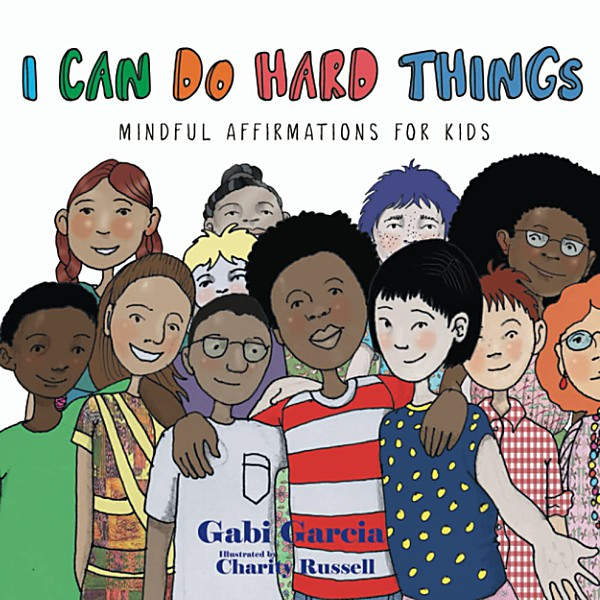

# Hello

By **Lee Michaels**

## Album Data

- **Catalog:** Beets
- **Format:** Digital, Album
- **Album:** Hello
- **Artist:** Lee Michaels
- **Albumartist:** Lee Michaels
- **Genre:** Psychedelic Rock
- **MusicBrainz Album Artist ID:** 
- **MusicBrainz Album ID:** 
- **MusicBrainz Release Group ID:** 
- **Year:** 2004
- **Catalog #:** 
- **Label:** 
- **Total Tracks:** 00

## Album Tracks

### Track 02 - Stormy Monday

- **Artist:** Lee Michaels
- **Format:** AAC
- **Genre:** Blues
- **Length:** 6:30
- **MusicBrainz Track ID:** 
- **Title:** Stormy Monday
- **Track:** 02
- **Year:** 1972

### Track 05 - Thumbs

- **Artist:** Lee Michaels
- **Format:** AAC
- **Genre:** Psychedelic Rock
- **Length:** 5:32
- **MusicBrainz Track ID:** 
- **Title:** Thumbs
- **Track:** 05
- **Year:** 1972

## See also

- [Live](Live.md)
- [Recital](Recital.md)
- [Roon: 5th (Remastered)](../../Roon/Lee_Michaels/5th_Remastered.md)
- [Roon: Barrel (Remastered)](../../Roon/Lee_Michaels/Barrel_Remastered.md)
- [Roon: Lee Michaels (Remastered)](../../Roon/Lee_Michaels/Lee_Michaels_Remastered.md)
