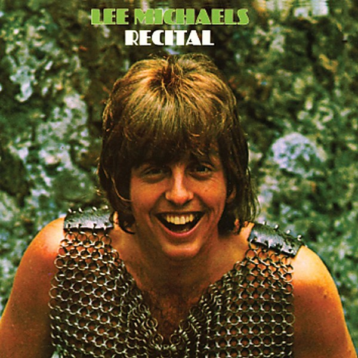

# Recital

By **Lee Michaels**

## Album Data

- **Catalog:** Beets
- **Format:** Digital, Album
- **Album:** Recital
- **Artist:** Lee Michaels
- **Albumartist:** Lee Michaels
- **Genre:** Psychedelic Rock
- **MusicBrainz Album Artist ID:** 
- **MusicBrainz Album ID:** 
- **MusicBrainz Release Group ID:** 
- **Year:** 1968
- **Catalog #:** 
- **Label:** 
- **Total Tracks:** 00

## Album Tracks

### Track 02 - Time Is Over

- **Artist:** Lee Michaels
- **Format:** AAC
- **Genre:** Psychedelic Rock
- **Length:** 3:45
- **MusicBrainz Track ID:** 
- **Title:** Time Is Over
- **Track:** 02
- **Year:** 1968

## See also

- [Hello](Hello.md)
- [Live](Live.md)
- [Roon: 5th (Remastered)](../../Roon/Lee_Michaels/5th_Remastered.md)
- [Roon: Barrel (Remastered)](../../Roon/Lee_Michaels/Barrel_Remastered.md)
- [Roon: Lee Michaels (Remastered)](../../Roon/Lee_Michaels/Lee_Michaels_Remastered.md)
