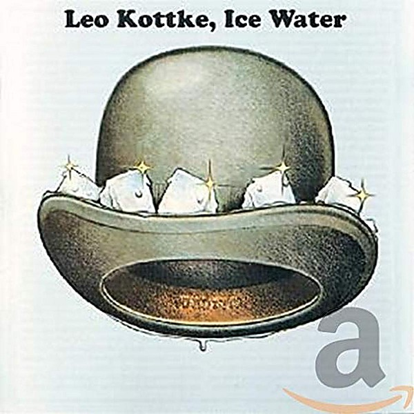

# Ice Water

By **Leo Kottke**

## Album Data

- **Catalog:** Beets
- **Format:** Digital, Album
- **Album:** Ice Water
- **Artist:** Leo Kottke
- **Albumartist:** Leo Kottke
- **Genre:** Unknown
- **MusicBrainz Album Artist ID:** [1a21878d-05b1-4983-a059-7cf3abee04b7](https://musicbrainz.org/artist/1a21878d-05b1-4983-a059-7cf3abee04b7)
- **MusicBrainz Album ID:** [b8b2f3eb-902d-4191-96ec-c3534f64146a](https://musicbrainz.org/release/b8b2f3eb-902d-4191-96ec-c3534f64146a)
- **MusicBrainz Release Group ID:** [f649ed6e-8342-3f8b-a0cc-c10522fe4b5e](https://musicbrainz.org/release-group/f649ed6e-8342-3f8b-a0cc-c10522fe4b5e)
- **Year:** 1992
- **Catalog #:** 
- **Label:** 
- **Total Tracks:** 00

## Album Tracks

### Track 02 - Embryonic Journey

- **Artist:** Leo Kottke
- **Format:** AAC
- **Genre:** Unknown
- **Length:** 3:18
- **MusicBrainz Track ID:** 
- **Title:** Embryonic Journey
- **Track:** 02
- **Year:** 2000

### Track 07 - Sonaora's Death Row

- **Artist:** Leo Kottke
- **Format:** AAC
- **Genre:** Unknown
- **Length:** 4:32
- **MusicBrainz Track ID:** 
- **Title:** Sonaora's Death Row
- **Track:** 07
- **Year:** 0000

## See also

- [Essential](Essential.md)
- [Roon: 6- And 12-String Guitar (Album Version)](../../Roon/Leo_Kottke/6-_And_12-String_Guitar_Album_Version.md)
- [Roon: Ice Water](../../Roon/Leo_Kottke/Ice_Water.md)
- [Roon: John Fahey, Peter Lang, Leo Kottke](../../Roon/Leo_Kottke/John_Fahey__Peter_Lang__Leo_Kottke.md)
