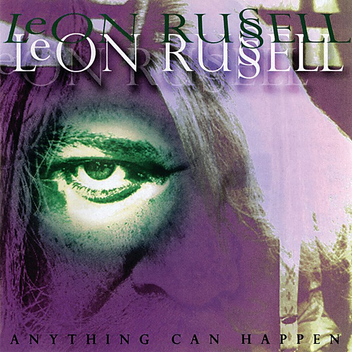

# Anything Can Happen

By **Leon Russell**

## Album Data

- **Catalog:** Beets
- **Format:** Digital, Album
- **Album:** Anything Can Happen
- **Artist:** Leon Russell
- **Albumartist:** Leon Russell
- **Genre:** Rock
- **MusicBrainz Album Artist ID:** [d4cc0ed5-0f76-4188-9e14-2a23ca12188a](https://musicbrainz.org/artist/d4cc0ed5-0f76-4188-9e14-2a23ca12188a)
- **MusicBrainz Album ID:** [ff34f8ae-87ba-454e-9c58-1d13933012c3](https://musicbrainz.org/release/ff34f8ae-87ba-454e-9c58-1d13933012c3)
- **MusicBrainz Release Group ID:** [4deec232-9c7f-3176-997e-af2bf494c618](https://musicbrainz.org/release-group/4deec232-9c7f-3176-997e-af2bf494c618)
- **Year:** 1992
- **Catalog #:** 
- **Label:** Capitol Records
- **Total Tracks:** 12

## Album Tracks

### Track 01 - Tight Rope

- **Artist:** Leon Russell
- **Format:** ALAC
- **Genre:** Rock
- **Length:** 3:01
- **MusicBrainz Track ID:** [67b40444-1434-4e85-9884-c34fad10f73b](https://musicbrainz.org/recording/67b40444-1434-4e85-9884-c34fad10f73b)
- **Title:** Tight Rope
- **Track:** 01
- **Year:** 2016

### Track 02 - Out in the Woods

- **Artist:** Leon Russell
- **Format:** ALAC
- **Genre:** Boogie
- **Length:** 3:37
- **MusicBrainz Track ID:** [983cef0a-34f2-4544-9916-7ce757a36053](https://musicbrainz.org/recording/983cef0a-34f2-4544-9916-7ce757a36053)
- **Title:** Out in the Woods
- **Track:** 02
- **Year:** 2016

### Track 03 - Me and Baby Jane

- **Artist:** Leon Russell
- **Format:** ALAC
- **Genre:** Rock
- **Length:** 3:52
- **MusicBrainz Track ID:** [627fedb9-b2c7-47be-89e7-8ec47d18c509](https://musicbrainz.org/recording/627fedb9-b2c7-47be-89e7-8ec47d18c509)
- **Title:** Me and Baby Jane
- **Track:** 03
- **Year:** 2016

### Track 04 - Manhattan Island Serenade

- **Artist:** Leon Russell
- **Format:** ALAC
- **Genre:** Soft Rock
- **Length:** 3:25
- **MusicBrainz Track ID:** [c69c5494-306b-4f41-93e0-2cdb32fd6ec3](https://musicbrainz.org/recording/c69c5494-306b-4f41-93e0-2cdb32fd6ec3)
- **Title:** Manhattan Island Serenade
- **Track:** 04
- **Year:** 2016

### Track 05 - Cajun Love Song

- **Artist:** Leon Russell
- **Format:** ALAC
- **Genre:** Soft Rock
- **Length:** 3:09
- **MusicBrainz Track ID:** [7e0df514-0705-4587-b3d5-87ebb48863f7](https://musicbrainz.org/recording/7e0df514-0705-4587-b3d5-87ebb48863f7)
- **Title:** Cajun Love Song
- **Track:** 05
- **Year:** 2016

### Track 06 - Roller Derby

- **Artist:** Leon Russell
- **Format:** ALAC
- **Genre:** Soft Rock
- **Length:** 2:25
- **MusicBrainz Track ID:** [2a12d423-8ae7-4023-b0fb-ff70b28d82e3](https://musicbrainz.org/recording/2a12d423-8ae7-4023-b0fb-ff70b28d82e3)
- **Title:** Roller Derby
- **Track:** 06
- **Year:** 2016

### Track 07 - Carney

- **Artist:** Leon Russell
- **Format:** ALAC
- **Genre:** Soft Rock
- **Length:** 0:47
- **MusicBrainz Track ID:** [1e5d885f-cb9a-4f3e-8e0e-8e85357a6d39](https://musicbrainz.org/recording/1e5d885f-cb9a-4f3e-8e0e-8e85357a6d39)
- **Title:** Carney
- **Track:** 07
- **Year:** 2016

### Track 08 - Acid Annapolis

- **Artist:** Leon Russell
- **Format:** ALAC
- **Genre:** Rock
- **Length:** 2:47
- **MusicBrainz Track ID:** [d01410dd-ad31-45bc-beee-4a74f371ef73](https://musicbrainz.org/recording/d01410dd-ad31-45bc-beee-4a74f371ef73)
- **Title:** Acid Annapolis
- **Track:** 08
- **Year:** 2016

### Track 09 - If the Shoe Fits

- **Artist:** Leon Russell
- **Format:** ALAC
- **Genre:** Rock
- **Length:** 2:22
- **MusicBrainz Track ID:** [91362798-ac83-49c6-8a4e-0d1a7a119747](https://musicbrainz.org/recording/91362798-ac83-49c6-8a4e-0d1a7a119747)
- **Title:** If the Shoe Fits
- **Track:** 09
- **Year:** 2016

### Track 10 - My Cricket

- **Artist:** Leon Russell
- **Format:** ALAC
- **Genre:** Soft Rock
- **Length:** 2:55
- **MusicBrainz Track ID:** [e3c69467-4560-4b6a-8c42-a9f3fbecec6b](https://musicbrainz.org/recording/e3c69467-4560-4b6a-8c42-a9f3fbecec6b)
- **Title:** My Cricket
- **Track:** 10
- **Year:** 2016

### Track 11 - This Masquerade

- **Artist:** Leon Russell
- **Format:** ALAC
- **Genre:** Soft Rock
- **Length:** 4:25
- **MusicBrainz Track ID:** [1ef4e418-4404-48b9-b231-c0db96a32ca9](https://musicbrainz.org/recording/1ef4e418-4404-48b9-b231-c0db96a32ca9)
- **Title:** This Masquerade
- **Track:** 11
- **Year:** 2016

### Track 12 - Magic Mirror

- **Artist:** Leon Russell
- **Format:** ALAC
- **Genre:** Soft Rock
- **Length:** 4:56
- **MusicBrainz Track ID:** [907ed7d4-ae58-4979-9340-403b69561477](https://musicbrainz.org/recording/907ed7d4-ae58-4979-9340-403b69561477)
- **Title:** Magic Mirror
- **Track:** 12
- **Year:** 2016

## See also

- [Carney](Carney.md)
- [Hank Wilson, Vol. 3](Hank_Wilson__Vol_3.md)
- [Leon Russell](Leon_Russell.md)
- [CD: Asylum Choir II](../../CD/Leon_Russell/Asylum_Choir_II.md)
- [CD: ](../../CD/Leon_Russell/Leon_Russell_index.md)
- [CD: Leon Russell](../../CD/Leon_Russell/Leon_Russell.md)
- [Roon: Asylum Choir II (Bonus Track Version)](../../Roon/Leon_Russell/Asylum_Choir_II_Bonus_Track_Version.md)
- [Roon: Carney](../../Roon/Leon_Russell/Carney.md)
- [Roon: Leon Live (Live)](../../Roon/Leon_Russell/Leon_Live_Live.md)
- [Roon: Leon Russell And The Shelter People (Remastered 2013)](../../Roon/Leon_Russell/Leon_Russell_And_The_Shelter_People_Remastered_2013.md)
- [Roon: Leon Russell](../../Roon/Leon_Russell/Leon_Russell.md)
- [Roon: Live At Gilley's (Live)](../../Roon/Leon_Russell/Live_At_Gilleys_Live.md)
- [Roon: Looking Back](../../Roon/Leon_Russell/Looking_Back.md)
- [Roon: The Live Album (Live)](../../Roon/Leon_Russell/The_Live_Album_Live.md)
- [Roon: Will O' The Wisp](../../Roon/Leon_Russell/Will_O_The_Wisp.md)
- [Vinyl: Carney](../../Vinyl/Leon_Russell/Carney.md)
- [Vinyl: Hank Wilson's Back Vol. I](../../Vinyl/Leon_Russell/Hank_Wilsons_Back_Vol_I.md)
- [Vinyl: ](../../Vinyl/Leon_Russell/Leon_Russell_index.md)
- [Vinyl: Leon Russell](../../Vinyl/Leon_Russell/Leon_Russell.md)
