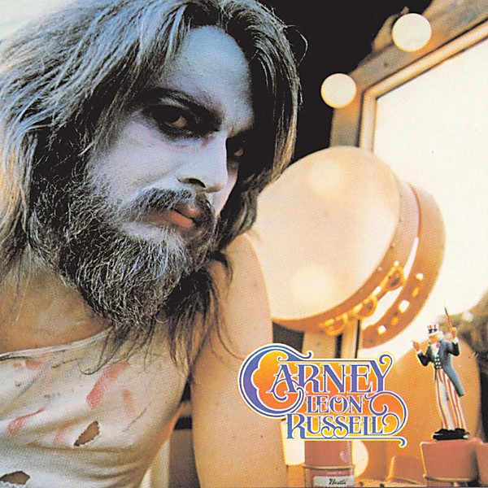

# Carney

By **Leon Russell**

## Album Data

- **Catalog:** Beets
- **Format:** Digital, Album
- **Album:** Carney
- **Artist:** Leon Russell
- **Albumartist:** Leon Russell
- **Genre:** Soft Rock
- **MusicBrainz Album Artist ID:** [d4cc0ed5-0f76-4188-9e14-2a23ca12188a](https://musicbrainz.org/artist/d4cc0ed5-0f76-4188-9e14-2a23ca12188a)
- **MusicBrainz Album ID:** [aabeddff-6d22-4140-91a0-d339d8e774fd](https://musicbrainz.org/release/aabeddff-6d22-4140-91a0-d339d8e774fd)
- **MusicBrainz Release Group ID:** [2b7b92ad-313c-3589-a2f0-f87e5ba18f9f](https://musicbrainz.org/release-group/2b7b92ad-313c-3589-a2f0-f87e5ba18f9f)
- **Year:** 2016
- **Catalog #:** GZS-1049
- **Label:** DCC Compact Classics
- **Total Tracks:** 17

## Album Tracks

### Track 01 - A Song for You

- **Artist:** Leon Russell
- **Format:** ALAC
- **Genre:** Rock
- **Length:** 4:10
- **MusicBrainz Track ID:** [121f277a-4794-44ca-bd3e-9cb3b8af6b6a](https://musicbrainz.org/recording/121f277a-4794-44ca-bd3e-9cb3b8af6b6a)
- **Title:** A Song for You
- **Track:** 01
- **Year:** 1993

### Track 02 - Dixie Lullaby

- **Artist:** Leon Russell
- **Format:** ALAC
- **Genre:** Blues
- **Length:** 2:41
- **MusicBrainz Track ID:** [538a893a-7b1a-439a-b39e-5c28f13bfdff](https://musicbrainz.org/recording/538a893a-7b1a-439a-b39e-5c28f13bfdff)
- **Title:** Dixie Lullaby
- **Track:** 02
- **Year:** 1993

### Track 03 - I Put a Spell on You

- **Artist:** Leon Russell
- **Format:** ALAC
- **Genre:** Soft Rock
- **Length:** 4:12
- **MusicBrainz Track ID:** [055a4730-ec8f-4d01-b471-22aa354a50c4](https://musicbrainz.org/recording/055a4730-ec8f-4d01-b471-22aa354a50c4)
- **Title:** I Put a Spell on You
- **Track:** 03
- **Year:** 1993

### Track 04 - Shoot Out on the Plantation

- **Artist:** Leon Russell
- **Format:** ALAC
- **Genre:** Rock
- **Length:** 3:13
- **MusicBrainz Track ID:** [0997e1c7-fb06-449b-a62a-6e426cea8063](https://musicbrainz.org/recording/0997e1c7-fb06-449b-a62a-6e426cea8063)
- **Title:** Shoot Out on the Plantation
- **Track:** 04
- **Year:** 1993

### Track 05 - Hummingbird

- **Artist:** Leon Russell
- **Format:** ALAC
- **Genre:** Rock
- **Length:** 4:02
- **MusicBrainz Track ID:** [a00b7416-4a83-4386-87a8-5dbcded2e85e](https://musicbrainz.org/recording/a00b7416-4a83-4386-87a8-5dbcded2e85e)
- **Title:** Hummingbird
- **Track:** 05
- **Year:** 1993

### Track 06 - Delta Lady

- **Artist:** Leon Russell
- **Format:** ALAC
- **Genre:** Boogie
- **Length:** 4:08
- **MusicBrainz Track ID:** [6fd444d4-b76a-4a8b-80f4-51a3a35d642e](https://musicbrainz.org/recording/6fd444d4-b76a-4a8b-80f4-51a3a35d642e)
- **Title:** Delta Lady
- **Track:** 06
- **Year:** 1993

### Track 07 - Prince of Peace

- **Artist:** Leon Russell
- **Format:** ALAC
- **Genre:** Rock
- **Length:** 3:08
- **MusicBrainz Track ID:** [4e297723-22c9-4368-b940-f3cd8f5f1ad3](https://musicbrainz.org/recording/4e297723-22c9-4368-b940-f3cd8f5f1ad3)
- **Title:** Prince of Peace
- **Track:** 07
- **Year:** 1993

### Track 08 - Old Masters

- **Artist:** Leon Russell
- **Format:** ALAC
- **Genre:** Soft Rock
- **Length:** 1:27
- **MusicBrainz Track ID:** [d61f9aec-6693-453d-9d1f-13a7f096c4fd](https://musicbrainz.org/recording/d61f9aec-6693-453d-9d1f-13a7f096c4fd)
- **Title:** Old Masters
- **Track:** 08
- **Year:** 1993

### Track 09 - Give Peace a Chance

- **Artist:** Leon Russell
- **Format:** ALAC
- **Genre:** Soft Rock
- **Length:** 2:18
- **MusicBrainz Track ID:** [84a8715d-05c2-4b3e-8c29-3536b475e509](https://musicbrainz.org/recording/84a8715d-05c2-4b3e-8c29-3536b475e509)
- **Title:** Give Peace a Chance
- **Track:** 09
- **Year:** 1993

### Track 10 - Hurtsome Body

- **Artist:** Leon Russell
- **Format:** ALAC
- **Genre:** Soft Rock
- **Length:** 3:29
- **MusicBrainz Track ID:** [f8833df0-fd7c-47d6-ad04-3365328c297d](https://musicbrainz.org/recording/f8833df0-fd7c-47d6-ad04-3365328c297d)
- **Title:** Hurtsome Body
- **Track:** 10
- **Year:** 1993

### Track 11 - Pisces Apple Lady

- **Artist:** Leon Russell
- **Format:** ALAC
- **Genre:** Blues
- **Length:** 2:58
- **MusicBrainz Track ID:** [9bd61121-246f-4a69-9d01-7be6236405cc](https://musicbrainz.org/recording/9bd61121-246f-4a69-9d01-7be6236405cc)
- **Title:** Pisces Apple Lady
- **Track:** 11
- **Year:** 1993

### Track 12 - Roll Away the Stone

- **Artist:** Leon Russell
- **Format:** ALAC
- **Genre:** Rock
- **Length:** 3:18
- **MusicBrainz Track ID:** [0d086ee5-24c9-4b47-ba35-65a17bd7afd1](https://musicbrainz.org/recording/0d086ee5-24c9-4b47-ba35-65a17bd7afd1)
- **Title:** Roll Away the Stone
- **Track:** 12
- **Year:** 1993

### Track 13 - The New Sweet Home Chicago

- **Artist:** Leon Russell
- **Format:** ALAC
- **Genre:** Soft Rock
- **Length:** 3:15
- **MusicBrainz Track ID:** [d400b01d-0f75-474e-b206-d9fe316c5b48](https://musicbrainz.org/recording/d400b01d-0f75-474e-b206-d9fe316c5b48)
- **Title:** The New Sweet Home Chicago
- **Track:** 13
- **Year:** 1993

### Track 14 - Jammin’ With Eric

- **Artist:** Leon Russell
- **Format:** ALAC
- **Genre:** Soft Rock
- **Length:** 4:17
- **MusicBrainz Track ID:** [e3b97a48-2b5f-4e17-add5-9b46ad6f2d05](https://musicbrainz.org/recording/e3b97a48-2b5f-4e17-add5-9b46ad6f2d05)
- **Title:** Jammin’ With Eric
- **Track:** 14
- **Year:** 1993

### Track 15 - Indian Girl

- **Artist:** Leon Russell
- **Format:** ALAC
- **Genre:** Soft Rock
- **Length:** 4:12
- **MusicBrainz Track ID:** [f03f69c9-4af0-4ed9-af42-7d7fd3350b40](https://musicbrainz.org/recording/f03f69c9-4af0-4ed9-af42-7d7fd3350b40)
- **Title:** Indian Girl
- **Track:** 15
- **Year:** 1993

### Track 16 - Shoot Out on the Plantation (solo piano version)

- **Artist:** Leon Russell
- **Format:** ALAC
- **Genre:** Soft Rock
- **Length:** 3:36
- **MusicBrainz Track ID:** [045518f1-7222-461f-a264-815e8189e03e](https://musicbrainz.org/recording/045518f1-7222-461f-a264-815e8189e03e)
- **Title:** Shoot Out on the Plantation (solo piano version)
- **Track:** 16
- **Year:** 1993

### Track 17 - (Can’t Seem to) Get a Line on You (rehearsal)

- **Artist:** Leon Russell
- **Format:** ALAC
- **Genre:** Soft Rock
- **Length:** 4:27
- **MusicBrainz Track ID:** [330168de-750f-43af-8774-8b61033bed6d](https://musicbrainz.org/recording/330168de-750f-43af-8774-8b61033bed6d)
- **Title:** (Can’t Seem to) Get a Line on You (rehearsal)
- **Track:** 17
- **Year:** 1993

## See also

- [Anything Can Happen](Anything_Can_Happen.md)
- [Hank Wilson, Vol. 3](Hank_Wilson__Vol_3.md)
- [Leon Russell](Leon_Russell.md)
- [CD: Asylum Choir II](../../CD/Leon_Russell/Asylum_Choir_II.md)
- [CD: ](../../CD/Leon_Russell/Leon_Russell_index.md)
- [CD: Leon Russell](../../CD/Leon_Russell/Leon_Russell.md)
- [Roon: Asylum Choir II (Bonus Track Version)](../../Roon/Leon_Russell/Asylum_Choir_II_Bonus_Track_Version.md)
- [Roon: Carney](../../Roon/Leon_Russell/Carney.md)
- [Roon: Leon Live (Live)](../../Roon/Leon_Russell/Leon_Live_Live.md)
- [Roon: Leon Russell And The Shelter People (Remastered 2013)](../../Roon/Leon_Russell/Leon_Russell_And_The_Shelter_People_Remastered_2013.md)
- [Roon: Leon Russell](../../Roon/Leon_Russell/Leon_Russell.md)
- [Roon: Live At Gilley's (Live)](../../Roon/Leon_Russell/Live_At_Gilleys_Live.md)
- [Roon: Looking Back](../../Roon/Leon_Russell/Looking_Back.md)
- [Roon: The Live Album (Live)](../../Roon/Leon_Russell/The_Live_Album_Live.md)
- [Roon: Will O' The Wisp](../../Roon/Leon_Russell/Will_O_The_Wisp.md)
- [Vinyl: Carney](../../Vinyl/Leon_Russell/Carney.md)
- [Vinyl: Hank Wilson's Back Vol. I](../../Vinyl/Leon_Russell/Hank_Wilsons_Back_Vol_I.md)
- [Vinyl: ](../../Vinyl/Leon_Russell/Leon_Russell_index.md)
- [Vinyl: Leon Russell](../../Vinyl/Leon_Russell/Leon_Russell.md)
