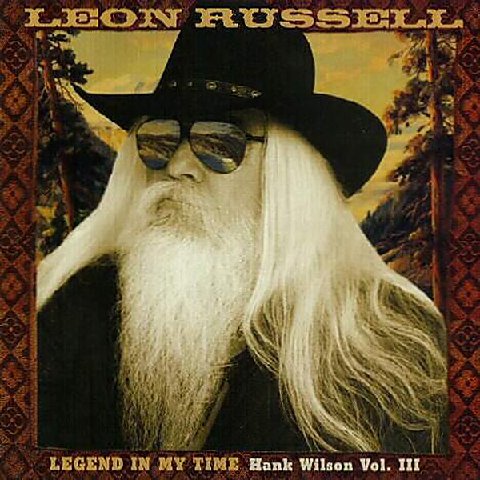

# Hank Wilson, Vol. 3

By **Leon Russell**

## Album Data

- **Catalog:** Beets
- **Format:** Digital, Album
- **Album:** Hank Wilson, Vol. 3
- **Artist:** Leon Russell
- **Albumartist:** Leon Russell
- **Genre:** Rock
- **MusicBrainz Album Artist ID:** 
- **MusicBrainz Album ID:** 
- **MusicBrainz Release Group ID:** 
- **Year:** 1998
- **Catalog #:** 2-91821
- **Label:** Virgin
- **Total Tracks:** 10

## Album Tracks

### Track 01 - Anything Can Happen

- **Artist:** Leon Russell
- **Format:** MP3
- **Genre:** Rock
- **Length:** 4:06
- **MusicBrainz Track ID:** [9b481b6c-3188-43df-b2a3-7d7c1ce2b980](https://musicbrainz.org/recording/9b481b6c-3188-43df-b2a3-7d7c1ce2b980)
- **Title:** Anything Can Happen
- **Track:** 01
- **Year:** 1992

### Track 02 - Black Halos

- **Artist:** Leon Russell
- **Format:** MP3
- **Genre:** Rock
- **Length:** 3:43
- **MusicBrainz Track ID:** [2662384d-3fd4-43f9-916f-493ede4249c1](https://musicbrainz.org/recording/2662384d-3fd4-43f9-916f-493ede4249c1)
- **Title:** Black Halos
- **Track:** 02
- **Year:** 1992

### Track 03 - No Man's Land

- **Artist:** Leon Russell
- **Format:** MP3
- **Genre:** Rock
- **Length:** 3:39
- **MusicBrainz Track ID:** [62d13c91-c5d4-4d8d-9a3b-9d6c5952f23f](https://musicbrainz.org/recording/62d13c91-c5d4-4d8d-9a3b-9d6c5952f23f)
- **Title:** No Man's Land
- **Track:** 03
- **Year:** 1992

### Track 04 - Too Much Monkey Business

- **Artist:** Leon Russell
- **Format:** MP3
- **Genre:** Rock
- **Length:** 2:58
- **MusicBrainz Track ID:** [5a461369-279c-4115-a203-2c21b3f3ac47](https://musicbrainz.org/recording/5a461369-279c-4115-a203-2c21b3f3ac47)
- **Title:** Too Much Monkey Business
- **Track:** 04
- **Year:** 1992

### Track 05 - Angel Ways

- **Artist:** Leon Russell
- **Format:** MP3
- **Genre:** Rock
- **Length:** 4:01
- **MusicBrainz Track ID:** [0898acd6-978a-442c-bb47-8f07a931059f](https://musicbrainz.org/recording/0898acd6-978a-442c-bb47-8f07a931059f)
- **Title:** Angel Ways
- **Track:** 05
- **Year:** 1992

### Track 06 - Life Of The Party

- **Artist:** Leon Russell
- **Format:** MP3
- **Genre:** Rock
- **Length:** 2:50
- **MusicBrainz Track ID:** [82b2275f-daa5-4886-93a7-c271094d32ba](https://musicbrainz.org/recording/82b2275f-daa5-4886-93a7-c271094d32ba)
- **Title:** Life Of The Party
- **Track:** 06
- **Year:** 1992

### Track 07 - Stranded On Easy Street

- **Artist:** Leon Russell
- **Format:** MP3
- **Genre:** Rock
- **Length:** 4:26
- **MusicBrainz Track ID:** [4eee6204-32b0-47fa-9c0b-4e6c1b6e2ed7](https://musicbrainz.org/recording/4eee6204-32b0-47fa-9c0b-4e6c1b6e2ed7)
- **Title:** Stranded On Easy Street
- **Track:** 07
- **Year:** 1992

### Track 08 - Jezebel

- **Artist:** Leon Russell
- **Format:** MP3
- **Genre:** Rock
- **Length:** 3:51
- **MusicBrainz Track ID:** [c774e986-dfa4-4067-b8fe-cea14e93dabb](https://musicbrainz.org/recording/c774e986-dfa4-4067-b8fe-cea14e93dabb)
- **Title:** Jezebel
- **Track:** 08
- **Year:** 1992

### Track 09 - Love Slave

- **Artist:** Leon Russell
- **Format:** MP3
- **Genre:** Rock
- **Length:** 3:02
- **MusicBrainz Track ID:** [fddcc203-394c-4027-9f62-d8fcb95c8727](https://musicbrainz.org/recording/fddcc203-394c-4027-9f62-d8fcb95c8727)
- **Title:** Love Slave
- **Track:** 09
- **Year:** 1992

### Track 10 - Faces Of The Children

- **Artist:** Leon Russell
- **Format:** MP3
- **Genre:** Rock
- **Length:** 3:45
- **MusicBrainz Track ID:** [59951197-e815-4bbf-a4ac-7478388a3499](https://musicbrainz.org/recording/59951197-e815-4bbf-a4ac-7478388a3499)
- **Title:** Faces Of The Children
- **Track:** 10
- **Year:** 1992

## See also

- [Anything Can Happen](Anything_Can_Happen.md)
- [Carney](Carney.md)
- [Leon Russell](Leon_Russell.md)
- [CD: Asylum Choir II](../../CD/Leon_Russell/Asylum_Choir_II.md)
- [CD: ](../../CD/Leon_Russell/Leon_Russell_index.md)
- [CD: Leon Russell](../../CD/Leon_Russell/Leon_Russell.md)
- [Roon: Asylum Choir II (Bonus Track Version)](../../Roon/Leon_Russell/Asylum_Choir_II_Bonus_Track_Version.md)
- [Roon: Carney](../../Roon/Leon_Russell/Carney.md)
- [Roon: Leon Live (Live)](../../Roon/Leon_Russell/Leon_Live_Live.md)
- [Roon: Leon Russell And The Shelter People (Remastered 2013)](../../Roon/Leon_Russell/Leon_Russell_And_The_Shelter_People_Remastered_2013.md)
- [Roon: Leon Russell](../../Roon/Leon_Russell/Leon_Russell.md)
- [Roon: Live At Gilley's (Live)](../../Roon/Leon_Russell/Live_At_Gilleys_Live.md)
- [Roon: Looking Back](../../Roon/Leon_Russell/Looking_Back.md)
- [Roon: The Live Album (Live)](../../Roon/Leon_Russell/The_Live_Album_Live.md)
- [Roon: Will O' The Wisp](../../Roon/Leon_Russell/Will_O_The_Wisp.md)
- [Vinyl: Carney](../../Vinyl/Leon_Russell/Carney.md)
- [Vinyl: Hank Wilson's Back Vol. I](../../Vinyl/Leon_Russell/Hank_Wilsons_Back_Vol_I.md)
- [Vinyl: ](../../Vinyl/Leon_Russell/Leon_Russell_index.md)
- [Vinyl: Leon Russell](../../Vinyl/Leon_Russell/Leon_Russell.md)
