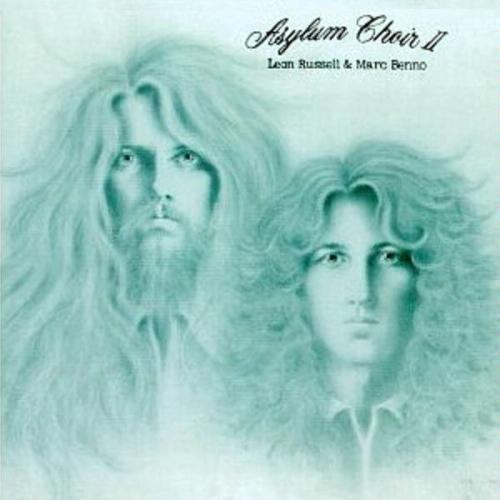

# Asylum Choir II

By **Leon Russell & Marc Benno**

## Album Data

- **Catalog:** Beets
- **Format:** Digital, Album
- **Album:** Asylum Choir II
- **Artist:** Leon Russell & Marc Benno
- **Albumartist:** Leon Russell & Marc Benno
- **Genre:** Rock
- **MusicBrainz Album Artist ID:** [d4cc0ed5-0f76-4188-9e14-2a23ca12188a](https://musicbrainz.org/artist/d4cc0ed5-0f76-4188-9e14-2a23ca12188a)
- **MusicBrainz Album ID:** [c9715676-db3a-4ffa-b55e-6bbaf4cf1e36](https://musicbrainz.org/release/c9715676-db3a-4ffa-b55e-6bbaf4cf1e36)
- **MusicBrainz Release Group ID:** [cd7cbb0f-2421-37b2-9a64-cbf3cfff1854](https://musicbrainz.org/release-group/cd7cbb0f-2421-37b2-9a64-cbf3cfff1854)
- **Year:** 1990
- **Catalog #:** SRZ-8014
- **Label:** Shelter Records
- **Total Tracks:** 16

## Album Tracks

### Track 01 - Sweet Home Chicago

- **Artist:** Leon Russell & Marc Benno
- **Format:** ALAC
- **Genre:** Rock
- **Length:** 3:22
- **MusicBrainz Track ID:** [3d7c85f6-ede8-4802-acad-f3219c5cb686](https://musicbrainz.org/recording/3d7c85f6-ede8-4802-acad-f3219c5cb686)
- **Title:** Sweet Home Chicago
- **Track:** 01
- **Year:** 1990

### Track 02 - Down on the Base

- **Artist:** Leon Russell & Marc Benno
- **Format:** ALAC
- **Genre:** Rock
- **Length:** 2:17
- **MusicBrainz Track ID:** [55ccab84-611c-4f70-9628-6139b1e005d9](https://musicbrainz.org/recording/55ccab84-611c-4f70-9628-6139b1e005d9)
- **Title:** Down on the Base
- **Track:** 02
- **Year:** 1990

### Track 03 - Hello Little Friend

- **Artist:** Leon Russell & Marc Benno
- **Format:** ALAC
- **Genre:** Rock
- **Length:** 2:52
- **MusicBrainz Track ID:** [2a4e7238-b375-4f41-9ba7-116f5da9cec7](https://musicbrainz.org/recording/2a4e7238-b375-4f41-9ba7-116f5da9cec7)
- **Title:** Hello Little Friend
- **Track:** 03
- **Year:** 1990

### Track 04 - Salty Candy

- **Artist:** Leon Russell & Marc Benno
- **Format:** ALAC
- **Genre:** Rock
- **Length:** 2:26
- **MusicBrainz Track ID:** [7baf4200-272f-4b33-b46f-20717fd4a332](https://musicbrainz.org/recording/7baf4200-272f-4b33-b46f-20717fd4a332)
- **Title:** Salty Candy
- **Track:** 04
- **Year:** 1990

### Track 05 - Tryin’ to Stay Alive

- **Artist:** Leon Russell & Marc Benno
- **Format:** ALAC
- **Genre:** Rock
- **Length:** 2:49
- **MusicBrainz Track ID:** [c16af603-f110-4ff8-97dd-70f92003b020](https://musicbrainz.org/recording/c16af603-f110-4ff8-97dd-70f92003b020)
- **Title:** Tryin’ to Stay Alive
- **Track:** 05
- **Year:** 1990

### Track 06 - …Intro to Rita…

- **Artist:** Leon Russell & Marc Benno
- **Format:** ALAC
- **Genre:** Rock
- **Length:** 2:06
- **MusicBrainz Track ID:** [9fb3d150-149e-4557-a068-f151fcf50da0](https://musicbrainz.org/recording/9fb3d150-149e-4557-a068-f151fcf50da0)
- **Title:** …Intro to Rita…
- **Track:** 06
- **Year:** 1990

### Track 07 - Straight Brother

- **Artist:** Leon Russell & Marc Benno
- **Format:** ALAC
- **Genre:** Rock
- **Length:** 3:07
- **MusicBrainz Track ID:** [c1af3d18-4a4c-4848-8c92-a96155dfe269](https://musicbrainz.org/recording/c1af3d18-4a4c-4848-8c92-a96155dfe269)
- **Title:** Straight Brother
- **Track:** 07
- **Year:** 1990

### Track 08 - Learn How to Boogie

- **Artist:** Leon Russell & Marc Benno
- **Format:** ALAC
- **Genre:** Rock
- **Length:** 2:40
- **MusicBrainz Track ID:** [7d2c3f6d-1fdb-47c5-9943-5ad5d1b90e5f](https://musicbrainz.org/recording/7d2c3f6d-1fdb-47c5-9943-5ad5d1b90e5f)
- **Title:** Learn How to Boogie
- **Track:** 08
- **Year:** 1990

### Track 09 - Ballad for a Soldier

- **Artist:** Leon Russell & Marc Benno
- **Format:** ALAC
- **Genre:** Rock
- **Length:** 4:24
- **MusicBrainz Track ID:** [3a60bc09-5a23-4be3-8278-a0ca0978d17a](https://musicbrainz.org/recording/3a60bc09-5a23-4be3-8278-a0ca0978d17a)
- **Title:** Ballad for a Soldier
- **Track:** 09
- **Year:** 1990

### Track 10 - When You Wish Upon a Fag

- **Artist:** Leon Russell & Marc Benno
- **Format:** ALAC
- **Genre:** Rock
- **Length:** 4:08
- **MusicBrainz Track ID:** [a3a0f91a-d6f0-4408-997d-2521cacb266c](https://musicbrainz.org/recording/a3a0f91a-d6f0-4408-997d-2521cacb266c)
- **Title:** When You Wish Upon a Fag
- **Track:** 10
- **Year:** 1990

### Track 11 - Lady in Waiting

- **Artist:** Leon Russell & Marc Benno
- **Format:** ALAC
- **Genre:** Rock
- **Length:** 3:39
- **MusicBrainz Track ID:** [46eb848d-4fea-43c0-9340-1e3a73059e4c](https://musicbrainz.org/recording/46eb848d-4fea-43c0-9340-1e3a73059e4c)
- **Title:** Lady in Waiting
- **Track:** 11
- **Year:** 1990

### Track 12 - Welcome to Hollywood

- **Artist:** Leon Russell & Marc Benno
- **Format:** ALAC
- **Genre:** Rock
- **Length:** 2:31
- **MusicBrainz Track ID:** [5783c83e-e2ba-425f-b3ef-6f8bc9173a57](https://musicbrainz.org/recording/5783c83e-e2ba-425f-b3ef-6f8bc9173a57)
- **Title:** Welcome to Hollywood
- **Track:** 12
- **Year:** 1990

### Track 13 - Death of the Flowers

- **Artist:** Leon Russell & Marc Benno
- **Format:** ALAC
- **Genre:** Rock
- **Length:** 3:16
- **MusicBrainz Track ID:** [3948bdec-f50c-45ba-a80a-e3957455704c](https://musicbrainz.org/recording/3948bdec-f50c-45ba-a80a-e3957455704c)
- **Title:** Death of the Flowers
- **Track:** 13
- **Year:** 1990

### Track 14 - Icicle Star Tree

- **Artist:** Leon Russell & Marc Benno
- **Format:** ALAC
- **Genre:** Rock
- **Length:** 3:05
- **MusicBrainz Track ID:** [4a7f40e0-ca6e-40ed-bc3f-9add31abb59a](https://musicbrainz.org/recording/4a7f40e0-ca6e-40ed-bc3f-9add31abb59a)
- **Title:** Icicle Star Tree
- **Track:** 14
- **Year:** 1990

### Track 15 - Mr. Henri the Clown

- **Artist:** Leon Russell & Marc Benno
- **Format:** ALAC
- **Genre:** Rock
- **Length:** 3:01
- **MusicBrainz Track ID:** [49525b3d-6108-4625-9ef7-39947d75d1cc](https://musicbrainz.org/recording/49525b3d-6108-4625-9ef7-39947d75d1cc)
- **Title:** Mr. Henri the Clown
- **Track:** 15
- **Year:** 1990

### Track 16 - Soul Food

- **Artist:** Leon Russell & Marc Benno
- **Format:** ALAC
- **Genre:** Rock
- **Length:** 2:14
- **MusicBrainz Track ID:** [f6f18e5e-9c86-4aae-8bb8-71d3ae330d25](https://musicbrainz.org/recording/f6f18e5e-9c86-4aae-8bb8-71d3ae330d25)
- **Title:** Soul Food
- **Track:** 16
- **Year:** 1990

