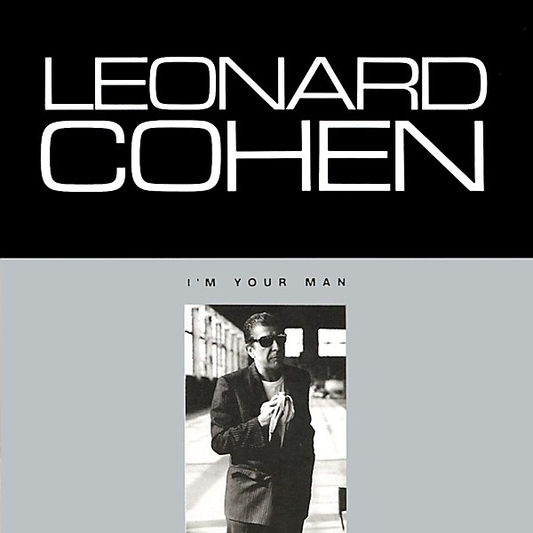

# I’m Your Man

By **Leonard Cohen**

## Album Data

- **Catalog:** Beets
- **Format:** Digital, Album
- **Album:** I’m Your Man
- **Artist:** Leonard Cohen
- **Albumartist:** Leonard Cohen
- **Genre:** Rock
- **MusicBrainz Album Artist ID:** [65314b12-0e08-43fa-ba33-baaa7b874c15](https://musicbrainz.org/artist/65314b12-0e08-43fa-ba33-baaa7b874c15)
- **MusicBrainz Album ID:** [43ab84bf-bce4-44ce-918b-a19aaf9367ce](https://musicbrainz.org/release/43ab84bf-bce4-44ce-918b-a19aaf9367ce)
- **MusicBrainz Release Group ID:** [7f073c9c-f64f-3a79-bbd8-5aa7668e5cd8](https://musicbrainz.org/release-group/7f073c9c-f64f-3a79-bbd8-5aa7668e5cd8)
- **Year:** 1988
- **Catalog #:** 88697405022
- **Label:** Columbia
- **Total Tracks:** 26

## Album Tracks

### Track 01 - Dance Me to the End of Love

- **Artist:** Leonard Cohen
- **Format:** ALAC
- **Genre:** Folk Rock
- **Length:** 6:20
- **MusicBrainz Track ID:** [4c41b647-7779-4331-83a1-655f42087e87](https://musicbrainz.org/recording/4c41b647-7779-4331-83a1-655f42087e87)
- **Title:** Dance Me to the End of Love
- **Track:** 01
- **Year:** 2009

### Track 02 - The Future

- **Artist:** Leonard Cohen
- **Format:** ALAC
- **Genre:** Folk Rock
- **Length:** 7:20
- **MusicBrainz Track ID:** [0b17cae6-651e-488c-9ca3-221348561ad3](https://musicbrainz.org/recording/0b17cae6-651e-488c-9ca3-221348561ad3)
- **Title:** The Future
- **Track:** 02
- **Year:** 2009

### Track 03 - Ain't No Cure for Love

- **Artist:** Leonard Cohen
- **Format:** ALAC
- **Genre:** Pop Rock
- **Length:** 6:16
- **MusicBrainz Track ID:** [ce913779-7ae0-4da2-8492-3d1336215728](https://musicbrainz.org/recording/ce913779-7ae0-4da2-8492-3d1336215728)
- **Title:** Ain't No Cure for Love
- **Track:** 03
- **Year:** 2009

### Track 04 - Bird on the Wire

- **Artist:** Leonard Cohen
- **Format:** ALAC
- **Genre:** Rock
- **Length:** 6:14
- **MusicBrainz Track ID:** [f70b58d4-4a00-4fbf-872d-5a7c0ce191c6](https://musicbrainz.org/recording/f70b58d4-4a00-4fbf-872d-5a7c0ce191c6)
- **Title:** Bird on the Wire
- **Track:** 04
- **Year:** 2009

### Track 05 - Everybody Knows

- **Artist:** Leonard Cohen
- **Format:** ALAC
- **Genre:** Rock
- **Length:** 5:52
- **MusicBrainz Track ID:** [b192a39a-fdad-4290-90a8-a250ab26c436](https://musicbrainz.org/recording/b192a39a-fdad-4290-90a8-a250ab26c436)
- **Title:** Everybody Knows
- **Track:** 05
- **Year:** 2009

### Track 06 - In My Secret Life

- **Artist:** Leonard Cohen
- **Format:** ALAC
- **Genre:** Rock
- **Length:** 5:02
- **MusicBrainz Track ID:** [ff58f3a6-c885-45a0-a641-f57abeec97db](https://musicbrainz.org/recording/ff58f3a6-c885-45a0-a641-f57abeec97db)
- **Title:** In My Secret Life
- **Track:** 06
- **Year:** 2009

### Track 07 - Who by Fire

- **Artist:** Leonard Cohen
- **Format:** ALAC
- **Genre:** Rock
- **Length:** 6:35
- **MusicBrainz Track ID:** [054beded-fc1d-48b7-9189-2ecf46bd4d5c](https://musicbrainz.org/recording/054beded-fc1d-48b7-9189-2ecf46bd4d5c)
- **Title:** Who by Fire
- **Track:** 07
- **Year:** 2009

### Track 08 - Hey, That's No Way to Say Goodbye

- **Artist:** Leonard Cohen
- **Format:** ALAC
- **Genre:** Rock
- **Length:** 3:47
- **MusicBrainz Track ID:** [fde8fb47-223c-4d8f-b2fd-353f2725d38c](https://musicbrainz.org/recording/fde8fb47-223c-4d8f-b2fd-353f2725d38c)
- **Title:** Hey, That's No Way to Say Goodbye
- **Track:** 08
- **Year:** 2009

### Track 09 - Anthem

- **Artist:** Leonard Cohen
- **Format:** ALAC
- **Genre:** Rock
- **Length:** 7:20
- **MusicBrainz Track ID:** [1b88c034-75a2-49a7-9c3d-42134f60fe51](https://musicbrainz.org/recording/1b88c034-75a2-49a7-9c3d-42134f60fe51)
- **Title:** Anthem
- **Track:** 09
- **Year:** 2009

### Track 10 - Introduction

- **Artist:** Leonard Cohen
- **Format:** ALAC
- **Genre:** Rock
- **Length:** 1:29
- **MusicBrainz Track ID:** [02166d2b-e0cb-47da-8ee3-55887c975fc8](https://musicbrainz.org/recording/02166d2b-e0cb-47da-8ee3-55887c975fc8)
- **Title:** Introduction
- **Track:** 10
- **Year:** 2009

### Track 11 - Tower of Song

- **Artist:** Leonard Cohen
- **Format:** ALAC
- **Genre:** Rock
- **Length:** 7:07
- **MusicBrainz Track ID:** [15df4ce1-9f4d-48a4-9942-cd9295565ce7](https://musicbrainz.org/recording/15df4ce1-9f4d-48a4-9942-cd9295565ce7)
- **Title:** Tower of Song
- **Track:** 11
- **Year:** 2009

### Track 12 - Suzanne

- **Artist:** Leonard Cohen
- **Format:** ALAC
- **Genre:** Rock
- **Length:** 3:46
- **MusicBrainz Track ID:** [6b4cc35a-16fd-4d70-b294-44fd2991afb0](https://musicbrainz.org/recording/6b4cc35a-16fd-4d70-b294-44fd2991afb0)
- **Title:** Suzanne
- **Track:** 12
- **Year:** 2009

### Track 13 - The Gypsy's Wife

- **Artist:** Leonard Cohen
- **Format:** ALAC
- **Genre:** Rock
- **Length:** 6:42
- **MusicBrainz Track ID:** [afa179f2-7fa0-4ac6-aea2-33aa96163cfb](https://musicbrainz.org/recording/afa179f2-7fa0-4ac6-aea2-33aa96163cfb)
- **Title:** The Gypsy's Wife
- **Track:** 13
- **Year:** 2009

### Track 14 - Boogie Street

- **Artist:** Leonard Cohen
- **Format:** ALAC
- **Genre:** Soft Rock
- **Length:** 6:57
- **MusicBrainz Track ID:** [1dcc89c7-3e26-4b85-bca7-3efc0e68fbac](https://musicbrainz.org/recording/1dcc89c7-3e26-4b85-bca7-3efc0e68fbac)
- **Title:** Boogie Street
- **Track:** 14
- **Year:** 2009

### Track 15 - Hallelujah

- **Artist:** Leonard Cohen
- **Format:** ALAC
- **Genre:** Rock
- **Length:** 7:20
- **MusicBrainz Track ID:** [f8c8344e-27f0-4ebd-bcc3-6ebaef30108f](https://musicbrainz.org/recording/f8c8344e-27f0-4ebd-bcc3-6ebaef30108f)
- **Title:** Hallelujah
- **Track:** 15
- **Year:** 2009

### Track 16 - Democracy

- **Artist:** Leonard Cohen
- **Format:** ALAC
- **Genre:** Soft Rock
- **Length:** 7:08
- **MusicBrainz Track ID:** [7b347aa7-4d4c-4acd-bc6c-5c7b9321d470](https://musicbrainz.org/recording/7b347aa7-4d4c-4acd-bc6c-5c7b9321d470)
- **Title:** Democracy
- **Track:** 16
- **Year:** 2009

### Track 17 - I'm Your Man

- **Artist:** Leonard Cohen
- **Format:** ALAC
- **Genre:** Rock
- **Length:** 5:41
- **MusicBrainz Track ID:** [3f141575-6489-46f9-b879-1e676d52529b](https://musicbrainz.org/recording/3f141575-6489-46f9-b879-1e676d52529b)
- **Title:** I'm Your Man
- **Track:** 17
- **Year:** 2009

### Track 18 - Recitation w/ N.L.

- **Artist:** Leonard Cohen
- **Format:** ALAC
- **Genre:** Folk Rock
- **Length:** 3:53
- **MusicBrainz Track ID:** [ac6ff6fa-eb5b-4d73-bc2e-dd6e9d40faa3](https://musicbrainz.org/recording/ac6ff6fa-eb5b-4d73-bc2e-dd6e9d40faa3)
- **Title:** Recitation w/ N.L.
- **Track:** 18
- **Year:** 2009

### Track 19 - Take this Waltz

- **Artist:** Leonard Cohen
- **Format:** ALAC
- **Genre:** Rock
- **Length:** 8:37
- **MusicBrainz Track ID:** [a7fd3d26-b750-4ec2-a53e-bd8b31c41bc3](https://musicbrainz.org/recording/a7fd3d26-b750-4ec2-a53e-bd8b31c41bc3)
- **Title:** Take this Waltz
- **Track:** 19
- **Year:** 2009

### Track 20 - So Long, Marianne

- **Artist:** Leonard Cohen
- **Format:** ALAC
- **Genre:** Folk Rock
- **Length:** 5:24
- **MusicBrainz Track ID:** [f11618f2-0926-4a9c-8ca1-0fe4749c5976](https://musicbrainz.org/recording/f11618f2-0926-4a9c-8ca1-0fe4749c5976)
- **Title:** So Long, Marianne
- **Track:** 20
- **Year:** 2009

### Track 21 - First We Take Manhattan

- **Artist:** Leonard Cohen
- **Format:** ALAC
- **Genre:** Folk Rock
- **Length:** 6:15
- **MusicBrainz Track ID:** [9efeec47-b13b-4f38-879a-3ad1ff4576b7](https://musicbrainz.org/recording/9efeec47-b13b-4f38-879a-3ad1ff4576b7)
- **Title:** First We Take Manhattan
- **Track:** 21
- **Year:** 2009

### Track 22 - Sisters of Mercy

- **Artist:** Leonard Cohen
- **Format:** ALAC
- **Genre:** Folk Rock
- **Length:** 4:56
- **MusicBrainz Track ID:** [caaa76d4-77c4-47fd-8405-0ae46d6fb742](https://musicbrainz.org/recording/caaa76d4-77c4-47fd-8405-0ae46d6fb742)
- **Title:** Sisters of Mercy
- **Track:** 22
- **Year:** 2009

### Track 23 - If it Be Your Will

- **Artist:** Leonard Cohen
- **Format:** ALAC
- **Genre:** Rock
- **Length:** 5:22
- **MusicBrainz Track ID:** [0ea5e615-0bfb-4a45-98e8-b1e318532135](https://musicbrainz.org/recording/0ea5e615-0bfb-4a45-98e8-b1e318532135)
- **Title:** If it Be Your Will
- **Track:** 23
- **Year:** 2009

### Track 24 - Closing Time

- **Artist:** Leonard Cohen
- **Format:** ALAC
- **Genre:** Folk Rock
- **Length:** 6:15
- **MusicBrainz Track ID:** [e6d5517c-ca59-4891-b9d2-e4ef27667cca](https://musicbrainz.org/recording/e6d5517c-ca59-4891-b9d2-e4ef27667cca)
- **Title:** Closing Time
- **Track:** 24
- **Year:** 2009

### Track 25 - I Tried to Leave You

- **Artist:** Leonard Cohen
- **Format:** ALAC
- **Genre:** Folk Rock
- **Length:** 8:33
- **MusicBrainz Track ID:** [d094f4f2-68b6-48a8-abb3-1adaddff572e](https://musicbrainz.org/recording/d094f4f2-68b6-48a8-abb3-1adaddff572e)
- **Title:** I Tried to Leave You
- **Track:** 25
- **Year:** 2009

### Track 26 - Whither Thou Goest

- **Artist:** Leonard Cohen
- **Format:** ALAC
- **Genre:** Folk Rock
- **Length:** 1:27
- **MusicBrainz Track ID:** [d8ab1423-610e-4505-801b-07719812a11e](https://musicbrainz.org/recording/d8ab1423-610e-4505-801b-07719812a11e)
- **Title:** Whither Thou Goest
- **Track:** 26
- **Year:** 2009

## See also

- [Dear Heather](Dear_Heather.md)
- [Death of a Ladies’ Man](Death_of_a_Ladies’_Man.md)
- [Live in London](Live_in_London.md)
- [New Skin for the Old Ceremony](New_Skin_for_the_Old_Ceremony.md)
- [Recent Songs](Recent_Songs.md)
- [Songs From a Room](Songs_From_a_Room.md)
- [Songs of Leonard Cohen](Songs_of_Leonard_Cohen.md)
- [Songs of Love and Hate](Songs_of_Love_and_Hate.md)
- [Ten New Songs](Ten_New_Songs.md)
- [The Future](The_Future.md)
- [Various Positions](Various_Positions.md)
- [CD: Dear Heather](../../CD/Leonard_Cohen/Dear_Heather.md)
- [CD: Death A Of Ladies' Man](../../CD/Leonard_Cohen/Death_A_Of_Ladies_Man.md)
- [CD: I'm Your Man](../../CD/Leonard_Cohen/Im_Your_Man.md)
- [CD: ](../../CD/Leonard_Cohen/Leonard_Cohen.md)
- [CD: New Skin For The Old Ceremony](../../CD/Leonard_Cohen/New_Skin_For_The_Old_Ceremony.md)
- [CD: Recent Songs](../../CD/Leonard_Cohen/Recent_Songs.md)
- [CD: Songs From A Room](../../CD/Leonard_Cohen/Songs_From_A_Room.md)
- [CD: Songs Of Leonard Cohen](../../CD/Leonard_Cohen/Songs_Of_Leonard_Cohen.md)
- [CD: Songs Of Love And Hate](../../CD/Leonard_Cohen/Songs_Of_Love_And_Hate.md)
- [CD: Ten New Songs](../../CD/Leonard_Cohen/Ten_New_Songs.md)
- [CD: The Future](../../CD/Leonard_Cohen/The_Future.md)
- [CD: Various Positions](../../CD/Leonard_Cohen/Various_Positions.md)
