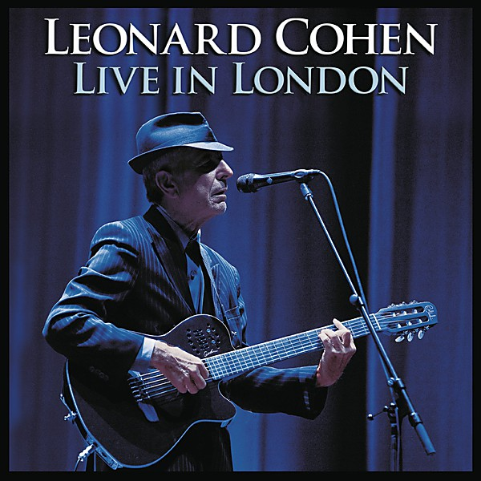

# Live in London

By **Leonard Cohen**

## Album Data

- **Catalog:** Beets
- **Format:** Digital, Album
- **Album:** Live in London
- **Artist:** Leonard Cohen
- **Albumartist:** Leonard Cohen
- **Genre:** Folk Rock
- **MusicBrainz Album Artist ID:** [65314b12-0e08-43fa-ba33-baaa7b874c15](https://musicbrainz.org/artist/65314b12-0e08-43fa-ba33-baaa7b874c15)
- **MusicBrainz Album ID:** [47069cc8-b2bf-4033-aa30-239f33dd551a](https://musicbrainz.org/release/47069cc8-b2bf-4033-aa30-239f33dd551a)
- **MusicBrainz Release Group ID:** [93c35972-7a36-340a-b844-ffb386d23c02](https://musicbrainz.org/release-group/93c35972-7a36-340a-b844-ffb386d23c02)
- **Year:** 2009
- **Catalog #:** 01-032660-10
- **Label:** Columbia
- **Total Tracks:** 11

## Album Tracks

### Track 01 - Is This What You Wanted

- **Artist:** Leonard Cohen
- **Format:** ALAC
- **Genre:** Folk Rock
- **Length:** 4:19
- **MusicBrainz Track ID:** [6ea0a938-b4a1-4323-9c7b-d8eb3be043a3](https://musicbrainz.org/recording/6ea0a938-b4a1-4323-9c7b-d8eb3be043a3)
- **Title:** Is This What You Wanted
- **Track:** 01
- **Year:** 1995

### Track 02 - Chelsea Hotel #2

- **Artist:** Leonard Cohen
- **Format:** ALAC
- **Genre:** Folk Rock
- **Length:** 3:08
- **MusicBrainz Track ID:** [9c4da7e7-d936-43f4-84d3-b06f5f5843b2](https://musicbrainz.org/recording/9c4da7e7-d936-43f4-84d3-b06f5f5843b2)
- **Title:** Chelsea Hotel #2
- **Track:** 02
- **Year:** 1995

### Track 03 - Lover Lover Lover

- **Artist:** Leonard Cohen
- **Format:** ALAC
- **Genre:** Soft Rock
- **Length:** 3:24
- **MusicBrainz Track ID:** [bdc69de7-c35d-473a-9a32-3143b5cf6c3d](https://musicbrainz.org/recording/bdc69de7-c35d-473a-9a32-3143b5cf6c3d)
- **Title:** Lover Lover Lover
- **Track:** 03
- **Year:** 1995

### Track 04 - Field Commander Cohen

- **Artist:** Leonard Cohen
- **Format:** ALAC
- **Genre:** Folk Rock
- **Length:** 4:04
- **MusicBrainz Track ID:** [5a0ea8c2-f34d-423e-b022-37b4e9803d7c](https://musicbrainz.org/recording/5a0ea8c2-f34d-423e-b022-37b4e9803d7c)
- **Title:** Field Commander Cohen
- **Track:** 04
- **Year:** 1995

### Track 05 - Why Don't You Try

- **Artist:** Leonard Cohen
- **Format:** ALAC
- **Genre:** Folk Rock
- **Length:** 3:54
- **MusicBrainz Track ID:** [446e2240-a8e7-4756-b35e-bc4ffdf5b610](https://musicbrainz.org/recording/446e2240-a8e7-4756-b35e-bc4ffdf5b610)
- **Title:** Why Don't You Try
- **Track:** 05
- **Year:** 1995

### Track 06 - There Is a War

- **Artist:** Leonard Cohen
- **Format:** ALAC
- **Genre:** Folk Rock
- **Length:** 3:04
- **MusicBrainz Track ID:** [7ce96582-4cb0-42f0-9d98-253e1fe36f33](https://musicbrainz.org/recording/7ce96582-4cb0-42f0-9d98-253e1fe36f33)
- **Title:** There Is a War
- **Track:** 06
- **Year:** 1995

### Track 07 - A Singer Must Die

- **Artist:** Leonard Cohen
- **Format:** ALAC
- **Genre:** Folk Rock
- **Length:** 3:22
- **MusicBrainz Track ID:** [174546b8-28bd-4d61-b1f1-9f7ffd57963e](https://musicbrainz.org/recording/174546b8-28bd-4d61-b1f1-9f7ffd57963e)
- **Title:** A Singer Must Die
- **Track:** 07
- **Year:** 1995

### Track 08 - I Tried to Leave You

- **Artist:** Leonard Cohen
- **Format:** ALAC
- **Genre:** Folk Rock
- **Length:** 2:42
- **MusicBrainz Track ID:** [456ebc49-9a54-45f8-a3ab-b50bfafeee79](https://musicbrainz.org/recording/456ebc49-9a54-45f8-a3ab-b50bfafeee79)
- **Title:** I Tried to Leave You
- **Track:** 08
- **Year:** 1995

### Track 09 - Who by Fire

- **Artist:** Leonard Cohen
- **Format:** ALAC
- **Genre:** Rock
- **Length:** 2:37
- **MusicBrainz Track ID:** [9313208d-480f-49fc-8616-ad13273e80a3](https://musicbrainz.org/recording/9313208d-480f-49fc-8616-ad13273e80a3)
- **Title:** Who by Fire
- **Track:** 09
- **Year:** 1995

### Track 10 - Take This Longing

- **Artist:** Leonard Cohen
- **Format:** ALAC
- **Genre:** Folk Rock
- **Length:** 4:10
- **MusicBrainz Track ID:** [e68f1283-5675-485c-b840-8bb9202a7145](https://musicbrainz.org/recording/e68f1283-5675-485c-b840-8bb9202a7145)
- **Title:** Take This Longing
- **Track:** 10
- **Year:** 1995

### Track 11 - Leaving Green Sleeves

- **Artist:** Leonard Cohen
- **Format:** ALAC
- **Genre:** Folk Rock
- **Length:** 2:39
- **MusicBrainz Track ID:** [b45b3886-b5f6-4a33-a9ee-5dd3307552f6](https://musicbrainz.org/recording/b45b3886-b5f6-4a33-a9ee-5dd3307552f6)
- **Title:** Leaving Green Sleeves
- **Track:** 11
- **Year:** 1995

