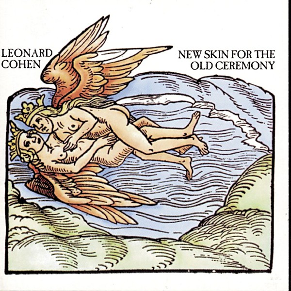

# New Skin for the Old Ceremony

By **Leonard Cohen**

## Album Data

- **Catalog:** Beets
- **Format:** Digital, Album
- **Album:** New Skin for the Old Ceremony
- **Artist:** Leonard Cohen
- **Albumartist:** Leonard Cohen
- **Genre:** Folk Rock
- **MusicBrainz Album Artist ID:** [65314b12-0e08-43fa-ba33-baaa7b874c15](https://musicbrainz.org/artist/65314b12-0e08-43fa-ba33-baaa7b874c15)
- **MusicBrainz Album ID:** [6e4212d3-5399-4da6-917b-a4ee3a579876](https://musicbrainz.org/release/6e4212d3-5399-4da6-917b-a4ee3a579876)
- **MusicBrainz Release Group ID:** [713b95c0-6259-33a5-9711-6bb791e15e3e](https://musicbrainz.org/release-group/713b95c0-6259-33a5-9711-6bb791e15e3e)
- **Year:** 1995
- **Catalog #:** 
- **Label:** 
- **Total Tracks:** 10

## Album Tracks

### Track 01 - The Guests

- **Artist:** Leonard Cohen
- **Format:** ALAC
- **Genre:** Rock
- **Length:** 6:40
- **MusicBrainz Track ID:** [9ab9cba8-dc25-4c71-abca-12b879284123](https://musicbrainz.org/recording/9ab9cba8-dc25-4c71-abca-12b879284123)
- **Title:** The Guests
- **Track:** 01
- **Year:** 2008

### Track 02 - Humbled in Love

- **Artist:** Leonard Cohen
- **Format:** ALAC
- **Genre:** Folk Rock
- **Length:** 5:15
- **MusicBrainz Track ID:** [40ba62d5-3fc8-4570-9fc0-6bd741551551](https://musicbrainz.org/recording/40ba62d5-3fc8-4570-9fc0-6bd741551551)
- **Title:** Humbled in Love
- **Track:** 02
- **Year:** 2008

### Track 03 - The Window

- **Artist:** Leonard Cohen
- **Format:** ALAC
- **Genre:** Folk Rock
- **Length:** 5:56
- **MusicBrainz Track ID:** [1c54de7c-069a-4023-a8a3-b0cd55400609](https://musicbrainz.org/recording/1c54de7c-069a-4023-a8a3-b0cd55400609)
- **Title:** The Window
- **Track:** 03
- **Year:** 2008

### Track 04 - Came So Far for Beauty

- **Artist:** Leonard Cohen
- **Format:** ALAC
- **Genre:** Folk Rock
- **Length:** 4:04
- **MusicBrainz Track ID:** [04360542-ef02-4eae-9826-ee8870e70321](https://musicbrainz.org/recording/04360542-ef02-4eae-9826-ee8870e70321)
- **Title:** Came So Far for Beauty
- **Track:** 04
- **Year:** 2008

### Track 05 - The Lost Canadian (Un Canadien errant)

- **Artist:** Leonard Cohen
- **Format:** ALAC
- **Genre:** Chanson
- **Length:** 4:44
- **MusicBrainz Track ID:** [650c92ba-a9eb-40ec-83dd-30148fc1679a](https://musicbrainz.org/recording/650c92ba-a9eb-40ec-83dd-30148fc1679a)
- **Title:** The Lost Canadian (Un Canadien errant)
- **Track:** 05
- **Year:** 2008

### Track 06 - The Traitor

- **Artist:** Leonard Cohen
- **Format:** ALAC
- **Genre:** New Wave
- **Length:** 6:15
- **MusicBrainz Track ID:** [7d644bc4-e70d-46d9-a3e0-4f47315e5e03](https://musicbrainz.org/recording/7d644bc4-e70d-46d9-a3e0-4f47315e5e03)
- **Title:** The Traitor
- **Track:** 06
- **Year:** 2008

### Track 07 - Our Lady of Solitude

- **Artist:** Leonard Cohen
- **Format:** ALAC
- **Genre:** Alternative Rock
- **Length:** 3:13
- **MusicBrainz Track ID:** [5b2cc354-3abb-477d-8143-46394f7c9242](https://musicbrainz.org/recording/5b2cc354-3abb-477d-8143-46394f7c9242)
- **Title:** Our Lady of Solitude
- **Track:** 07
- **Year:** 2008

### Track 08 - The Gypsy's Wife

- **Artist:** Leonard Cohen
- **Format:** ALAC
- **Genre:** Rock
- **Length:** 5:13
- **MusicBrainz Track ID:** [bfe0b37d-fe45-4a5c-9857-386092b5396e](https://musicbrainz.org/recording/bfe0b37d-fe45-4a5c-9857-386092b5396e)
- **Title:** The Gypsy's Wife
- **Track:** 08
- **Year:** 2008

### Track 09 - The Smokey Life

- **Artist:** Leonard Cohen
- **Format:** ALAC
- **Genre:** Folk Rock
- **Length:** 5:18
- **MusicBrainz Track ID:** [90977aa4-eead-4245-9413-92a635cbb4a6](https://musicbrainz.org/recording/90977aa4-eead-4245-9413-92a635cbb4a6)
- **Title:** The Smokey Life
- **Track:** 09
- **Year:** 2008

### Track 10 - Ballad of the Absent Mare

- **Artist:** Leonard Cohen
- **Format:** ALAC
- **Genre:** Alternative Rock
- **Length:** 6:42
- **MusicBrainz Track ID:** [38e88e6e-16e3-4f7a-8156-db319e0508cd](https://musicbrainz.org/recording/38e88e6e-16e3-4f7a-8156-db319e0508cd)
- **Title:** Ballad of the Absent Mare
- **Track:** 10
- **Year:** 2008

## See also

- [Dear Heather](Dear_Heather.md)
- [Death of a Ladies’ Man](Death_of_a_Ladies’_Man.md)
- [I’m Your Man](I’m_Your_Man.md)
- [Live in London](Live_in_London.md)
- [Recent Songs](Recent_Songs.md)
- [Songs From a Room](Songs_From_a_Room.md)
- [Songs of Leonard Cohen](Songs_of_Leonard_Cohen.md)
- [Songs of Love and Hate](Songs_of_Love_and_Hate.md)
- [Ten New Songs](Ten_New_Songs.md)
- [The Future](The_Future.md)
- [Various Positions](Various_Positions.md)
- [CD: Dear Heather](../../CD/Leonard_Cohen/Dear_Heather.md)
- [CD: Death A Of Ladies' Man](../../CD/Leonard_Cohen/Death_A_Of_Ladies_Man.md)
- [CD: I'm Your Man](../../CD/Leonard_Cohen/Im_Your_Man.md)
- [CD: ](../../CD/Leonard_Cohen/Leonard_Cohen.md)
- [CD: New Skin For The Old Ceremony](../../CD/Leonard_Cohen/New_Skin_For_The_Old_Ceremony.md)
- [CD: Recent Songs](../../CD/Leonard_Cohen/Recent_Songs.md)
- [CD: Songs From A Room](../../CD/Leonard_Cohen/Songs_From_A_Room.md)
- [CD: Songs Of Leonard Cohen](../../CD/Leonard_Cohen/Songs_Of_Leonard_Cohen.md)
- [CD: Songs Of Love And Hate](../../CD/Leonard_Cohen/Songs_Of_Love_And_Hate.md)
- [CD: Ten New Songs](../../CD/Leonard_Cohen/Ten_New_Songs.md)
- [CD: The Future](../../CD/Leonard_Cohen/The_Future.md)
- [CD: Various Positions](../../CD/Leonard_Cohen/Various_Positions.md)
