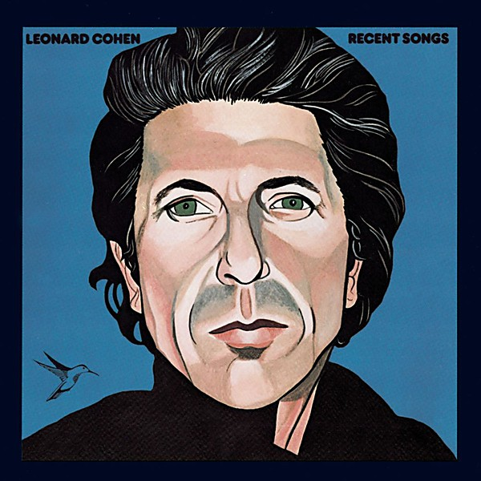

# Recent Songs

By **Leonard Cohen**

## Album Data

- **Catalog:** Beets
- **Format:** Digital, Album
- **Album:** Recent Songs
- **Artist:** Leonard Cohen
- **Albumartist:** Leonard Cohen
- **Genre:** Folk Rock
- **MusicBrainz Album Artist ID:** [65314b12-0e08-43fa-ba33-baaa7b874c15](https://musicbrainz.org/artist/65314b12-0e08-43fa-ba33-baaa7b874c15)
- **MusicBrainz Album ID:** [134ac08f-ab69-308e-96ba-47a9696cc27d](https://musicbrainz.org/release/134ac08f-ab69-308e-96ba-47a9696cc27d)
- **MusicBrainz Release Group ID:** [1d60df56-dec4-3b33-bca6-ce6f16ef85c5](https://musicbrainz.org/release-group/1d60df56-dec4-3b33-bca6-ce6f16ef85c5)
- **Year:** 2008
- **Catalog #:** 
- **Label:** Columbia Nashville
- **Total Tracks:** 10

## Album Tracks

### Track 01 - Bird on the Wire

- **Artist:** Leonard Cohen
- **Format:** ALAC
- **Genre:** Rock
- **Length:** 3:29
- **MusicBrainz Track ID:** [a7e15f12-ea5c-4f4a-85e8-22d7eb7fad2c](https://musicbrainz.org/recording/a7e15f12-ea5c-4f4a-85e8-22d7eb7fad2c)
- **Title:** Bird on the Wire
- **Track:** 01
- **Year:** 2014

### Track 02 - Story of Isaac

- **Artist:** Leonard Cohen
- **Format:** ALAC
- **Genre:** Folk Rock
- **Length:** 3:38
- **MusicBrainz Track ID:** [c122eb1a-532e-4e19-8762-000009d04270](https://musicbrainz.org/recording/c122eb1a-532e-4e19-8762-000009d04270)
- **Title:** Story of Isaac
- **Track:** 02
- **Year:** 2014

### Track 03 - A Bunch of Lonesome Heroes

- **Artist:** Leonard Cohen
- **Format:** ALAC
- **Genre:** Blues
- **Length:** 3:18
- **MusicBrainz Track ID:** [6df65969-fe42-46fa-b167-7f3abd47ee90](https://musicbrainz.org/recording/6df65969-fe42-46fa-b167-7f3abd47ee90)
- **Title:** A Bunch of Lonesome Heroes
- **Track:** 03
- **Year:** 2014

### Track 04 - The Partisan

- **Artist:** Leonard Cohen
- **Format:** ALAC
- **Genre:** Folk Rock
- **Length:** 3:29
- **MusicBrainz Track ID:** [298af3c5-74b0-4308-8b94-c11415fc6ebe](https://musicbrainz.org/recording/298af3c5-74b0-4308-8b94-c11415fc6ebe)
- **Title:** The Partisan
- **Track:** 04
- **Year:** 2014

### Track 05 - Seems So Long Ago, Nancy

- **Artist:** Leonard Cohen
- **Format:** ALAC
- **Genre:** Folk Rock
- **Length:** 3:41
- **MusicBrainz Track ID:** [7eff29b8-0773-4159-bae8-4d6bdf0a3dc1](https://musicbrainz.org/recording/7eff29b8-0773-4159-bae8-4d6bdf0a3dc1)
- **Title:** Seems So Long Ago, Nancy
- **Track:** 05
- **Year:** 2014

### Track 06 - The Old Revolution

- **Artist:** Leonard Cohen
- **Format:** ALAC
- **Genre:** Blues
- **Length:** 4:50
- **MusicBrainz Track ID:** [3b6dd603-b0c5-4765-97a3-cd859eae82e6](https://musicbrainz.org/recording/3b6dd603-b0c5-4765-97a3-cd859eae82e6)
- **Title:** The Old Revolution
- **Track:** 06
- **Year:** 2014

### Track 07 - The Butcher

- **Artist:** Leonard Cohen
- **Format:** ALAC
- **Genre:** Rock
- **Length:** 3:22
- **MusicBrainz Track ID:** [2f90cf1d-e28d-4523-a6f5-037259072178](https://musicbrainz.org/recording/2f90cf1d-e28d-4523-a6f5-037259072178)
- **Title:** The Butcher
- **Track:** 07
- **Year:** 2014

### Track 08 - You Know Who I Am

- **Artist:** Leonard Cohen
- **Format:** ALAC
- **Genre:** Rock
- **Length:** 3:32
- **MusicBrainz Track ID:** [25e0aba3-4737-4ae2-b9e3-5f5b9979115d](https://musicbrainz.org/recording/25e0aba3-4737-4ae2-b9e3-5f5b9979115d)
- **Title:** You Know Who I Am
- **Track:** 08
- **Year:** 2014

### Track 09 - Lady Midnight

- **Artist:** Leonard Cohen
- **Format:** ALAC
- **Genre:** Folk Rock
- **Length:** 3:01
- **MusicBrainz Track ID:** [943f918e-946e-47e6-9092-ab284cc72784](https://musicbrainz.org/recording/943f918e-946e-47e6-9092-ab284cc72784)
- **Title:** Lady Midnight
- **Track:** 09
- **Year:** 2014

### Track 10 - Tonight Will Be Fine

- **Artist:** Leonard Cohen
- **Format:** ALAC
- **Genre:** Folk Rock
- **Length:** 3:52
- **MusicBrainz Track ID:** [9650115c-487f-4973-addc-d8047ace294a](https://musicbrainz.org/recording/9650115c-487f-4973-addc-d8047ace294a)
- **Title:** Tonight Will Be Fine
- **Track:** 10
- **Year:** 2014

## See also

- [Dear Heather](Dear_Heather.md)
- [Death of a Ladies’ Man](Death_of_a_Ladies’_Man.md)
- [I’m Your Man](I’m_Your_Man.md)
- [Live in London](Live_in_London.md)
- [New Skin for the Old Ceremony](New_Skin_for_the_Old_Ceremony.md)
- [Songs From a Room](Songs_From_a_Room.md)
- [Songs of Leonard Cohen](Songs_of_Leonard_Cohen.md)
- [Songs of Love and Hate](Songs_of_Love_and_Hate.md)
- [Ten New Songs](Ten_New_Songs.md)
- [The Future](The_Future.md)
- [Various Positions](Various_Positions.md)
- [CD: Dear Heather](../../CD/Leonard_Cohen/Dear_Heather.md)
- [CD: Death A Of Ladies' Man](../../CD/Leonard_Cohen/Death_A_Of_Ladies_Man.md)
- [CD: I'm Your Man](../../CD/Leonard_Cohen/Im_Your_Man.md)
- [CD: ](../../CD/Leonard_Cohen/Leonard_Cohen.md)
- [CD: New Skin For The Old Ceremony](../../CD/Leonard_Cohen/New_Skin_For_The_Old_Ceremony.md)
- [CD: Recent Songs](../../CD/Leonard_Cohen/Recent_Songs.md)
- [CD: Songs From A Room](../../CD/Leonard_Cohen/Songs_From_A_Room.md)
- [CD: Songs Of Leonard Cohen](../../CD/Leonard_Cohen/Songs_Of_Leonard_Cohen.md)
- [CD: Songs Of Love And Hate](../../CD/Leonard_Cohen/Songs_Of_Love_And_Hate.md)
- [CD: Ten New Songs](../../CD/Leonard_Cohen/Ten_New_Songs.md)
- [CD: The Future](../../CD/Leonard_Cohen/The_Future.md)
- [CD: Various Positions](../../CD/Leonard_Cohen/Various_Positions.md)
