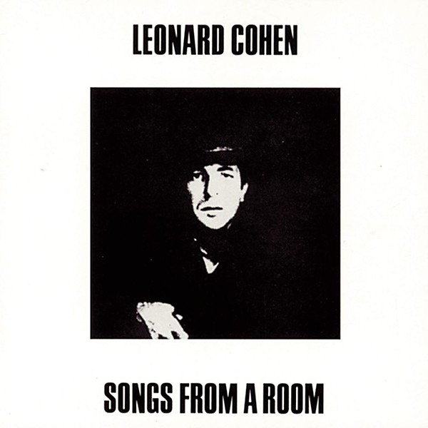

# Songs From a Room

By **Leonard Cohen**

## Album Data

- **Catalog:** Beets
- **Format:** Digital, Album
- **Album:** Songs From a Room
- **Artist:** Leonard Cohen
- **Albumartist:** Leonard Cohen
- **Genre:** Folk Rock
- **MusicBrainz Album Artist ID:** [65314b12-0e08-43fa-ba33-baaa7b874c15](https://musicbrainz.org/artist/65314b12-0e08-43fa-ba33-baaa7b874c15)
- **MusicBrainz Album ID:** [4f722dd0-be9b-4448-b8d2-ad31cc4c6536](https://musicbrainz.org/release/4f722dd0-be9b-4448-b8d2-ad31cc4c6536)
- **MusicBrainz Release Group ID:** [0c0d5696-5d29-3809-8b79-4bf1320f0353](https://musicbrainz.org/release-group/0c0d5696-5d29-3809-8b79-4bf1320f0353)
- **Year:** 2014
- **Catalog #:** CK 9533
- **Label:** Columbia
- **Total Tracks:** 10

## Album Tracks

### Track 01 - Suzanne

- **Artist:** Leonard Cohen
- **Format:** ALAC
- **Genre:** Rock
- **Length:** 3:50
- **MusicBrainz Track ID:** [dabf85e1-ce84-467b-a267-1e6a36b600ed](https://musicbrainz.org/recording/dabf85e1-ce84-467b-a267-1e6a36b600ed)
- **Title:** Suzanne
- **Track:** 01
- **Year:** 1989

### Track 02 - Master Song

- **Artist:** Leonard Cohen
- **Format:** ALAC
- **Genre:** Folk Rock
- **Length:** 5:58
- **MusicBrainz Track ID:** [9e632ee6-a2b3-461d-8b82-d28c99f73fa9](https://musicbrainz.org/recording/9e632ee6-a2b3-461d-8b82-d28c99f73fa9)
- **Title:** Master Song
- **Track:** 02
- **Year:** 1989

### Track 03 - Winter Lady

- **Artist:** Leonard Cohen
- **Format:** ALAC
- **Genre:** Rock
- **Length:** 2:17
- **MusicBrainz Track ID:** [8dbbc1e7-41cb-46cc-bd86-d8a6a926264c](https://musicbrainz.org/recording/8dbbc1e7-41cb-46cc-bd86-d8a6a926264c)
- **Title:** Winter Lady
- **Track:** 03
- **Year:** 1989

### Track 04 - The Stranger Song

- **Artist:** Leonard Cohen
- **Format:** ALAC
- **Genre:** Rock
- **Length:** 5:07
- **MusicBrainz Track ID:** [44fae494-0cc6-4a03-92f6-3cd89b94eb25](https://musicbrainz.org/recording/44fae494-0cc6-4a03-92f6-3cd89b94eb25)
- **Title:** The Stranger Song
- **Track:** 04
- **Year:** 1989

### Track 05 - Sisters of Mercy

- **Artist:** Leonard Cohen
- **Format:** ALAC
- **Genre:** Folk Rock
- **Length:** 3:36
- **MusicBrainz Track ID:** [1dfbe751-83d3-4a9e-820e-b8f7c46213ba](https://musicbrainz.org/recording/1dfbe751-83d3-4a9e-820e-b8f7c46213ba)
- **Title:** Sisters of Mercy
- **Track:** 05
- **Year:** 1989

### Track 06 - So Long, Marianne

- **Artist:** Leonard Cohen
- **Format:** ALAC
- **Genre:** Folk Rock
- **Length:** 5:40
- **MusicBrainz Track ID:** [03324c96-733a-4f07-8d63-da47d8285294](https://musicbrainz.org/recording/03324c96-733a-4f07-8d63-da47d8285294)
- **Title:** So Long, Marianne
- **Track:** 06
- **Year:** 1989

### Track 07 - Hey, That's No Way to Say Goodbye

- **Artist:** Leonard Cohen
- **Format:** ALAC
- **Genre:** Rock
- **Length:** 2:57
- **MusicBrainz Track ID:** [f01d27f7-5080-48fe-877a-0176e217cce7](https://musicbrainz.org/recording/f01d27f7-5080-48fe-877a-0176e217cce7)
- **Title:** Hey, That's No Way to Say Goodbye
- **Track:** 07
- **Year:** 1989

### Track 08 - Stories of the Street

- **Artist:** Leonard Cohen
- **Format:** ALAC
- **Genre:** Blues
- **Length:** 4:37
- **MusicBrainz Track ID:** [ef095d10-ceb5-4ff0-8e32-e33ae176e374](https://musicbrainz.org/recording/ef095d10-ceb5-4ff0-8e32-e33ae176e374)
- **Title:** Stories of the Street
- **Track:** 08
- **Year:** 1989

### Track 09 - Teachers

- **Artist:** Leonard Cohen
- **Format:** ALAC
- **Genre:** Folk Rock
- **Length:** 3:02
- **MusicBrainz Track ID:** [9d6a550c-3cb2-440f-81d1-5237d35558ef](https://musicbrainz.org/recording/9d6a550c-3cb2-440f-81d1-5237d35558ef)
- **Title:** Teachers
- **Track:** 09
- **Year:** 1989

### Track 10 - One of Us Cannot Be Wrong

- **Artist:** Leonard Cohen
- **Format:** ALAC
- **Genre:** Rock
- **Length:** 4:29
- **MusicBrainz Track ID:** [a4bb8b08-9a6a-4405-b023-84675169bafa](https://musicbrainz.org/recording/a4bb8b08-9a6a-4405-b023-84675169bafa)
- **Title:** One of Us Cannot Be Wrong
- **Track:** 10
- **Year:** 1989

## See also

- [Dear Heather](Dear_Heather.md)
- [Death of a Ladies’ Man](Death_of_a_Ladies’_Man.md)
- [I’m Your Man](I’m_Your_Man.md)
- [Live in London](Live_in_London.md)
- [New Skin for the Old Ceremony](New_Skin_for_the_Old_Ceremony.md)
- [Recent Songs](Recent_Songs.md)
- [Songs of Leonard Cohen](Songs_of_Leonard_Cohen.md)
- [Songs of Love and Hate](Songs_of_Love_and_Hate.md)
- [Ten New Songs](Ten_New_Songs.md)
- [The Future](The_Future.md)
- [Various Positions](Various_Positions.md)
- [CD: Dear Heather](../../CD/Leonard_Cohen/Dear_Heather.md)
- [CD: Death A Of Ladies' Man](../../CD/Leonard_Cohen/Death_A_Of_Ladies_Man.md)
- [CD: I'm Your Man](../../CD/Leonard_Cohen/Im_Your_Man.md)
- [CD: ](../../CD/Leonard_Cohen/Leonard_Cohen.md)
- [CD: New Skin For The Old Ceremony](../../CD/Leonard_Cohen/New_Skin_For_The_Old_Ceremony.md)
- [CD: Recent Songs](../../CD/Leonard_Cohen/Recent_Songs.md)
- [CD: Songs From A Room](../../CD/Leonard_Cohen/Songs_From_A_Room.md)
- [CD: Songs Of Leonard Cohen](../../CD/Leonard_Cohen/Songs_Of_Leonard_Cohen.md)
- [CD: Songs Of Love And Hate](../../CD/Leonard_Cohen/Songs_Of_Love_And_Hate.md)
- [CD: Ten New Songs](../../CD/Leonard_Cohen/Ten_New_Songs.md)
- [CD: The Future](../../CD/Leonard_Cohen/The_Future.md)
- [CD: Various Positions](../../CD/Leonard_Cohen/Various_Positions.md)
