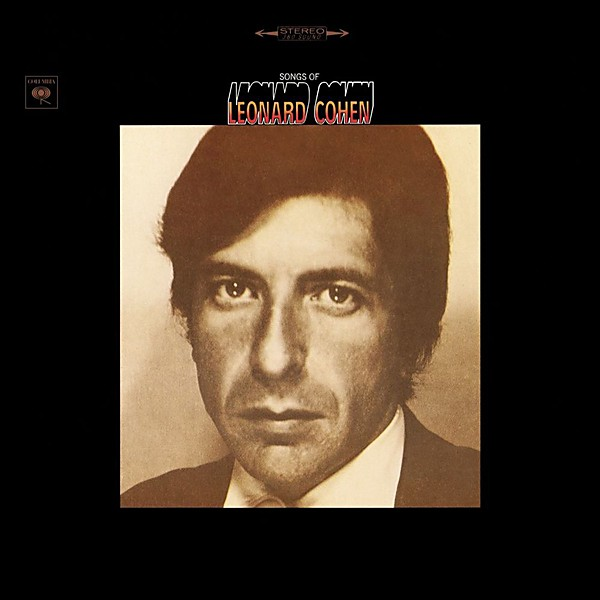

# Songs of Leonard Cohen

By **Leonard Cohen**

## Album Data

- **Catalog:** Beets
- **Format:** Digital, Album
- **Album:** Songs of Leonard Cohen
- **Artist:** Leonard Cohen
- **Albumartist:** Leonard Cohen
- **Genre:** Folk Rock
- **MusicBrainz Album Artist ID:** [65314b12-0e08-43fa-ba33-baaa7b874c15](https://musicbrainz.org/artist/65314b12-0e08-43fa-ba33-baaa7b874c15)
- **MusicBrainz Album ID:** [794c20e2-d259-3e51-9e23-47e1f3aa4888](https://musicbrainz.org/release/794c20e2-d259-3e51-9e23-47e1f3aa4888)
- **MusicBrainz Release Group ID:** [34291a49-8df9-304e-bd39-16b11d829d5f](https://musicbrainz.org/release-group/34291a49-8df9-304e-bd39-16b11d829d5f)
- **Year:** 1989
- **Catalog #:** C 30103
- **Label:** Columbia
- **Total Tracks:** 08

## Album Tracks

### Track 01 - Avalanche

- **Artist:** Leonard Cohen
- **Format:** ALAC
- **Genre:** Rock
- **Length:** 5:07
- **MusicBrainz Track ID:** [98fd912c-49e7-4f9c-b3c4-25f7b28052ce](https://musicbrainz.org/recording/98fd912c-49e7-4f9c-b3c4-25f7b28052ce)
- **Title:** Avalanche
- **Track:** 01
- **Year:** 1971

### Track 02 - Last Year’s Man

- **Artist:** Leonard Cohen
- **Format:** ALAC
- **Genre:** Folk Rock
- **Length:** 6:02
- **MusicBrainz Track ID:** [3d5b07a8-a641-4cda-a988-c1b5aa4d7aff](https://musicbrainz.org/recording/3d5b07a8-a641-4cda-a988-c1b5aa4d7aff)
- **Title:** Last Year’s Man
- **Track:** 02
- **Year:** 1971

### Track 03 - Dress Rehearsal Rag

- **Artist:** Leonard Cohen
- **Format:** ALAC
- **Genre:** Rock
- **Length:** 6:12
- **MusicBrainz Track ID:** [7e032abc-c653-43f2-9de8-982cf62e3688](https://musicbrainz.org/recording/7e032abc-c653-43f2-9de8-982cf62e3688)
- **Title:** Dress Rehearsal Rag
- **Track:** 03
- **Year:** 1971

### Track 04 - Diamonds in the Mine

- **Artist:** Leonard Cohen
- **Format:** ALAC
- **Genre:** Country Rock
- **Length:** 3:52
- **MusicBrainz Track ID:** [bc07db48-3846-4447-bfa6-0629b86db45e](https://musicbrainz.org/recording/bc07db48-3846-4447-bfa6-0629b86db45e)
- **Title:** Diamonds in the Mine
- **Track:** 04
- **Year:** 1971

### Track 05 - Love Calls You by Your Name

- **Artist:** Leonard Cohen
- **Format:** ALAC
- **Genre:** Folk Rock
- **Length:** 5:44
- **MusicBrainz Track ID:** [89006e1c-3466-4606-80c9-448c5dc64007](https://musicbrainz.org/recording/89006e1c-3466-4606-80c9-448c5dc64007)
- **Title:** Love Calls You by Your Name
- **Track:** 05
- **Year:** 1971

### Track 06 - Famous Blue Raincoat

- **Artist:** Leonard Cohen
- **Format:** ALAC
- **Genre:** Rock
- **Length:** 5:15
- **MusicBrainz Track ID:** [e208aa92-4c0e-462c-a737-c85e9209d217](https://musicbrainz.org/recording/e208aa92-4c0e-462c-a737-c85e9209d217)
- **Title:** Famous Blue Raincoat
- **Track:** 06
- **Year:** 1971

### Track 07 - Sing Another Song, Boys

- **Artist:** Leonard Cohen
- **Format:** ALAC
- **Genre:** Rock
- **Length:** 6:17
- **MusicBrainz Track ID:** [12879ba5-6dcb-4279-aafa-8ad0fa91d331](https://musicbrainz.org/recording/12879ba5-6dcb-4279-aafa-8ad0fa91d331)
- **Title:** Sing Another Song, Boys
- **Track:** 07
- **Year:** 1971

### Track 08 - Joan of Arc

- **Artist:** Leonard Cohen
- **Format:** ALAC
- **Genre:** Rock
- **Length:** 6:29
- **MusicBrainz Track ID:** [8c3f1e33-ce21-4c64-813a-24c10f572d2c](https://musicbrainz.org/recording/8c3f1e33-ce21-4c64-813a-24c10f572d2c)
- **Title:** Joan of Arc
- **Track:** 08
- **Year:** 1971

## See also

- [Dear Heather](Dear_Heather.md)
- [Death of a Ladies’ Man](Death_of_a_Ladies’_Man.md)
- [I’m Your Man](I’m_Your_Man.md)
- [Live in London](Live_in_London.md)
- [New Skin for the Old Ceremony](New_Skin_for_the_Old_Ceremony.md)
- [Recent Songs](Recent_Songs.md)
- [Songs From a Room](Songs_From_a_Room.md)
- [Songs of Love and Hate](Songs_of_Love_and_Hate.md)
- [Ten New Songs](Ten_New_Songs.md)
- [The Future](The_Future.md)
- [Various Positions](Various_Positions.md)
- [CD: Dear Heather](../../CD/Leonard_Cohen/Dear_Heather.md)
- [CD: Death A Of Ladies' Man](../../CD/Leonard_Cohen/Death_A_Of_Ladies_Man.md)
- [CD: I'm Your Man](../../CD/Leonard_Cohen/Im_Your_Man.md)
- [CD: ](../../CD/Leonard_Cohen/Leonard_Cohen.md)
- [CD: New Skin For The Old Ceremony](../../CD/Leonard_Cohen/New_Skin_For_The_Old_Ceremony.md)
- [CD: Recent Songs](../../CD/Leonard_Cohen/Recent_Songs.md)
- [CD: Songs From A Room](../../CD/Leonard_Cohen/Songs_From_A_Room.md)
- [CD: Songs Of Leonard Cohen](../../CD/Leonard_Cohen/Songs_Of_Leonard_Cohen.md)
- [CD: Songs Of Love And Hate](../../CD/Leonard_Cohen/Songs_Of_Love_And_Hate.md)
- [CD: Ten New Songs](../../CD/Leonard_Cohen/Ten_New_Songs.md)
- [CD: The Future](../../CD/Leonard_Cohen/The_Future.md)
- [CD: Various Positions](../../CD/Leonard_Cohen/Various_Positions.md)
