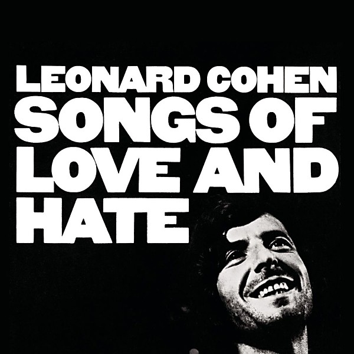

# Songs of Love and Hate

By **Leonard Cohen**

## Album Data

- **Catalog:** Beets
- **Format:** Digital, Album
- **Album:** Songs of Love and Hate
- **Artist:** Leonard Cohen
- **Albumartist:** Leonard Cohen
- **Genre:** Folk Rock
- **MusicBrainz Album Artist ID:** [65314b12-0e08-43fa-ba33-baaa7b874c15](https://musicbrainz.org/artist/65314b12-0e08-43fa-ba33-baaa7b874c15)
- **MusicBrainz Album ID:** [535bf80d-bde6-4a8c-b89a-45f69e56a025](https://musicbrainz.org/release/535bf80d-bde6-4a8c-b89a-45f69e56a025)
- **MusicBrainz Release Group ID:** [964ccc52-2873-3bce-a806-73d71532c539](https://musicbrainz.org/release-group/964ccc52-2873-3bce-a806-73d71532c539)
- **Year:** 1971
- **Catalog #:** CK 85953
- **Label:** Columbia
- **Total Tracks:** 10

## Album Tracks

### Track 01 - In My Secret Life

- **Artist:** Leonard Cohen
- **Format:** ALAC
- **Genre:** Rock
- **Length:** 4:55
- **MusicBrainz Track ID:** [3b26072c-426e-41d8-8498-037a4e95bfb7](https://musicbrainz.org/recording/3b26072c-426e-41d8-8498-037a4e95bfb7)
- **Title:** In My Secret Life
- **Track:** 01
- **Year:** 2001

### Track 02 - A Thousand Kisses Deep

- **Artist:** Leonard Cohen
- **Format:** ALAC
- **Genre:** Soft Rock
- **Length:** 6:29
- **MusicBrainz Track ID:** [36497e8d-1d2e-4621-bc9c-0d85de60b42d](https://musicbrainz.org/recording/36497e8d-1d2e-4621-bc9c-0d85de60b42d)
- **Title:** A Thousand Kisses Deep
- **Track:** 02
- **Year:** 2001

### Track 03 - That Don't Make It Junk

- **Artist:** Leonard Cohen
- **Format:** ALAC
- **Genre:** Soft Rock
- **Length:** 4:28
- **MusicBrainz Track ID:** [03d237a6-50b0-4d97-9272-6cda1789aa58](https://musicbrainz.org/recording/03d237a6-50b0-4d97-9272-6cda1789aa58)
- **Title:** That Don't Make It Junk
- **Track:** 03
- **Year:** 2001

### Track 04 - Here It Is

- **Artist:** Leonard Cohen
- **Format:** ALAC
- **Genre:** Folk Rock
- **Length:** 4:18
- **MusicBrainz Track ID:** [c3122495-ce76-40ce-ab37-8213d5ec1735](https://musicbrainz.org/recording/c3122495-ce76-40ce-ab37-8213d5ec1735)
- **Title:** Here It Is
- **Track:** 04
- **Year:** 2001

### Track 05 - Love Itself

- **Artist:** Leonard Cohen
- **Format:** ALAC
- **Genre:** Folk Rock
- **Length:** 5:26
- **MusicBrainz Track ID:** [03f720ba-4f36-4f61-808c-04774705b6f1](https://musicbrainz.org/recording/03f720ba-4f36-4f61-808c-04774705b6f1)
- **Title:** Love Itself
- **Track:** 05
- **Year:** 2001

### Track 06 - By the Rivers Dark

- **Artist:** Leonard Cohen
- **Format:** ALAC
- **Genre:** Folk Rock
- **Length:** 5:20
- **MusicBrainz Track ID:** [cfcf38f3-b8f5-4cf2-bb15-e839e89a1ea9](https://musicbrainz.org/recording/cfcf38f3-b8f5-4cf2-bb15-e839e89a1ea9)
- **Title:** By the Rivers Dark
- **Track:** 06
- **Year:** 2001

### Track 07 - Alexandra Leaving

- **Artist:** Leonard Cohen
- **Format:** ALAC
- **Genre:** Rock
- **Length:** 5:25
- **MusicBrainz Track ID:** [07d39109-cec9-4cec-9678-34041f86e441](https://musicbrainz.org/recording/07d39109-cec9-4cec-9678-34041f86e441)
- **Title:** Alexandra Leaving
- **Track:** 07
- **Year:** 2001

### Track 08 - You Have Loved Enough

- **Artist:** Leonard Cohen
- **Format:** ALAC
- **Genre:** Soft Rock
- **Length:** 5:41
- **MusicBrainz Track ID:** [e14acf57-24cc-4e7c-83ef-de3a55eb9104](https://musicbrainz.org/recording/e14acf57-24cc-4e7c-83ef-de3a55eb9104)
- **Title:** You Have Loved Enough
- **Track:** 08
- **Year:** 2001

### Track 09 - Boogie Street

- **Artist:** Leonard Cohen
- **Format:** ALAC
- **Genre:** Soft Rock
- **Length:** 6:04
- **MusicBrainz Track ID:** [46a307fa-16ba-4ca1-8ae2-6b7b4694e21e](https://musicbrainz.org/recording/46a307fa-16ba-4ca1-8ae2-6b7b4694e21e)
- **Title:** Boogie Street
- **Track:** 09
- **Year:** 2001

### Track 10 - The Land of Plenty

- **Artist:** Leonard Cohen
- **Format:** ALAC
- **Genre:** Soft Rock
- **Length:** 4:36
- **MusicBrainz Track ID:** [846fedd4-3852-46e7-a71b-d0bfd45d96ff](https://musicbrainz.org/recording/846fedd4-3852-46e7-a71b-d0bfd45d96ff)
- **Title:** The Land of Plenty
- **Track:** 10
- **Year:** 2001

## See also

- [Dear Heather](Dear_Heather.md)
- [Death of a Ladies’ Man](Death_of_a_Ladies’_Man.md)
- [I’m Your Man](I’m_Your_Man.md)
- [Live in London](Live_in_London.md)
- [New Skin for the Old Ceremony](New_Skin_for_the_Old_Ceremony.md)
- [Recent Songs](Recent_Songs.md)
- [Songs From a Room](Songs_From_a_Room.md)
- [Songs of Leonard Cohen](Songs_of_Leonard_Cohen.md)
- [Ten New Songs](Ten_New_Songs.md)
- [The Future](The_Future.md)
- [Various Positions](Various_Positions.md)
- [CD: Dear Heather](../../CD/Leonard_Cohen/Dear_Heather.md)
- [CD: Death A Of Ladies' Man](../../CD/Leonard_Cohen/Death_A_Of_Ladies_Man.md)
- [CD: I'm Your Man](../../CD/Leonard_Cohen/Im_Your_Man.md)
- [CD: ](../../CD/Leonard_Cohen/Leonard_Cohen.md)
- [CD: New Skin For The Old Ceremony](../../CD/Leonard_Cohen/New_Skin_For_The_Old_Ceremony.md)
- [CD: Recent Songs](../../CD/Leonard_Cohen/Recent_Songs.md)
- [CD: Songs From A Room](../../CD/Leonard_Cohen/Songs_From_A_Room.md)
- [CD: Songs Of Leonard Cohen](../../CD/Leonard_Cohen/Songs_Of_Leonard_Cohen.md)
- [CD: Songs Of Love And Hate](../../CD/Leonard_Cohen/Songs_Of_Love_And_Hate.md)
- [CD: Ten New Songs](../../CD/Leonard_Cohen/Ten_New_Songs.md)
- [CD: The Future](../../CD/Leonard_Cohen/The_Future.md)
- [CD: Various Positions](../../CD/Leonard_Cohen/Various_Positions.md)
