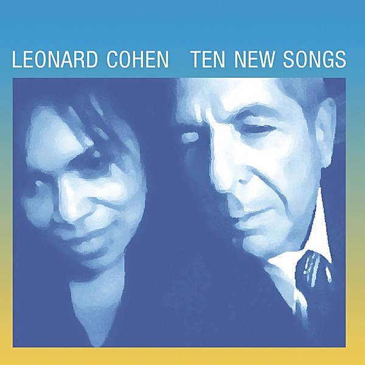

# Ten New Songs

By **Leonard Cohen**

## Album Data

- **Catalog:** Beets
- **Format:** Digital, Album
- **Album:** Ten New Songs
- **Artist:** Leonard Cohen
- **Albumartist:** Leonard Cohen
- **Genre:** Sophisti-Pop
- **MusicBrainz Album Artist ID:** [65314b12-0e08-43fa-ba33-baaa7b874c15](https://musicbrainz.org/artist/65314b12-0e08-43fa-ba33-baaa7b874c15)
- **MusicBrainz Album ID:** [14d4301c-f1ef-4169-a5fb-dfc9c869eacd](https://musicbrainz.org/release/14d4301c-f1ef-4169-a5fb-dfc9c869eacd)
- **MusicBrainz Release Group ID:** [b162cc5a-e4bb-3c65-b321-09245aea3e7a](https://musicbrainz.org/release-group/b162cc5a-e4bb-3c65-b321-09245aea3e7a)
- **Year:** 2001
- **Catalog #:** CK 53226
- **Label:** Columbia
- **Total Tracks:** 09

## Album Tracks

### Track 01 - The Future

- **Artist:** Leonard Cohen
- **Format:** ALAC
- **Genre:** Folk Rock
- **Length:** 6:43
- **MusicBrainz Track ID:** [06cf07c0-b739-4ce7-92c4-56424ee061cc](https://musicbrainz.org/recording/06cf07c0-b739-4ce7-92c4-56424ee061cc)
- **Title:** The Future
- **Track:** 01
- **Year:** 1992

### Track 02 - Waiting for the Miracle

- **Artist:** Leonard Cohen
- **Format:** ALAC
- **Genre:** Rock
- **Length:** 7:42
- **MusicBrainz Track ID:** [3a824c74-8ed4-4963-aa92-2ea0a173eeeb](https://musicbrainz.org/recording/3a824c74-8ed4-4963-aa92-2ea0a173eeeb)
- **Title:** Waiting for the Miracle
- **Track:** 02
- **Year:** 1992

### Track 03 - Be for Real

- **Artist:** Leonard Cohen
- **Format:** ALAC
- **Genre:** Soul
- **Length:** 4:32
- **MusicBrainz Track ID:** [93b29043-59f5-4092-b74d-32c267dadaf7](https://musicbrainz.org/recording/93b29043-59f5-4092-b74d-32c267dadaf7)
- **Title:** Be for Real
- **Track:** 03
- **Year:** 1992

### Track 04 - Closing Time

- **Artist:** Leonard Cohen
- **Format:** ALAC
- **Genre:** Folk Rock
- **Length:** 6:00
- **MusicBrainz Track ID:** [8be14815-92d2-4307-a16f-f47c3a0feeb6](https://musicbrainz.org/recording/8be14815-92d2-4307-a16f-f47c3a0feeb6)
- **Title:** Closing Time
- **Track:** 04
- **Year:** 1992

### Track 05 - Anthem

- **Artist:** Leonard Cohen
- **Format:** ALAC
- **Genre:** Rock
- **Length:** 6:09
- **MusicBrainz Track ID:** [34b3b2fc-fe08-429c-90fc-da7929f62846](https://musicbrainz.org/recording/34b3b2fc-fe08-429c-90fc-da7929f62846)
- **Title:** Anthem
- **Track:** 05
- **Year:** 1992

### Track 06 - Democracy

- **Artist:** Leonard Cohen
- **Format:** ALAC
- **Genre:** Soft Rock
- **Length:** 7:14
- **MusicBrainz Track ID:** [cb970ecf-215f-43d4-8b2c-24ff99a72194](https://musicbrainz.org/recording/cb970ecf-215f-43d4-8b2c-24ff99a72194)
- **Title:** Democracy
- **Track:** 06
- **Year:** 1992

### Track 07 - Light as the Breeze

- **Artist:** Leonard Cohen
- **Format:** ALAC
- **Genre:** Rock
- **Length:** 7:16
- **MusicBrainz Track ID:** [2ed281d2-a440-4a65-ab52-0d88a30ebe1a](https://musicbrainz.org/recording/2ed281d2-a440-4a65-ab52-0d88a30ebe1a)
- **Title:** Light as the Breeze
- **Track:** 07
- **Year:** 1992

### Track 08 - Always

- **Artist:** Leonard Cohen
- **Format:** ALAC
- **Genre:** Chanson
- **Length:** 8:04
- **MusicBrainz Track ID:** [a39d2625-9fc7-4c0a-b44c-d0fa4b955055](https://musicbrainz.org/recording/a39d2625-9fc7-4c0a-b44c-d0fa4b955055)
- **Title:** Always
- **Track:** 08
- **Year:** 1992

### Track 09 - Tacoma Trailer

- **Artist:** Leonard Cohen
- **Format:** ALAC
- **Genre:** Rock
- **Length:** 5:58
- **MusicBrainz Track ID:** [579927d8-3ef4-479a-9142-2723fe7f55c5](https://musicbrainz.org/recording/579927d8-3ef4-479a-9142-2723fe7f55c5)
- **Title:** Tacoma Trailer
- **Track:** 09
- **Year:** 1992

## See also

- [Dear Heather](Dear_Heather.md)
- [Death of a Ladies’ Man](Death_of_a_Ladies’_Man.md)
- [I’m Your Man](I’m_Your_Man.md)
- [Live in London](Live_in_London.md)
- [New Skin for the Old Ceremony](New_Skin_for_the_Old_Ceremony.md)
- [Recent Songs](Recent_Songs.md)
- [Songs From a Room](Songs_From_a_Room.md)
- [Songs of Leonard Cohen](Songs_of_Leonard_Cohen.md)
- [Songs of Love and Hate](Songs_of_Love_and_Hate.md)
- [The Future](The_Future.md)
- [Various Positions](Various_Positions.md)
- [CD: Dear Heather](../../CD/Leonard_Cohen/Dear_Heather.md)
- [CD: Death A Of Ladies' Man](../../CD/Leonard_Cohen/Death_A_Of_Ladies_Man.md)
- [CD: I'm Your Man](../../CD/Leonard_Cohen/Im_Your_Man.md)
- [CD: ](../../CD/Leonard_Cohen/Leonard_Cohen.md)
- [CD: New Skin For The Old Ceremony](../../CD/Leonard_Cohen/New_Skin_For_The_Old_Ceremony.md)
- [CD: Recent Songs](../../CD/Leonard_Cohen/Recent_Songs.md)
- [CD: Songs From A Room](../../CD/Leonard_Cohen/Songs_From_A_Room.md)
- [CD: Songs Of Leonard Cohen](../../CD/Leonard_Cohen/Songs_Of_Leonard_Cohen.md)
- [CD: Songs Of Love And Hate](../../CD/Leonard_Cohen/Songs_Of_Love_And_Hate.md)
- [CD: Ten New Songs](../../CD/Leonard_Cohen/Ten_New_Songs.md)
- [CD: The Future](../../CD/Leonard_Cohen/The_Future.md)
- [CD: Various Positions](../../CD/Leonard_Cohen/Various_Positions.md)
