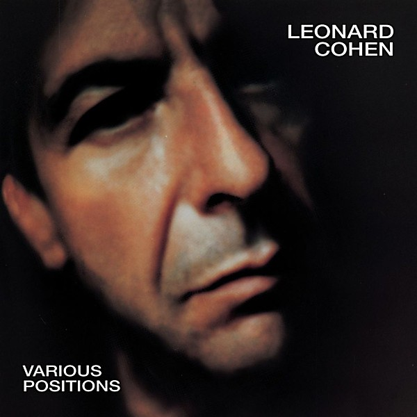

# Various Positions

By **Leonard Cohen**

## Album Data

- **Catalog:** Beets
- **Format:** Digital, Album
- **Album:** Various Positions
- **Artist:** Leonard Cohen
- **Albumartist:** Leonard Cohen
- **Genre:** Soft Rock
- **MusicBrainz Album Artist ID:** [65314b12-0e08-43fa-ba33-baaa7b874c15](https://musicbrainz.org/artist/65314b12-0e08-43fa-ba33-baaa7b874c15)
- **MusicBrainz Album ID:** [f84c6d8d-b477-46aa-9521-03d4b10128c4](https://musicbrainz.org/release/f84c6d8d-b477-46aa-9521-03d4b10128c4)
- **MusicBrainz Release Group ID:** [19c21cd1-54eb-3f42-a0ab-6fa0f834cee7](https://musicbrainz.org/release-group/19c21cd1-54eb-3f42-a0ab-6fa0f834cee7)
- **Year:** 1984
- **Catalog #:** 88697238482 TH
- **Label:** Sony Music Custom Marketing Group
- **Total Tracks:** 09

## Album Tracks

### Track 01 - Dance Me to the End of Love

- **Artist:** Leonard Cohen
- **Format:** ALAC
- **Genre:** Folk Rock
- **Length:** 4:40
- **MusicBrainz Track ID:** [3aa00e9d-e2be-4c3b-a6ac-66193f2a938f](https://musicbrainz.org/recording/3aa00e9d-e2be-4c3b-a6ac-66193f2a938f)
- **Title:** Dance Me to the End of Love
- **Track:** 01
- **Year:** 1984

### Track 02 - Coming Back to You

- **Artist:** Leonard Cohen
- **Format:** ALAC
- **Genre:** Soft Rock
- **Length:** 3:35
- **MusicBrainz Track ID:** [ec432f41-4de2-4238-83d3-d3267f1e1d64](https://musicbrainz.org/recording/ec432f41-4de2-4238-83d3-d3267f1e1d64)
- **Title:** Coming Back to You
- **Track:** 02
- **Year:** 1984

### Track 03 - The Law

- **Artist:** Leonard Cohen
- **Format:** ALAC
- **Genre:** Soft Rock
- **Length:** 4:28
- **MusicBrainz Track ID:** [7578e206-534a-4985-a7b1-2d268ae6d073](https://musicbrainz.org/recording/7578e206-534a-4985-a7b1-2d268ae6d073)
- **Title:** The Law
- **Track:** 03
- **Year:** 1984

### Track 04 - Night Comes On

- **Artist:** Leonard Cohen
- **Format:** ALAC
- **Genre:** Folk Rock
- **Length:** 4:41
- **MusicBrainz Track ID:** [4326e410-94d6-4047-b137-734aa9a40f1d](https://musicbrainz.org/recording/4326e410-94d6-4047-b137-734aa9a40f1d)
- **Title:** Night Comes On
- **Track:** 04
- **Year:** 1984

### Track 05 - Hallelujah

- **Artist:** Leonard Cohen
- **Format:** ALAC
- **Genre:** Rock
- **Length:** 4:39
- **MusicBrainz Track ID:** [0ef6d5e2-78e3-43e8-a32c-36e28fed4834](https://musicbrainz.org/recording/0ef6d5e2-78e3-43e8-a32c-36e28fed4834)
- **Title:** Hallelujah
- **Track:** 05
- **Year:** 1984

### Track 06 - The Captain

- **Artist:** Leonard Cohen
- **Format:** ALAC
- **Genre:** Folk Rock
- **Length:** 4:10
- **MusicBrainz Track ID:** [2583aade-4757-4570-ad2f-a78b59598a55](https://musicbrainz.org/recording/2583aade-4757-4570-ad2f-a78b59598a55)
- **Title:** The Captain
- **Track:** 06
- **Year:** 1984

### Track 07 - Hunter's Lullaby

- **Artist:** Leonard Cohen
- **Format:** ALAC
- **Genre:** Synthpop
- **Length:** 2:26
- **MusicBrainz Track ID:** [a514d6c9-11be-4ed4-9702-ec09fbad7df2](https://musicbrainz.org/recording/a514d6c9-11be-4ed4-9702-ec09fbad7df2)
- **Title:** Hunter's Lullaby
- **Track:** 07
- **Year:** 1984

### Track 08 - Heart With No Companion

- **Artist:** Leonard Cohen
- **Format:** ALAC
- **Genre:** Synthpop
- **Length:** 3:04
- **MusicBrainz Track ID:** [d48c3939-b2a0-4e65-a717-e88859403b07](https://musicbrainz.org/recording/d48c3939-b2a0-4e65-a717-e88859403b07)
- **Title:** Heart With No Companion
- **Track:** 08
- **Year:** 1984

### Track 09 - If It Be Your Will

- **Artist:** Leonard Cohen
- **Format:** ALAC
- **Genre:** Rock
- **Length:** 3:44
- **MusicBrainz Track ID:** [fd8ad4d2-3ad6-48c7-90da-7975a18bec96](https://musicbrainz.org/recording/fd8ad4d2-3ad6-48c7-90da-7975a18bec96)
- **Title:** If It Be Your Will
- **Track:** 09
- **Year:** 1984

## See also

- [Dear Heather](Dear_Heather.md)
- [Death of a Ladies’ Man](Death_of_a_Ladies’_Man.md)
- [I’m Your Man](I’m_Your_Man.md)
- [Live in London](Live_in_London.md)
- [New Skin for the Old Ceremony](New_Skin_for_the_Old_Ceremony.md)
- [Recent Songs](Recent_Songs.md)
- [Songs From a Room](Songs_From_a_Room.md)
- [Songs of Leonard Cohen](Songs_of_Leonard_Cohen.md)
- [Songs of Love and Hate](Songs_of_Love_and_Hate.md)
- [Ten New Songs](Ten_New_Songs.md)
- [The Future](The_Future.md)
- [CD: Dear Heather](../../CD/Leonard_Cohen/Dear_Heather.md)
- [CD: Death A Of Ladies' Man](../../CD/Leonard_Cohen/Death_A_Of_Ladies_Man.md)
- [CD: I'm Your Man](../../CD/Leonard_Cohen/Im_Your_Man.md)
- [CD: ](../../CD/Leonard_Cohen/Leonard_Cohen.md)
- [CD: New Skin For The Old Ceremony](../../CD/Leonard_Cohen/New_Skin_For_The_Old_Ceremony.md)
- [CD: Recent Songs](../../CD/Leonard_Cohen/Recent_Songs.md)
- [CD: Songs From A Room](../../CD/Leonard_Cohen/Songs_From_A_Room.md)
- [CD: Songs Of Leonard Cohen](../../CD/Leonard_Cohen/Songs_Of_Leonard_Cohen.md)
- [CD: Songs Of Love And Hate](../../CD/Leonard_Cohen/Songs_Of_Love_And_Hate.md)
- [CD: Ten New Songs](../../CD/Leonard_Cohen/Ten_New_Songs.md)
- [CD: The Future](../../CD/Leonard_Cohen/The_Future.md)
- [CD: Various Positions](../../CD/Leonard_Cohen/Various_Positions.md)
