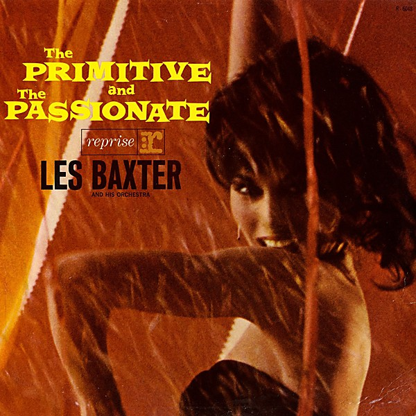

# Unknown Album

By **Les Baxter With His Chorus & Orchestra**

## Album Data

- **Catalog:** Beets
- **Format:** Digital, Album
- **Album:** Unknown Album
- **Artist:** Les Baxter With His Chorus & Orchestra
- **Albumartist:** Les Baxter With His Chorus & Orchestra
- **Genre:** Easy Listening
- **MusicBrainz Album Artist ID:** 
- **MusicBrainz Album ID:** 
- **MusicBrainz Release Group ID:** 
- **Year:** 1955
- **Catalog #:** 
- **Label:** 
- **Total Tracks:** 00

## Album Tracks

### Track 00 - Unchained Melody

- **Artist:** Les Baxter With His Chorus & Orchestra
- **Format:** AAC
- **Genre:** Easy Listening
- **Length:** 2:32
- **MusicBrainz Track ID:** 
- **Title:** Unchained Melody
- **Track:** 00
- **Year:** 1955

