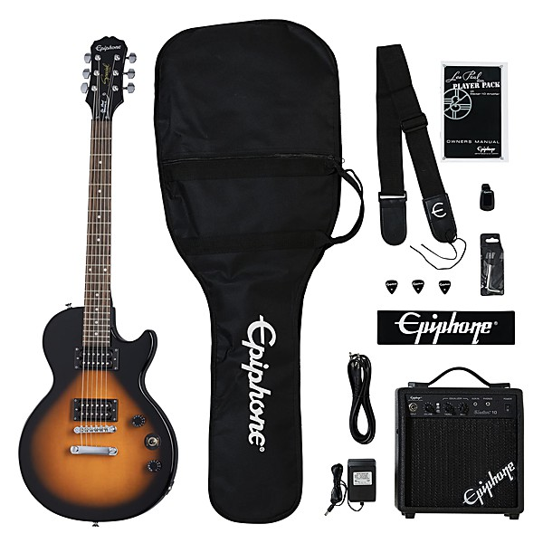

# Unknown Album

By **Les Paul & Mary Ford**

## Album Data

- **Catalog:** Beets
- **Format:** Digital, Album
- **Album:** Unknown Album
- **Artist:** Les Paul & Mary Ford
- **Albumartist:** Les Paul & Mary Ford
- **Genre:** Space Age Pop
- **MusicBrainz Album Artist ID:** 
- **MusicBrainz Album ID:** 
- **MusicBrainz Release Group ID:** 
- **Year:** 0000
- **Catalog #:** 
- **Label:** 
- **Total Tracks:** 00

## Album Tracks

### Track 00 - Mockin' Bird Hill

- **Artist:** Les Paul & Mary Ford
- **Format:** AAC
- **Genre:** Swing
- **Length:** 2:19
- **MusicBrainz Track ID:** 
- **Title:** Mockin' Bird Hill
- **Track:** 00
- **Year:** 0000

## See also

- [Vinyl: Bye Bye Blues!](../../Vinyl/Les_Paul_and_Mary_Ford/Bye_Bye_Blues!.md)
- [Vinyl: ](../../Vinyl/Les_Paul_and_Mary_Ford/Les_Paul_and_Mary_Ford.md)
