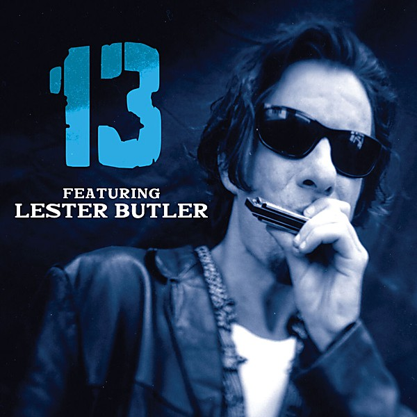

# 13 Featuring Lester Butler

By **Lester Butler**

## Album Data

- **Catalog:** Beets
- **Format:** Digital, Album
- **Album:** 13 Featuring Lester Butler
- **Artist:** Lester Butler
- **Albumartist:** Lester Butler
- **Genre:** Blues
- **MusicBrainz Album Artist ID:** 
- **MusicBrainz Album ID:** 
- **MusicBrainz Release Group ID:** 
- **Year:** 1997
- **Catalog #:** 
- **Label:** Hightone
- **Total Tracks:** 00

## Album Tracks

### Track 01 - So Low Down

- **Artist:** 13
- **Format:** MP3
- **Genre:** Sludge Metal
- **Length:** 3:33
- **MusicBrainz Track ID:** 
- **Title:** So Low Down
- **Track:** 01
- **Year:** 1997

